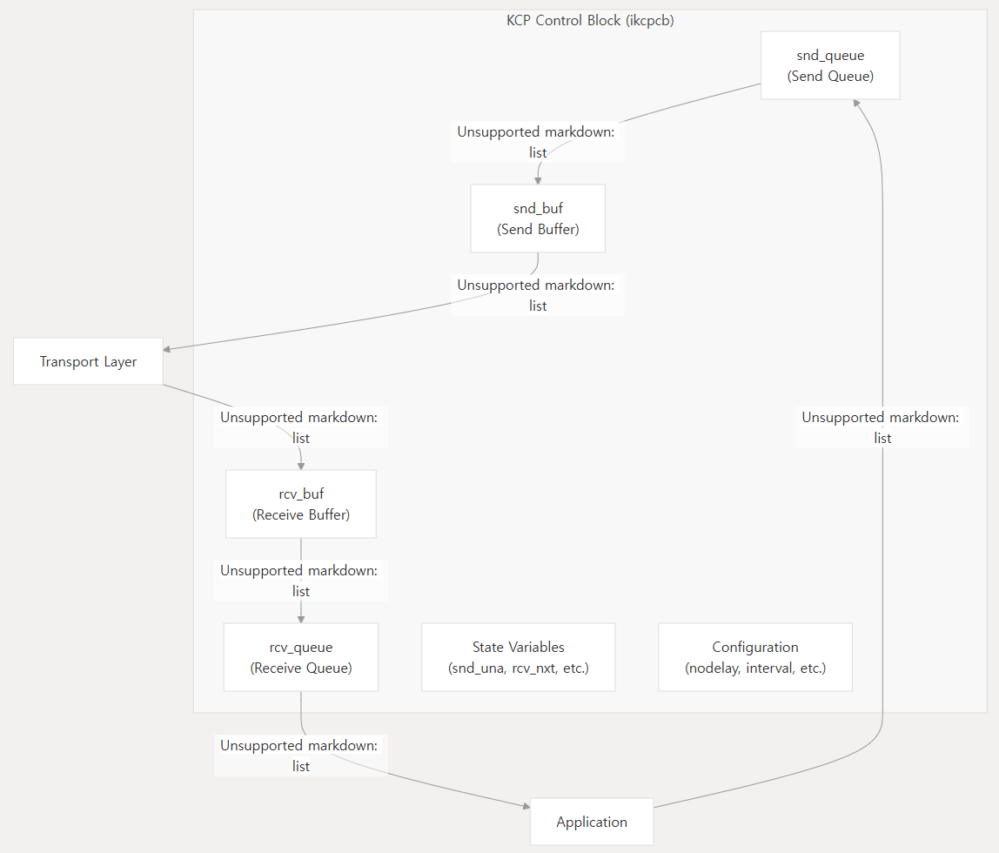
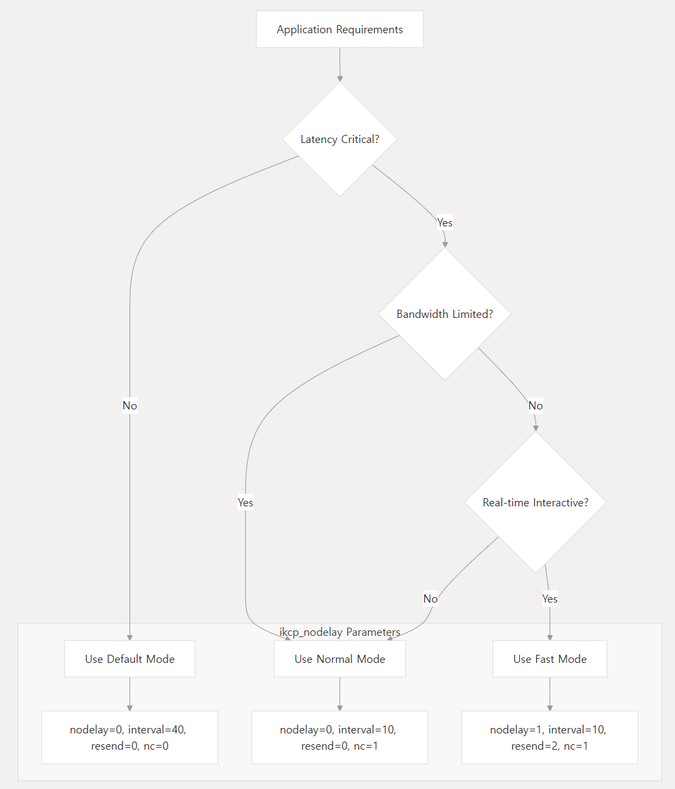
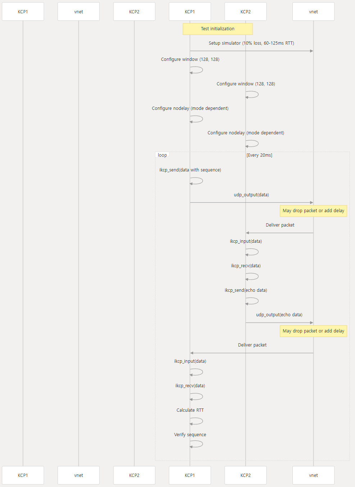
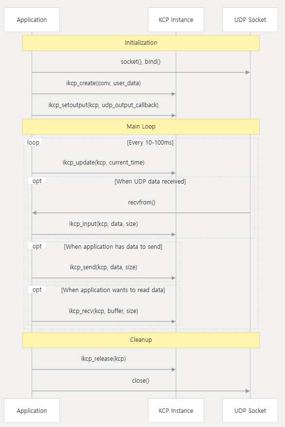

DeepWiki로 만든 것을 번역하였다.    
- https://deepwiki.com/jacking75/kcp/1-kcp-protocol-overview  
  
======================================

# KCP 프로토콜 개요

## 목적 및 범위
이 문서는 전통적인 TCP와 비교하여 지연 시간을 크게 줄이면서 신뢰성을 유지하도록 설계된 빠르고 안정적인 ARQ 프로토콜인 KCP(KCP Control Protocol)에 대한 소개를 제공한다. KCP의 핵심 개념, 아키텍처, 주요 기능 및 기본 사용 패턴을 다룬다. 자세한 구현 지침은 빠른 시작 가이드 및 API 참조를 참조하면 된다.

## KCP란 무엇인가?
KCP는 다음을 제공하는 경량화되고 고성능 신뢰성 전송 프로토콜이다:
- TCP에 비해 **평균 지연 시간 30-40% 감소**
- 손실이 많은 네트워크 환경에서 **최대 3배 낮은 최대 지연 시간**
- TCP와 유사한 **신뢰성**이지만 더 공격적이고 구성 가능한 재전송 전략 제공
- 모든 데이터그램 프로토콜(일반적으로 UDP)에서 작동하는 **전송 계층 독립적 설계**

이 프로토콜은 TCP에 비해 약 10-20% 추가 대역폭 사용이라는 트레이드오프로 이러한 이점을 달성하여, 응답성이 대역폭 효율성보다 더 중요한 지연 시간에 민감한 응용 프로그램에 이상적이다.

많은 네트워크 프로토콜이 모든 것을 함께 번들로 제공하는 것과 달리, KCP는 단 두 개의 파일(`ikcp.h` 및 `ikcp.c`)로 구성된 순수 알고리즘 구현으로, 기존 시스템에 통합하기가 매우 쉽고 이식성이 뛰어나다.

## 프로토콜 아키텍처
  
   
KCP 프로토콜 아키텍처 다이어그램  
  
KCP는 설계에서 명확한 관심사 분리를 따른다:
- **프로토콜 코어**: `ikcpcb`(KCP Control Block) 구조는 KCP 연결의 상태를 유지한다
- **애플리케이션 인터페이스**: `ikcp_send`, `ikcp_recv`, `ikcp_update`와 같이 KCP와 상호 작용하는 함수
- **전송 추상화**: KCP는 실제 네트워크 I/O를 처리하지 않고 패킷을 보내기 위한 콜백 메커니즘을 사용한다

이 설계를 통해 KCP는 핵심 성능 이점을 유지하면서 모든 전송 계층 및 애플리케이션 프레임워크와 통합될 수 있다.
   
   
## 데이터 흐름  
   
KCP 데이터 흐름 다이어그램

KCP의 데이터 흐름은 다음 단계를 따른다:
1. 애플리케이션 데이터가 `ikcp_send`에 전달되어 전송 대기열(`snd_queue`)에 저장된다
2. `ikcp_update` 함수는 전송 대기열에서 전송 버퍼(`snd_buf`)로 데이터를 이동시키고 패킷을 생성한다
3. 이러한 패킷은 사용자가 제공한 출력 콜백을 통해 전송된다
4. 수신 측은 `ikcp_input`을 통해 패킷을 받고, 수신 버퍼(`rcv_buf`)로 처리한다
5. 재정렬 및 검증 후, 데이터는 수신 대기열(`rcv_queue`)로 이동한다
6. 애플리케이션은 `ikcp_recv`를 통해 데이터를 검색한다
  
  
## 주요 기능

### 1. 지연 시간 대 처리량에 최적화
TCP가 처리량(단위 시간당 데이터 양)을 최대화하도록 설계된 반면, KCP는 지연 시간(개별 패킷이 도착하는 시간)을 최소화하는 데 중점을 둔다. 이러한 근본적인 설계 차이는 다음과 같이 비유할 수 있다:
- **TCP**: 대량의 물을 운반하는 넓고 느리게 움직이는 운하
- **KCP**: 더 적은 양을 더 빠르게 전달하는 좁고 빠르게 움직이는 개울

이 설계 철학은 응답성이 원시 대역폭보다 더 중요한 실시간 애플리케이션에 KCP를 이상적으로 만든다.

### 2. 고급 재전송 전략  
   
KCP 재전송 전략 다이어그램  

KCP는 손실이 많은 네트워크에서 성능을 향상시키기 위한 여러 전략을 구현한다:
- **RTO 계산**: 빠른 모드에서는 패킷 손실 후 RTO가 TCP의 2배가 아닌 1.5배만 증가하여 여러 손실 후 지연을 줄인다
- **선택적 재전송**: 손실된 패킷만 재전송되며, 종종 모든 후속 데이터를 재전송하는 TCP와는 다르다
- **빠른 재전송**: KCP는 순서가 맞지 않는 ACK를 통해 패킷 건너뛰기를 감지할 때 타임아웃을 기다리지 않고 재전송을 트리거할 수 있다

### 3. ACK 최적화
KCP는 확인 응답 처리에 두 가지 주요 개선 사항을 제공한다:
- **구성 가능한 ACK 지연**: TCP의 지연된 ACK(인식된 RTT를 증가시킴)와 달리, KCP는 즉각적인 ACK 전송을 허용한다
- **결합된 UNA+ACK**: 각 패킷에는 UNA 정보(특정 시퀀스 번호까지의 모든 패킷 수신 확인)와 특정 ACK 정보가 모두 포함되어 효율성이 향상된다

### 4. 유연한 흐름 제어
KCP는 여러 흐름 제어 옵션을 제공한다:
- **표준 흐름 제어**: TCP와 유사하게 송수신 윈도우 크기, 혼잡 및 슬로우 스타트를 고려한다
- **비양보 모드**: 지연 시간이 중요한 애플리케이션의 경우 혼잡 제어 및 슬로우 스타트를 우회하고 버퍼 용량만 사용할 수 있다

이러한 유연성을 통해 개발자는 특정 사용 사례에 맞게 최적화할 수 있다.

## 구성 옵션  
   
KCP 구성 옵션 다이어그램  
  
KCP는 성능을 미세 조정하기 위한 광범위한 구성 옵션을 제공한다:

| 매개변수 | 기능 | 설명 |
|---------|------|------|
| nodelay | Nagle 알고리즘 활성화/비활성화 | 0=비활성화(기본값), 1=활성화 |
| interval | 프로토콜 업데이트 간격 | 밀리초 단위(일반적으로 10-100ms) |
| resend | 빠른 재전송 공격성 | 0=끔, 2=중복 ACK 2개 후 재전송 |
| nc | 흐름 제어 모드 | 0=정상, 1=혼잡 제어 없음 |
| sndwnd | 송신 윈도우 크기 | 패킷 단위(기본값 32) |
| rcvwnd | 수신 윈도우 크기 | 패킷 단위(기본값 32) |
| mtu | 최대 전송 단위 | 기본값 1400 바이트 |
| rx_minrto | 최소 RTO | 재전송 전 최소 타임아웃 |

두 가지 일반적인 사전 설정 구성은 다음과 같다:
- **일반 모드**: `ikcp_nodelay(kcp, 0, 40, 0, 0)` - TCP와 유사한 동작
- **빠른 모드**: `ikcp_nodelay(kcp, 1, 10, 2, 1)` - 최소 지연 시간에 최적화

## 기본 사용법
KCP를 사용하기 위한 기본 워크플로우는 다음과 같다:
1. KCP 인스턴스 생성  
    ```
    ikcpcb *kcp = ikcp_create(conv, user);
    ```  
       
2. 출력 콜백 설정  
    ```
    int udp_output(const char *buf, int len, ikcpcb *kcp, void *user) {
        // Send data via UDP or other transport
    }
    kcp->output = udp_output;
    ```

3. KCP 상태 정기적 업데이트
    ```
    ikcp_update(kcp, millisec);
    ```  

4. 수신 패킷 처리  
    ```
    ikcp_input(kcp, received_udp_packet, received_udp_size);
    ```  
    
5. 애플리케이션 데이터 송수신
    ```
    ikcp_send(kcp, data, size);  // Send data
    ikcp_recv(kcp, buffer, size);  // Receive data  
    ```
  
더 자세한 사용 예제는 빠른 시작 가이드를 참조하면 된다.
   
  
## 성능 특성
KCP는 특히 손실이 많은 네트워크 조건에서 TCP와 같은 다른 신뢰성 있는 프로토콜에 비해 상당한 지연 시간 개선을 달성한다. 독립적인 벤치마크에 따르면:
- TCP에 비해 **평균 지연 시간 30-40% 감소**
- 네트워크 혼잡 동안 **최대 지연의 최대 3배 감소**
- ENet 및 UDT와 같은 대안보다 **패킷 손실로부터 더 빠른 복구**

이러한 이점은 무선(WiFi), 모바일(3G/4G) 및 혼잡한 공용 네트워크와 같은 까다로운 네트워크 환경에서 특히 두드러진다.

트레이드오프는 TCP에 비해 대역폭 사용량이 10-20% 증가하는 것인데, 이는 응답성이 중요한 애플리케이션에서는 일반적으로 허용 가능하다.
  

## 사용 사례
KCP는 다음과 같은 경우에 특히 적합하다:
- 최소한의 입력 지연이 필요한 **실시간 멀티플레이어 게임**
- **라이브 비디오/오디오 스트리밍** 애플리케이션
- 응답성이 중요한 **대화형 원격 애플리케이션**
- 신뢰할 수 없는 네트워크에서 작동하는 **IoT 애플리케이션**
- 성능 향상이 필요한 **VPN 및 터널링 서비스**
  
이 프로토콜은 인기 있는 온라인 게임, 스트리밍 플랫폼 및 네트워킹 도구를 포함하여 수백만 명의 사용자가 있는 수많은 고프로파일 애플리케이션에 성공적으로 배포되었다.
   
특정 사용 사례에 대한 성능 튜닝에 대한 자세한 내용은 구성 가이드 및 성능 튜닝을 참조하면 된다.
  

## 요약
KCP는 신뢰성을 유지하면서 전통적인 TCP에 비해 지연 시간을 크게 줄이는 경량화되고 고성능 신뢰성 전송 프로토콜을 제공한다. 고급 재전송 전략, 최적화된 확인 응답 처리 및 유연한 흐름 제어를 구현하여 KCP는 까다로운 네트워크 조건에서 우수한 성능을 달성한다.

모듈화되고 전송에 구애받지 않는 설계로 기존 시스템에 쉽게 통합할 수 있으며, 광범위한 구성 옵션을 통해 특정 애플리케이션 요구 사항에 맞게 미세 조정할 수 있다.

구현 세부 사항에 대한 자세한 정보는 프로토콜 아키텍처를 참조하고, API 문서는 API 참조를 참조하면 된다.  
    
   
<br>  

# KCP 빠른 시작 가이드

## KCP란 무엇인가?
KCP는 경량화되고, 빠르며, 신뢰할 수 있는 ARQ 프로토콜이다. TCP보다 30-40% 낮은 지연 시간을 달성하는 대신 10-20% 더 많은 대역폭을 사용한다. 전체 구현은 단 두 개의 파일(`ikcp.h`와 `ikcp.c`)로 구성되어 있어 어떤 프로젝트에도 쉽게 통합할 수 있다.

## 기본 통합 흐름
  
 

### 1단계: KCP 객체 생성

```
// Initialize KCP object
// conv: conversation ID (must match on both endpoints)
// user: pointer for callbacks
ikcpcb *kcp = ikcp_create(conv, user);
```     
  
`conv` 매개변수는 통신하는 양쪽 엔드포인트에서 동일해야 하는 세션 식별자이다. `user` 매개변수는 콜백에 전달되어 컨텍스트를 제공하는 포인터이다.   
  
### 2단계: 출력 콜백 설정
  
```
// Define your network output function
int udp_output(const char *buf, int len, ikcpcb *kcp, void *user)
{
    // Send the packet via your transport (e.g., UDP)
    // Return 0 on success, negative on error
}

// Set the callback
kcp->output = udp_output;
```    
이 콜백은 중요하다 - KCP가 기본 전송을 통해 패킷을 보내는 방법이다. KCP는 순수하게 프로토콜 로직에 집중하고 실제 네트워크 I/O는 애플리케이션에 위임한다.  
    
### 3단계: KCP 상태 업데이트
  
```
// Call regularly with current timestamp in milliseconds
ikcp_update(kcp, current_millisec);
```    
이 함수를 주기적으로(10-100ms마다) 호출하여 재전송, 확인 응답, 윈도우 업데이트를 처리하는 KCP의 내부 상태 기계를 구동해야 한다.

### 4단계: 입력 패킷 처리
  
```
// When you receive a packet from your transport
ikcp_input(kcp, received_packet_data, received_packet_size);
```    
전송 계층에서 들어오는 모든 패킷을 이 함수를 통해 KCP에 전달한다.  

### 5단계: 데이터 송수신

데이터 보내기:
```
// Send data reliably
int result = ikcp_send(kcp, data_buffer, data_length);
```

데이터 받기:
```
// Check if data is available
int size = ikcp_peeksize(kcp);
if (size > 0) {
    // Buffer must be at least 'size' bytes
    char *buffer = malloc(size);
    // Receive data
    int received = ikcp_recv(kcp, buffer, size);
    // Process data...
    free(buffer);
}
```
  

## KCP의 데이터 흐름
이 다이어그램은 KCP 프로토콜을 통해 데이터가 어떻게 흐르는지 보여준다:  

 

## 구성 옵션

### Nodelay 모드
  
```
int ikcp_nodelay(ikcpcb *kcp, int nodelay, int interval, int resend, int nc);
```  
    
매개변수:
- `nodelay`: 노딜레이 모드 활성화(1) 또는 비활성화(0)
- `interval`: 내부 업데이트 간격(밀리초, 10-100)
- `resend`: 빠른 재전송 모드(0=비활성화, 2=빠름)
- `nc`: 혼잡 제어(0=활성화, 1=비활성화)

일반적인 프리셋:
- 표준 모드: `ikcp_nodelay(kcp, 0, 40, 0, 0);`
- 빠른 모드: `ikcp_nodelay(kcp, 1, 10, 2, 1);`
 
### 윈도우 크기
  
```
int ikcp_wndsize(ikcpcb *kcp, int sndwnd, int rcvwnd);
```    
최대 송신 및 수신 윈도우 크기 설정(기본값: 32). 더 큰 윈도우는 메모리 사용량이 증가하는 대신 처리량을 향상시킬 수 있다.

### MTU 크기
  
```
int ikcp_setmtu(ikcpcb *kcp, int mtu);
```    
최대 전송 단위 크기 설정(기본값: 1400바이트). IP 단편화를 피하기 위해 네트워크에 맞게 조정한다.
  

## 완전한 통합 예제
다음은 애플리케이션에 KCP를 통합하는 완전한 예제이다:  
```
// 1. Create KCP object
ikcpcb *kcp = ikcp_create(0x12345678, user_context);

// 2. Set output callback
kcp->output = udp_output_function;

// 3. Configure KCP (optional)
ikcp_nodelay(kcp, 1, 10, 2, 1);  // Fast mode
ikcp_wndsize(kcp, 128, 128);     // Larger window
ikcp_setmtu(kcp, 1400);          // Default MTU

// 4. Main application loop
while (running) {
    // Get current timestamp
    uint32_t current = get_current_millisec();
    
    // Process any received UDP packets
    while (udp_packet_available()) {
        char buffer[1500];
        int size = receive_udp_packet(buffer);
        ikcp_input(kcp, buffer, size);
    }
    
    // Send data if needed
    if (data_to_send_available()) {
        ikcp_send(kcp, data, data_size);
    }
    
    // Check for received data
    int peek_size;
    while ((peek_size = ikcp_peeksize(kcp)) > 0) {
        char *recv_buffer = malloc(peek_size);
        int recv_size = ikcp_recv(kcp, recv_buffer, peek_size);
        if (recv_size > 0) {
            process_received_data(recv_buffer, recv_size);
        }
        free(recv_buffer);
    }
    
    // Update KCP state
    ikcp_update(kcp, current);
    
    // Sleep for a short time
    sleep_milliseconds(10);
}

// 5. Cleanup
ikcp_release(kcp);
```  
  
  
## KCP 제어 블록의 주요 구성 요소
`ikcpcb` 구조체는 KCP의 기능을 구동하는 몇 가지 중요한 구성 요소를 포함한다:

| 구성 요소 | 설명 |
|-----------|------|
| conv | 연결을 식별하는 대화 ID |
| mtu, mss | 최대 전송 단위 및 세그먼트 크기 |
| snd_una | 가장 오래된 확인되지 않은 패킷 시퀀스 번호 |
| snd_nxt | 다음으로 보낼 패킷 시퀀스 번호 |
| rcv_nxt | 다음으로 받을 것으로 예상되는 패킷 시퀀스 번호 |
| snd_wnd, rcv_wnd | 송신 및 수신 윈도우 크기 |
| cwnd | 혼잡 윈도우 크기 |
| snd_queue, rcv_queue | 애플리케이션 데이터 큐 |
| snd_buf, rcv_buf | 전송 중인 패킷 버퍼 |
| output | 출력 콜백을 위한 함수 포인터 |
  

## 중요한 팁
- **정기적인 업데이트**: 유휴 상태에서도 구성한 간격(10-100ms)으로 `ikcp_update`를 호출한다.
- **타임스탬프 정확도**: `ikcp_update`에 정확한 밀리초 타임스탬프를 제공한다.
- **반환 값 확인**: 오류 조건을 확인하기 위해 항상 KCP 함수의 반환 값을 확인한다.
- **버퍼 관리**: KCP는 애플리케이션 버퍼를 관리하지 않는다; 적절한 할당과 해제를 보장한다.
- **ikcp_peeksize**: 수신하기 전에 다음 메시지의 크기를 결정하기 위해 이 함수를 사용한다.

더 자세한 튜닝 정보는 `구성 가이드`를 참조한다.
  

## 다음 단계
더 자세한 정보는 다음을 참조한다:
- KCP의 내부 메커니즘에 대한 자세한 내용은 `프로토콜 아키텍처`
- 모든 함수에 대한 포괄적인 문서는 `API 참조`
- KCP가 네트워크 혼잡을 관리하는 방법에 대한 통찰력은 `흐름 제어 및 혼잡 제어`


<br>  
  
# 프로토콜 아키텍처

## 소개
KCP는 UDP와 같은 신뢰할 수 없는 데이터그램 기반 프로토콜 위에서 작동하도록 설계된 경량화되고 신뢰할 수 있는 전송 프로토콜이다. TCP가 처리량을 최적화하는 것과 달리, KCP는 빠른 재전송, 선택적 승인, 구성 가능한 혼잡 제어와 같은 혁신적인 메커니즘을 통해 30-40% 낮은 평균 지연 시간을 달성하면서 신뢰성을 유지하는 데 우선순위를 둔다.

이 프로토콜은 외부 종속성 없이 단 두 개의 파일(ikcp.h 및 ikcp.c)로 구현되어 있어 기존 네트워크 스택에 쉽게 통합할 수 있다.

## 프로토콜 계층화
KCP는 응용 프로그램과 기본 신뢰할 수 없는 전송 프로토콜(일반적으로 UDP) 사이의 중간 계층으로 작동한다. 전통적인 소켓 API와 달리 KCP는 실제 네트워크 I/O 작업을 직접 처리하지 않고 패킷을 보내기 위한 콜백에 의존하며 외부 타이밍 메커니즘이 필요하다.

 
  

## 핵심 구성 요소
KCP 아키텍처는 신뢰할 수 있는 데이터 전송을 제공하기 위해 함께 작동하는 여러 핵심 구성 요소로 구성된다:

 
  
주요 구성 요소는 다음과 같다:  
- **KCP 제어 블록(`ikcpcb`)**: 연결 상태를 보유하는 중앙 데이터 구조
- **송신 큐(`snd_queue`)**: 전송 전 송신 데이터 저장
- **수신 큐(`rcv_queue`)**: 응용 프로그램이 소비할 준비가 된 정렬된 데이터 저장
- **송신 버퍼(`snd_buf`)**: 승인될 때까지 전송된 세그먼트 보유
- **수신 버퍼(`rcv_buf`)**: 순서가 맞지 않는 세그먼트를 임시로 저장
  

## 패킷 구조
KCP는 24바이트 헤더와 선택적 데이터 페이로드로 구성된 모든 메시지에 대해 단일 통합 패킷 형식을 사용한다:
  
   
  
### 헤더 필드

| 필드 | 크기 | 설명 |
|------|------|------|
| conv | 4 바이트 | 대화 ID - 연결을 식별 |
| cmd | 1 바이트 | 명령 유형 (PUSH=81, ACK=82, WASK=83, WINS=84) |
| frg | 1 바이트 | 조각 개수 (0 = 마지막 조각) |
| wnd | 2 바이트 | 광고된 수신 윈도우 크기 |
| ts | 4 바이트 | 타임스탬프 - RTT 계산에 사용 |
| sn | 4 바이트 | 이 패킷의 시퀀스 번호 |
| una | 4 바이트 | 첫 번째 미확인 시퀀스 번호 |
| len | 4 바이트 | 데이터 페이로드의 길이 |

KCP 헤더는 항상 24바이트(`IKCP_OVERHEAD`)이며, 전체 패킷 크기는 구성된 MTU(기본값 1400바이트)로 제한된다.
  

## 프로토콜을 통한 데이터 흐름
KCP의 데이터 흐름은 데이터를 보내고, 승인하고, 받는 사이클이다:
  
    


### 송신 경로
1. 응용 프로그램이 전송할 데이터와 함께 `ikcp_send()`를 호출한다
2. 필요한 경우 데이터가 조각화되어 `snd_queue`에 추가된다
3. `ikcp_update()` 동안 `snd_queue`에서 세그먼트가 `snd_buf`로 이동한다
4. `ikcp_flush()`가 이러한 세그먼트를 형식화하고 출력 콜백을 호출한다
5. 전송 계층이 패킷을 전달한다

### 수신 경로
1. 전송 계층이 패킷을 수신하고 `ikcp_input()`에 전달한다
2. KCP가 패킷을 처리하여 ACK 및 데이터 세그먼트를 처리한다
3. 데이터 세그먼트는 `rcv_buf`에 배치된다
4. 순서가 맞는 세그먼트는 `rcv_queue`로 이동한다
5. 응용 프로그램이 데이터를 검색하기 위해 `ikcp_recv()`를 호출한다
  

## 상태 기계 및 작동
KCP의 작동은 프로토콜 타이밍을 유지하기 위해 정기적으로(일반적으로 10-100ms마다) 호출해야 하는 `ikcp_update()` 함수에 의해 구동된다. 이 함수는 상태 기계를 구동하고 필요한 패킷 전송 및 재전송을 트리거한다.
  
   
   

주요 작동 단계는 다음과 같다:

1. **생성**: 응용 프로그램이 `ikcp_create()`로 KCP 인스턴스를 생성한다
2. **초기화**: 응용 프로그램이 `ikcp_setoutput()`으로 출력 콜백을 설정한다
3. **주기적 업데이트**: 응용 프로그램이 현재 시간으로 `ikcp_update()`를 정기적으로 호출한다
4. **송신 프로세스**: 응용 프로그램이 전송할 데이터를 큐에 넣기 위해 `ikcp_send()`를 호출한다
5. **수신 프로세스**: 네트워크에서 데이터가 도착하면 응용 프로그램이 `ikcp_input()`을 호출한다
6. **데이터 검색**: 응용 프로그램이 수신된 데이터를 검색하기 위해 `ikcp_recv()`를 호출한다
7. **종료**: 응용 프로그램이 리소스를 정리하기 위해 `ikcp_release()`를 호출한다
  

## 핵심 메커니즘
KCP는 지연 시간을 최소화하면서 신뢰성을 제공할 수 있는 몇 가지 중요한 메커니즘을 구현한다:

### 1. ARQ (Automatic Repeat reQuest)
KCP는 선택적 승인 ARQ 시스템을 구현한다:
- 각 전송된 세그먼트에는 고유한 시퀀스 번호가 있다
- 수신자는 전용 ACK 패킷을 통해 세그먼트를 확인한다
- 미확인 세그먼트는 타임아웃 후 또는 빠른 재전송 트리거에 의해 재전송된다
- TCP와 달리 KCP는 손실 후 모든 세그먼트가 아닌 손실된 세그먼트만 재전송한다
  

### 2. 빠른 재전송
패킷이 손실될 가능성이 있을 때 KCP는 빠르게 재전송할 수 있다:
  
   

송신자가 특정 시퀀스 번호를 건너뛰는 여러 ACK를 수신하면 타임아웃을 기다리지 않고 누락된 패킷을 빠르게 식별하고 재전송할 수 있다.  
  

### 3. 흐름 제어 및 혼잡 제어
KCP는 윈도우 기반 흐름 및 혼잡 제어 시스템을 구현한다:

**흐름 제어**: 송신자가 수신자를 압도하지 않도록 보장한다
- 수신자는 윈도우 크기(`rcv_wnd`)를 광고한다
- 송신자는 이 윈도우를 존중하고 수신자가 처리할 수 있는 것보다 더 많이 보내지 않는다

**혼잡 제어**: 네트워크 혼잡을 방지한다
- 느린 시작 및 혼잡 회피가 있는 TCP와 유사한 체계 사용
- 네트워크 조건에 따라 조정할 수 있는 혼잡 윈도우(`cwnd`)를 유지한다
- 지연 시간에 민감한 응용 프로그램의 경우 `nocwnd` 매개변수로 선택적으로 비활성화할 수 있다
  

### 4. RTO (Retransmission Timeout) 관리
KCP는 측정된 RTT를 기반으로 RTO를 동적으로 조정한다:
- 평활화된 RTT(`rx_srtt`) 및 RTT 변동(`rx_rttval`)을 유지한다
- TCP와 유사한 공식을 사용하지만 구성 가능한 매개변수로 RTO를 계산한다
- 표준 모드에서 최소 RTO는 100ms이다
- nodelay 모드에서 최소 RTO는 30ms로 감소한다
- 다양한 네트워크 시나리오에 맞게 수동으로 구성할 수 있다
  

## 구성 옵션
KCP는 다양한 시나리오에 대한 성능을 최적화하기 위한 몇 가지 구성 옵션을 제공한다:

### 1. nodelay 매개변수
  
```
int ikcp_nodelay(ikcpcb *kcp, int nodelay, int interval, int resend, int nc)
```  
    
| 매개변수 | 설명 |
|----------|------|
| nodelay | 0=비활성화(기본값), 1=nodelay 모드 활성화 |
| interval | 밀리초 단위의 업데이트 간격(10-100ms) |
| resend | 빠른 재전송 트리거 임계값(0=끔, 2=권장) |
| nc | 혼잡 제어 없음(0=정상, 1=혼잡 제어 비활성화) |
  

### 2. 프리셋 모드
KCP는 여러 가지 프리셋 작동 모드를 제공한다:

| 모드 | 구성 | 특성 |
|------|------|------|
| 기본 | nodelay(0, 40, 0, 0) | TCP와 유사한 동작 |
| 일반 | nodelay(0, 30, 2, 1) | 개선된 지연 시간 |
| 빠름 | nodelay(1, 20, 2, 1) | 가장 낮은 지연 시간, 더 많은 대역폭 사용 |
  

### 3. 윈도우 크기
  
```
int ikcp_wndsize(ikcpcb *kcp, int sndwnd, int rcvwnd)
```    
최대 송신 및 수신 윈도우 크기를 설정한다(기본값 32 패킷).
  

## 응용 프로그램과의 통합
KCP는 전송에 구애받지 않도록 설계되었으며 응용 프로그램의 네트워크 I/O 시스템과의 통합이 필요하다:
  
   
  
일반적인 통합 단계는 다음과 같다:

1. `ikcp_create()`로 KCP 인스턴스 생성
2. `ikcp_setoutput()`으로 출력 콜백 설정
3. `ikcp_update()`를 정기적으로 호출하기 위한 타이머 설정
4. 응용 프로그램이 데이터를 보내고 싶을 때 `ikcp_send()` 호출
5. UDP 패킷이 수신되면 `ikcp_input()` 호출
6. 수신된 데이터를 검색하기 위해 주기적으로 `ikcp_recv()` 호출
7. 완료되면 리소스를 해제하기 위해 `ikcp_release()` 호출

KCP는 패킷 전송을 직접 처리하지 않는다 - 응용 프로그램은 출력 콜백을 기반으로 실제 네트워크 I/O 작업을 구현해야 한다.

## 결론
KCP의 아키텍처는 지연 시간을 최소화하면서 신뢰할 수 없는 전송을 통한 신뢰성을 제공한다. 신중한 흐름 제어, 빠른 재전송 및 구성 가능한 작동 모드를 통해 KCP는 많은 대화형 응용 프로그램에서 TCP보다 더 나은 성능을 달성한다.

프로토콜의 경량 구현(단 두 개의 소스 파일)은 여전히 강력한 전송 기능을 제공하면서 프로젝트에 쉽게 통합할 수 있다.

특정 API 세부 정보 및 사용 예제는 `API 참조`를 참조하라.  
  
  
<br>  
  
# 패킷 구조

## 개요
KCP는 데이터 전송 및 제어 메시지를 포함한 모든 유형의 메시지에 대해 통합된 패킷 형식을 사용한다. 코드에서는 "세그먼트"라고도 불리는 단일 패킷 구조를 사용한다. 모든 패킷 유형은 동일한 헤더 형식을 공유하며, 데이터 패킷의 경우 선택적 데이터 페이로드가 있다.  
   
  

## 헤더 구조
KCP 패킷 헤더는 24바이트 길이로, 프로토콜의 신뢰성, 순서 지정 및 흐름 제어 메커니즘을 제어하는 여러 필드를 포함한다.

헤더의 각 필드는 프로토콜에서 특정 목적을 가진다:

| 필드 | 크기 | 설명 |
|------|------|------|
| conv | 4 바이트 | 대화 ID - 연결을 식별 |
| cmd | 1 바이트 | 명령 유형 - 패킷 목적을 나타냄 |
| frg | 1 바이트 | 조각 - 메시지에 남은 조각 수 |
| wnd | 2 바이트 | 윈도우 크기 - 사용 가능한 수신 윈도우를 알림 |
| ts | 4 바이트 | 타임스탬프 - RTT 계산에 사용 |
| sn | 4 바이트 | 일련 번호 - 패킷의 고유 식별자 |
| una | 4 바이트 | 미확인 - 가장 초기의 미확인 패킷 |
| len | 4 바이트 | 길이 - 데이터 페이로드의 크기 |

## 메모리 레이아웃
KCP 패킷의 정확한 바이트 레이아웃은 다음과 같다:  
   
  

## 필드 상세 정보

### Conversation(대화) ID (conv)
Conversation ID는 KCP 연결을 고유하게 식별하는 32비트 정수이다. 동일한 연결의 모든 패킷은 동일한 Conversation ID를 공유한다. 이 필드는 단일 UDP 소켓을 통해 여러 연결을 다중화할 수 있게 한다.

실제로 대화 ID는 종종 양쪽 엔드포인트의 식별자를 포함하는 구조를 가진다:
- 상위 16비트: 호출자의 인덱스
- 하위 16비트: 수신자의 인덱스

### Commnad(명령) (cmd)

명령 필드는 패킷의 유형을 지정한다. KCP는 네 가지 명령 유형을 정의한다:

| 명령 | 값 | 설명 |
|------|------|------|
| IKCP_CMD_PUSH | 81 | 데이터 패킷 |
| IKCP_CMD_ACK | 82 | 확인 응답 |
| IKCP_CMD_WASK | 83 | 윈도우 프로브 (피어의 윈도우 크기 요청) |
| IKCP_CMD_WINS | 84 | 윈도우 크기 알림 |
  

### Fragment(조각) (frg)
조각 필드는 다중 패킷 메시지에서 얼마나 많은 조각이 더 따르는지 나타낸다. 단일 패킷 메시지나 다중 패킷 메시지의 마지막 조각의 경우 이 값은 0이다.

- 조각화되지 않은 메시지의 경우: frg = 0
- N개의 조각으로 나눠진 메시지의 경우:
  - 첫 번째 조각: frg = N-1
  - 두 번째 조각: frg = N-2
  - ...
  - 마지막 조각: frg = 0

이를 통해 수신자는 조각화된 메시지를 올바르게 재조립할 수 있다.
  

### 윈도우 크기 (wnd)
윈도우 크기 필드는 수신자의 버퍼에 남아 있는 공간을 알려주며, 수신자의 버퍼가 가득 차기 전에 발신자가 전송할 수 있는 패킷 수를 나타낸다.
  

### 타임스탬프 (ts)
타임스탬프 필드는 왕복 시간(RTT) 계산에 사용된다. 수신자가 패킷을 확인할 때 원래 타임스탬프를 다시 보내어 발신자가 RTT를 계산할 수 있게 한다.
  

### 일련 번호 (sn)
일련 번호는 시퀀스에서 각 패킷을 고유하게 식별한다. 패킷 손실을 감지하고, 재전송을 처리하며, 순서대로 전달을 보장하는 데 사용된다.
  

### 미확인 (una)
미확인 필드는 아직 확인되지 않은 가장 초기의 시퀀스 번호를 포함한다. 이는 수신자가 발신자가 아직 추적 중인 패킷을 이해하는 데 도움이 된다.
  

### 길이 (len)
길이 필드는 데이터 페이로드의 크기를 바이트 단위로 나타낸다. 페이로드가 없는 제어 패킷의 경우 이 값은 0이다.
  

## 패킷 유형 및 기능
  
    

### PUSH 패킷
PUSH 패킷(cmd = 81)은 발신자에서 수신자로 실제 데이터를 전달한다. 이들은 다음을 포함한다:
- 모든 필드가 있는 전체 헤더
- 데이터 페이로드(len 필드로 지정됨)

수신자는 ACK 패킷을 보내 PUSH 패킷을 확인한다.

### ACK 패킷
ACK 패킷(cmd = 82)은 PUSH 패킷의 수신을 확인한다. 이들은 다음을 포함한다:
- 전체 헤더(데이터 필드는 확인된 패킷과 관련됨)
- 데이터 페이로드 없음(len = 0)

ACK 패킷의 sn 필드는 확인된 PUSH 패킷의 시퀀스 번호를 포함한다.

### 윈도우 프로브 패킷 (WASK)
WASK 패킷(cmd = 83)은 발신자의 윈도우가 가득 차고 수신자에게 더 많은 공간이 있는지 알아야 할 때 보내진다. 이들은 다음을 포함한다:
- 전체 헤더
- 데이터 페이로드 없음(len = 0)

### 윈도우 업데이트 패킷 (WINS)
WINS 패킷(cmd = 84)은 수신자의 현재 윈도우 크기에 대해 발신자에게 알린다. 이들은 다음을 포함한다:
- 전체 헤더(wnd 필드 업데이트됨)
- 데이터 페이로드 없음(len = 0)
  

## 인코딩 및 디코딩
KCP 패킷은 바이트 단위로 인코딩 및 디코딩된다. 프로토콜은 다른 시스템 간의 호환성을 보장하기 위해 엔디안 문제를 처리한다.

### 인코딩 프로세스
인코딩 프로세스는 각 필드를 바이트 시퀀스로 변환하고 출력 버퍼에 추가한다:
1. conversation(대화) ID 인코딩(4 바이트)
2. 명령 인코딩(1 바이트)
3. 조각 수 인코딩(1 바이트)
4. 윈도우 크기 인코딩(2 바이트)
5. 타임스탬프 인코딩(4 바이트)
6. 일련 번호 인코딩(4 바이트)
7. 미확인 인코딩(4 바이트)
8. 길이 인코딩(4 바이트)
9. 데이터 추가(있는 경우)
  
### 디코딩 프로세스
디코딩 프로세스는 바이트 시퀀스에서 각 필드를 추출한다:
1. conversation ID 디코딩(4 바이트)
2. 명령 디코딩(1 바이트)
3. 조각 수 디코딩(1 바이트)
4. 윈도우 크기 디코딩(2 바이트)
5. 타임스탬프 디코딩(4 바이트)
6. 일련 번호 디코딩(4 바이트)
7. 미확인 디코딩(4 바이트)
8. 길이 디코딩(4 바이트)
9. 데이터 처리(있는 경우)
  

## 코드에서의 처리
KCP 구현에서 패킷 처리와 가장 관련된 함수는 다음과 같다:
- `ikcp_encode_seg`: 세그먼트를 바이트로 인코딩
- `ikcp_input`: 들어오는 패킷 처리
- `ikcp_parse_data`: 수신된 데이터 패킷 처리
- `ikcp_flush`: 대기 중인 패킷 전송
  
 
  

## 결론
KCP 패킷 구조는 UDP와 같은 신뢰할 수 없는 전송 프로토콜을 통해 신뢰할 수 있고, 순서가 지정되며, 흐름이 제어되는 통신을 지원하도록 설계되었다. 통합된 패킷 형식은 프로토콜이 효과적으로 기능하는 데 필요한 모든 정보를 제공하면서 구현을 단순화한다.  


<br>  

# 흐름 제어 및 혼잡 제어
이 페이지는 KCP가 흐름 제어 및 혼잡 제어 메커니즘을 처리하여 TCP와 같은 전통적인 프로토콜보다 낮은 지연 시간을 달성하면서 신뢰할 수 있는 데이터 전송을 유지하는 방법을 설명한다. 이러한 시스템은 네트워크 혼잡을 방지하고 다양한 네트워크 조건에서 최적의 성능을 보장하는 데 중요하다.

패킷 구조 및 프로토콜 세부 정보에 대한 정보는 [패킷 구조]를 참조한다.

## 흐름 제어 및 혼잡 제어 개요
흐름 제어와 혼잡 제어는 신뢰할 수 있는 전송 프로토콜에서 다르지만 상호 보완적인 목적을 제공한다:

**흐름 제어**: 수신자의 용량에 기반하여 전송 중인 데이터의 양을 제한함으로써 수신자가 과부하되는 것을 방지한다.

**혼잡 제어**: 네트워크 조건에 따라 전송 속도를 조정하여 네트워크가 과부하되는 것을 방지한다.

KCP는 지연 시간을 줄이면서 신뢰성을 유지하는 목표를 달성하는 데 도움이 되는 몇 가지 고유한 최적화를 통해 두 메커니즘을 모두 구현한다.
  
   
  

## KCP의 흐름 제어
KCP는 TCP와 유사한 슬라이딩 윈도우 메커니즘을 사용하지만, 지연 시간 감소를 위한 몇 가지 최적화가 있다.

### 윈도우 관리
KCP는 세 가지 주요 윈도우 매개변수를 유지한다:

**송신 윈도우**(snd_wnd): 송신자가 전송할 수 있는 패킷 수를 제한한다.

**수신 윈도우**(rcv_wnd): 수신자가 수락할 수 있는 패킷 수를 제한한다.

**원격 윈도우**(rmt_wnd): 수신자가 공지한 윈도우 크기이다.

유효 윈도우 크기는 이들 값의 최소값으로 계산된다.

   
 

### 윈도우 프로빙
원격 윈도우 크기가 0일 때, KCP는 윈도우 프로빙 상태로 전환한다:
- 지수 백오프가 있는 프로브 타이머를 설정한다.
- 윈도우 프로브 명령(IKCP_CMD_WASK)을 보낸다.
- 윈도우 크기 업데이트(IKCP_CMD_WINS)를 기다린다.

이 메커니즘은 임시 수신 버퍼 가득 참 상태 이후에 전송이 재개될 수 있도록 보장한다.

 

### 흐름 제어 구성
송신 및 수신 윈도우 크기를 설정하여 KCP의 흐름 제어를 구성할 수 있다:  
```
int ikcp_wndsize(ikcpcb *kcp, int sndwnd, int rcvwnd);
```  
  
KCP의 기본 윈도우 크기는 다음과 같다:
- 기본 송신 윈도우: 32 패킷
- 기본 수신 윈도우: 128 패킷(최대 조각 크기 이상이어야 함)

  
## KCP의 혼잡 제어
KCP의 혼잡 제어는 TCP 접근 방식을 기반으로 하지만 지연 시간에 민감한 애플리케이션을 위해 수정하거나 비활성화하는 옵션을 포함한다.

### 표준 혼잡 제어
표준 모드에서 작동할 때, KCP는 TCP와 유사한 혼잡 제어를 구현한다:

**슬로우 스타트**: 슬로우 스타트 임계값에 도달할 때까지 혼잡 윈도우를 지수적으로 증가시킨다.

**혼잡 회피**: 임계값 이후 혼잡 윈도우를 선형적으로 증가시킨다.

**빠른 복구**: 패킷 손실 감지 시 윈도우를 줄인다.
  
   
  
### 빠른 재전송
KCP의 빠른 재전송 메커니즘은 TCP보다 더 적극적이다:

- 패킷이 "건너뛰어진"(순서에 맞지 않게 확인됨) 횟수를 추적한다.
- 건너뛰기 횟수가 구성된 임계값에 도달하면(기본값: 0, 비활성화):
  - RTO를 기다리지 않고 즉시 패킷을 재전송한다.
  - 혼잡 제어 매개변수를 업데이트한다.

이는 패킷 손실 후 복구 시간을 크게 줄인다.
  
   


### 후퇴하지 않는 혼잡 제어
KCP의 고유한 기능 중 하나는 `nc` 매개변수를 사용하여 전통적인 혼잡 제어를 비활성화하는 기능이다:

- `nc = 0`(기본값): 표준 TCP와 유사한 혼잡 제어를 사용한다.
- `nc = 1`: 혼잡 제어를 비활성화한다.
  - 흐름 제어(snd_wnd, rcv_wnd)만 전송을 제한한다.
  - 패킷 손실 시 백오프하지 않는다.
  - 공정성을 낮은 지연 시간으로 교환한다.

이 모드는 제어된 환경에서 지연 시간에 민감한 애플리케이션에 적합하다.
  
     
  
  
## RTO 계산 및 백오프 전략
KCP의 RTO(재전송 타임아웃) 계산은 TCP와 유사하지만 구성 옵션을 제공한다:

### RTO 계산

KCP는 평활화된 RTT와 RTT 변동 공식을 사용한다:  
```
SRTT = (7 * SRTT + RTT) / 8
RTTVAR = (3 * RTTVAR + |RTT - SRTT|) / 4
RTO = SRTT + max(interval, 4 * RTTVAR)
```  
  
RTO는 `rx_minrto`와 `IKCP_RTO_MAX`(60000ms) 사이로 제한된다.

  
### RTO 백오프 전략
TCP와의 한 가지 주요 차이점은 재전송 시 RTO가 증가하는 방식이다:
- **TCP**: 재전송 시 RTO를 두 배로 늘린다(RTO *= 2)
- **일반 모드의 KCP**: RTO = max(RTO, rx_rto) - 더 점진적인 증가
- **nodelay 모드의 KCP**: RTO += RTO/2 - 더욱 보수적임

이러한 덜 적극적인 백오프 전략은 KCP가 일시적인 네트워크 문제에서 더 빠르게 복구하는 데 도움이 된다.
  
     

  
## 구성 옵션
KCP는 흐름 및 혼잡 제어를 미세하게 조정하기 위한 유연한 구성 인터페이스를 제공한다:

### Nodelay 구성
`ikcp_nodelay` 함수는 KCP의 전송 동작을 구성하는 주요 방법이다:  
```
int ikcp_nodelay(ikcpcb *kcp, int nodelay, int interval, int resend, int nc);
```  
  
- nodelay: nodelay 모드 활성화(1) 또는 비활성화(0)
- interval: 밀리초 단위의 업데이트 간격(플러시 빈도에 영향)
- resend: 빠른 재전송 임계값(0은 빠른 재전송 비활성화)
- nc: 일반 혼잡 제어(0) 또는 혼잡 제어 없음(1)
  

### 프리셋 모드
KCP는 세 가지 프리셋 구성을 제공한다:

| 모드 | 구성 | 설명 |
|------|------|------|
| 기본 | nodelay(0, 40, 0, 0) | 신뢰성 우선의 TCP와 유사한 동작 |
| 일반 | nodelay(0, 30, 2, 1) | 개선된 지연 시간을 가진 균형 모드 |
| 빠름 | nodelay(1, 20, 2, 1) | 가장 낮은 지연 시간 모드, 더 많은 대역폭을 사용할 수 있음 |

  
### 윈도우 크기 구성
윈도우 크기는 애플리케이션 요구 사항에 맞게 구성할 수 있다:  
```
int ikcp_wndsize(ikcpcb *kcp, int sndwnd, int rcvwnd);
```  
  
더 큰 윈도우는 처리량을 향상시키지만 더 많은 메모리를 소비한다. 수신 윈도우는 최대 조각 크기 이상이어야 한다.
  
  
## 구현 세부 사항

### 데이터 구조
KCP는 흐름 및 혼잡 제어를 위해 여러 주요 구조와 필드를 사용한다.  
  
     
  
  
### 주요 알고리즘

#### 윈도우 업데이트 및 처리
- 수신자는 각 패킷에서 윈도우 크기를 공지한다.
- 원격 윈도우가 0일 때 윈도우 프로빙이 사용된다.
- 데이터 전송은 모든 윈도우 제약 조건의 최소값을 준수한다.
  
  
#### 혼잡 윈도우 업데이트
새로운 확인응답이 수신될 때 혼잡 윈도우가 업데이트된다.

   
  
#### 빠른 재전송 처리
동일한 패킷에 대해 반복된 ACK가 수신될 때(새로운 패킷을 "순서에 맞지 않게" 만듦):
- 확인된 모든 패킷에 대해 `fastack` 카운터가 증가한다.
- 이 카운터가 임계값을 초과하면 패킷이 재전송된다.
- 혼잡 제어 매개변수가 업데이트된다.
  
  
## 성능 고려 사항

### 대역폭 대 지연 시간 트레이드오프
KCP의 흐름 및 혼잡 제어 접근 방식에는 트레이드오프가 관련되어 있다:
- **기본 모드**는 대역폭 효율성이 더 높지만 지연 시간이 더 높다.
- **빠른 모드**는 지연 시간이 낮지만 더 많은 대역폭을 사용한다.
- 혼잡 제어 비활성화(nc=1)는 가장 낮은 지연 시간을 제공하지만 다른 네트워크 사용자에게 불공정할 수 있다.

사용 사례에 따른 최적 구성은 [구성 가이드]를 참조한다.
  
  
### 네트워크 조건
다른 네트워크 조건에는 다른 구성이 필요할 수 있다:
- 패킷 손실이 적은 안정적인 네트워크는 더 적극적인 설정을 사용할 수 있다.
- 높은 패킷 손실 네트워크는 빠른 재전송 설정의 이점을 얻는다.
- 매우 높은 지연 시간 네트워크는 더 큰 윈도우가 필요할 수 있다.
  

## 요약
KCP의 흐름 제어 및 혼잡 제어 메커니즘은 다양한 애플리케이션 요구 사항에 맞게 조정할 수 있는 유연한 프레임워크를 제공한다:
- **윈도우 기반 흐름 제어**는 수신자가 과부하되는 것을 방지한다.
- **구성 가능한 혼잡 제어**는 지연 시간 또는 공정성의 우선순위를 지정할 수 있다.
- **빠른 재전송**은 패킷 손실 후 복구 시간을 줄인다.
- **덜 적극적인 RTO 백오프**는 패킷 손실 중에 처리량을 유지하는 데 도움이 된다.

이러한 메커니즘은 KCP의 다른 최적화와 결합하여 TCP에 비해 지연 시간을 줄이면서 신뢰성을 유지하는 목표를 달성할 수 있게 한다.
  
  
<br>  
  
# API 참조
이 문서는 KCP 프로토콜 API에 대한 포괄적인 참조를 제공한다. KCP(KCP Protocol)는 손실이 많은 네트워크에서 지연 시간을 줄여 TCP와 같은 전통적인 프로토콜을 개선하도록 설계된 빠르고 신뢰할 수 있는 전송 프로토콜이다. 이 참조는 KCP를 애플리케이션에 통합하는 데 필요한 모든 함수, 데이터 구조 및 구성 옵션을 다룬다.

프로토콜 자체에 대한 개요는 'KCP 프로토콜 개요'를 참조하고, 특정 사용 사례에 맞게 KCP를 구성하는 방법에 대한 정보는 '구성 가이드'를 참조한다.

## 핵심 데이터 구조
KCP 구현은 두 가지 주요 데이터 구조를 중심으로 이루어진다:

### IKCPCB (KCP 제어 블록)
KCP 연결을 나타내는 주요 구조. 두 엔드포인트 간의 각 연결에는 하나의 `ikcpcb` 인스턴스가 필요하다.

`ikcpcb`의 주요 구성 요소:
- `conv`: 연결 식별자, 통신 양쪽 엔드포인트에서 동일해야 함
- `mtu`/`mss`: 최대 전송 단위 및 최대 세그먼트 크기
- `snd_una`, `snd_nxt`, `rcv_nxt`: 시퀀스 제어 번호
- 큐 구조(`snd_queue`, `rcv_queue`, `snd_buf`, `rcv_buf`): 데이터 관리를 위한 내부 버퍼
- `output`: 패킷을 기본 전송 계층으로 보내기 위한 콜백 함수

  
### IKCPSEG (KCP 세그먼트)
KCP 프로토콜의 패킷 세그먼트를 나타낸다.

`IKCPSEG`의 주요 구성 요소:
- `cmd`: 명령 유형(PUSH, ACK, WASK, WINS)
- `frg`: 조각 인덱스
- `sn`: 시퀀스 번호
- `ts`: 타임스탬프
- `data`: 가변 길이 데이터 페이로드

출처: ikcp.h 267-283

## 핵심 API 함수

### 연결 관리

#### ikcp_create
새 KCP 제어 객체를 생성한다.  
```
ikcpcb* ikcp_create(IUINT32 conv, void *user);
```

매개변수:
- `conv`: 연결 식별자, 양쪽 엔드포인트에서 동일해야 함
- `user`: 사용자 정의 컨텍스트 포인터, 콜백에 전달됨

반환: 새 KCP 제어 블록에 대한 포인터

  
#### ikcp_release
KCP 제어 객체를 해제하고 모든 리소스를 해제한다.  
```
void ikcp_release(ikcpcb *kcp);
```

매개변수:
- `kcp`: 해제할 KCP 제어 블록에 대한 포인터

  
#### ikcp_setoutput
출력 콜백 함수를 설정한다.
  
```
void ikcp_setoutput(ikcpcb *kcp, int (*output)(const char *buf, int len, ikcpcb *kcp, void *user));
```

매개변수:
- `kcp`: KCP 제어 블록
- `output`: 패킷을 기본 전송 계층으로 보내기 위한 함수 포인터

  
### 데이터 전송

#### ikcp_send
원격 엔드포인트로 데이터를 보낸다.
  
```
int ikcp_send(ikcpcb *kcp, const char *buffer, int len);
```
  
매개변수:
- `kcp`: KCP 제어 블록
- `buffer`: 보낼 데이터
- `len`: 바이트 단위의 데이터 길이

반환: 전송된 바이트 수 또는 오류시 음수 값
  
  
#### ikcp_recv
KCP 수신 대기열에서 데이터를 받는다.
  
```
int ikcp_recv(ikcpcb *kcp, char *buffer, int len);
```
  
매개변수:
- `kcp`: KCP 제어 블록
- `buffer`: 수신된 데이터를 저장할 버퍼
- `len`: 버퍼의 크기(바이트 단위) (또는 피크를 위한 음수)

반환: 수신된, 혹은 피크 된 데이터의 크기, 또는 오류/EAGAIN에 대한 음수 값
  
  
#### ikcp_input
기본 전송에서 들어오는 데이터를 처리한다.
  
```
int ikcp_input(ikcpcb *kcp, const char *data, long size);
```

매개변수:
- `kcp`: KCP 제어 블록
- `data`: 전송 계층에서 받은 원시 데이터
- `size`: 바이트 단위의 데이터 크기

반환: 성공 시 0, 오류 시 음수
  
  
#### ikcp_flush
대기 중인 데이터를 플러시한다.
  
```
void ikcp_flush(ikcpcb *kcp);
```

매개변수:
- `kcp`: KCP 제어 블록
  
  
### 상태 관리

#### ikcp_update
KCP 상태 시스템을 업데이트한다.
  
```
void ikcp_update(ikcpcb *kcp, IUINT32 current);
```
  
매개변수:
- `kcp`: KCP 제어 블록
- `current`: 밀리초 단위의 현재 타임스탬프
  
  
#### ikcp_check
다음 `ikcp_update`가 호출되어야 하는 시점을 결정한다.
  
```
IUINT32 ikcp_check(const ikcpcb *kcp, IUINT32 current);
```
  
매개변수:
- `kcp`: KCP 제어 블록
- `current`: 밀리초 단위의 현재 타임스탬프
  
반환: 다음 `ikcp_update`를 호출할 시점(밀리초 단위)
  
  
### 구성 함수

#### ikcp_nodelay
KCP 프로토콜 모드를 구성한다.
  
```
int ikcp_nodelay(ikcpcb *kcp, int nodelay, int interval, int resend, int nc);
```
  
매개변수:
- `kcp`: KCP 제어 블록
- `nodelay`: nodelay 모드를 비활성화하려면 0, 활성화하려면 1
- `interval`: 밀리초 단위의 내부 업데이트 간격(10-5000)
- `resend`: 빠른 재전송 모드, 비활성화는 0, 다른 수준은 1-2
- `nc`: 일반 혼잡 제어: 활성화는 0, 비활성화는 1

반환: 성공 시 0
  
  
#### ikcp_wndsize
최대 윈도우 크기를 설정한다.
  
```
int ikcp_wndsize(ikcpcb *kcp, int sndwnd, int rcvwnd);
```
  
매개변수:
- `kcp`: KCP 제어 블록
- `sndwnd`: 패킷 단위의 송신 윈도우 크기
- `rcvwnd`: 패킷 단위의 수신 윈도우 크기

반환: 성공 시 0
  
  
#### ikcp_setmtu
최대 전송 단위 크기를 설정한다.
  
```
int ikcp_setmtu(ikcpcb *kcp, int mtu);
```

매개변수:
- `kcp`: KCP 제어 블록
- `mtu`: 바이트 단위의 MTU 크기(>= 50이고 >= IKCP_OVERHEAD여야 함)

반환: 성공 시 0, 오류 시 음수
  
  
#### ikcp_interval
업데이트 간격을 설정한다.
  
```
int ikcp_interval(ikcpcb *kcp, int interval);
```

매개변수:
- `kcp`: KCP 제어 블록
- `interval`: 밀리초 단위의 업데이트 간격(10-5000)

반환: 성공 시 0
  
  
### 유틸리티 함수

#### ikcp_peeksize
수신 대기열에 있는 다음 메시지의 크기를 확인한다.
  
```
int ikcp_peeksize(const ikcpcb *kcp);
```

매개변수:
- `kcp`: KCP 제어 블록

반환: 바이트 단위의 다음 메시지 크기, 또는 없는 경우 음수
  
  
#### ikcp_waitsnd
보내기 위해 대기 중인 패킷 수를 가져온다.
  
```
int ikcp_waitsnd(const ikcpcb *kcp);
```

매개변수:
- `kcp`: KCP 제어 블록

반환: 전송 대기열 및 버퍼의 패킷 수
  
  
#### ikcp_getconv
KCP 패킷에서 대화 ID를 추출한다.
  
```
IUINT32 ikcp_getconv(const void *ptr);
```

매개변수:
- `ptr`: KCP 패킷에 대한 포인터

반환: 대화 ID
  
  
#### ikcp_allocator
사용자 정의 메모리 할당 함수를 설정한다.
  
```
void ikcp_allocator(void* (*new_malloc)(size_t), void (*new_free)(void*));
```

매개변수:
- `new_malloc`: 사용자 정의 malloc 함수
- `new_free`: 사용자 정의 free 함수
   
  
#### ikcp_log
로깅이 활성화된 경우 로그 메시지를 작성한다.
  
```
void ikcp_log(ikcpcb *kcp, int mask, const char *fmt, ...);
```
  
매개변수:
- `kcp`: KCP 제어 블록
- `mask`: 로그 유형 비트마스크
- `fmt`: 형식 문자열
- `...`: 형식 인수
  
  
## 데이터 흐름 및 함수 관계
    
### KCP 데이터 전송 경로
이 다이어그램은 데이터가 KCP 구현을 통해 어떻게 흐르는지 보여준다:  
   
  

## 로그 마스크 상수
KCP는 비트마스크 상수를 통해 다양한 로깅 옵션을 제공한다:

| 상수 | 값 | 설명 |
|------|-----|------|
| IKCP_LOG_OUTPUT | 1 | 패킷 출력 로그 |
| IKCP_LOG_INPUT | 2 | 패킷 입력 로그 |
| IKCP_LOG_SEND | 4 | 전송 작업 로그 |
| IKCP_LOG_RECV | 8 | 수신 작업 로그 |
| IKCP_LOG_IN_DATA | 16 | 들어오는 데이터 로그 |
| IKCP_LOG_IN_ACK | 32 | 들어오는 확인 응답 로그 |
| IKCP_LOG_IN_PROBE | 64 | 들어오는 프로브 로그 |
| IKCP_LOG_IN_WINS | 128 | 들어오는 윈도우 크기 로그 |
| IKCP_LOG_OUT_DATA | 256 | 나가는 데이터 로그 |
| IKCP_LOG_OUT_ACK | 512 | 나가는 확인 응답 로그 |
| IKCP_LOG_OUT_PROBE | 1024 | 나가는 프로브 로그 |
| IKCP_LOG_OUT_WINS | 2048 | 나가는 윈도우 크기 로그 |
  
  
## 기본 사용 예제
다음은 KCP API의 일반적인 사용 패턴이다:

1. KCP 인스턴스 생성 및 구성:  
    ```
    // Create a KCP instance with conversation ID 0x11223344
    ikcpcb *kcp = ikcp_create(0x11223344, user_context);

    // Set output callback
    ikcp_setoutput(kcp, udp_output);

    // Configure for low-latency mode
    ikcp_nodelay(kcp, 1, 10, 2, 1);  // Fast mode

    // Set window size
    ikcp_wndsize(kcp, 128, 128);
    ```  
  
2. 메인 루프에서:  
    ```
    // Current timestamp in milliseconds
    IUINT32 current = get_current_time();

    // Update KCP state
    ikcp_update(kcp, current);

    // When data arrives from network:
    ikcp_input(kcp, udp_data, udp_size);

    // Check and receive data
    while (1) {
        char buffer[1024];
        int hr = ikcp_recv(kcp, buffer, sizeof(buffer));
        if (hr < 0) break;  // No more data
        // Process received data...
    }

    // Send data
    ikcp_send(kcp, data, size);
    ```    
  
3. 완료 시:  
    ```
    ikcp_release(kcp);
    ```  


더 자세한 구성 정보와 고급 사용 패턴은 '구성 가이드'를 참조한다.

  
<br>  

# 핵심 함수
이 페이지는 애플리케이션에서 KCP 프로토콜을 통합하고 사용하는 데 필요한 필수 함수들을 문서화한다. 이러한 핵심 함수들은 연결 설정, 데이터 전송 및 프로토콜 상태 관리를 처리한다. 구성 옵션 및 미세 조정 매개변수에 대해서는 `구성 함수`를 참조한다.

## 개요
KCP의 핵심 API는 개발자가 UDP와 같은 신뢰할 수 없는 전송 프로토콜 위에 신뢰할 수 있는 전송 기능을 추가할 수 있는 간단한 설계 패턴을 따른다. 이 프로토콜은 다음을 처리하는 몇 가지 핵심 함수로 구동된다:

- 연결 수명 주기 관리
- 데이터 송수신
- 프로토콜 상태 업데이트
- 수신 패킷 처리

  
  

## 연결 수명 주기

### KCP 인스턴스 생성
KCP를 사용하기 위해서는 먼저 KCP 제어 블록을 생성해야 한다:  
 
  
  
#### 함수: ikcp_create
  
```
ikcpcb* ikcp_create(IUINT32 conv, void *user)
```
  
이 함수는 새로운 KCP 제어 블록 인스턴스를 생성하고 초기화한다.
  
매개변수:
- `conv`: 대화 ID, 동일한 연결에 대해 양쪽 엔드포인트에서 동일해야 함
- `user`: 사용자 정의 포인터, 출력 콜백에 전달됨

반환값:
- 새 KCP 제어 블록에 대한 포인터, 또는 메모리 할당에 실패하면 NULL

주요 초기화:
- 기본 윈도우 크기 설정(snd_wnd = 32, rcv_wnd = 128)
- 기본 MTU 설정(1400 바이트)
- 큐와 버퍼 초기화
- 기본 RTO(재전송 타임아웃)를 200ms로 설정
  

### 출력 콜백 설정
KCP 인스턴스를 생성한 후에는 출력 콜백을 설정해야 한다:
  
   

#### 함수: ikcp_setoutput
  
```
void ikcp_setoutput(ikcpcb *kcp, int (*output)(const char *buf, int len, ikcpcb *kcp, void *user))
```

이 함수는 KCP 인스턴스에 대한 출력 콜백을 설정한다.

매개변수:
- `kcp`: KCP 제어 블록
- `output`: 나가는 패킷을 보내기 위한 콜백 함수

출력 콜백 매개변수:
- `buf`: 보낼 데이터가 들어 있는 버퍼
- `len`: 버퍼의 데이터 길이
- `kcp`: KCP 제어 블록 인스턴스
- `user`: ikcp_create에 전달된 사용자 포인터

### KCP 인스턴스 해제

KCP 연결 사용이 끝나면 해당 리소스를 해제한다:

#### 함수: ikcp_release

```
void ikcp_release(ikcpcb *kcp)
```

이 함수는 KCP 인스턴스와 관련된 모든 리소스를 해제한다.

매개변수:
- `kcp`: 해제할 KCP 제어 블록

동작:
- 송신/수신 큐 및 버퍼의 모든 세그먼트 해제
- 내부 버퍼 해제
- KCP 제어 블록 자체 해제
  
  
## 데이터 전송

### 데이터 전송
KCP를 통해 데이터를 보내려면:
  
   
  
  
#### 함수: ikcp_send

```
int ikcp_send(ikcpcb *kcp, const char *buffer, int len)
```

이 함수는 전송할 데이터를 제출한다.

매개변수:
- `kcp`: KCP 제어 블록
- `buffer`: 보낼 데이터
- `len`: 데이터 길이

반환값:
- 전송을 위해 수락된 바이트 수
- 매개변수가 유효하지 않으면 -1
- 송신 큐가 가득 차면 -2

동작:
- 스트림 모드에서는 가능한 경우 마지막 세그먼트에 추가할 수 있음
- 그렇지 않으면 데이터를 MSS 크기의 세그먼트로 분할
- 세그먼트를 송신 큐에 추가
- 데이터는 다음에 `ikcp_update`/`ikcp_flush`가 호출될 때 실제로 전송됨
  

### 데이터 수신
KCP로부터 데이터를 수신하려면:
  
 
  
  
#### 함수: ikcp_recv

```
int ikcp_recv(ikcpcb *kcp, char *buffer, int len)
```

이 함수는 KCP가 수신한 데이터를 검색한다.

매개변수:
- `kcp`: KCP 제어 블록
- `buffer`: 수신된 데이터를 저장할 버퍼
- `len`: 버퍼 크기(또는 피크 모드의 경우 음수)

반환값:
- 읽은 바이트 수
- 수신 큐가 비어 있으면 -1
- peeksize에 오류가 있으면 -2
- 버퍼가 다음 메시지에 비해 너무 작으면 -3

동작:
- 메시지 조각을 검색하고 재조립
- 수신 큐에서 데이터 제거(피크 모드가 아닌 경우)
- 흐름 제어 정보 업데이트

### 메시지 크기 확인

데이터를 수신하기 전에 다음 메시지의 크기를 확인할 수 있다:

#### 함수: ikcp_peeksize

```
int ikcp_peeksize(const ikcpcb *kcp)
```

이 함수는 수신 큐에 있는 다음 메시지의 크기를 확인한다.

매개변수:
- `kcp`: KCP 제어 블록

반환값:
- 다음 완전한 메시지의 크기(바이트)
- 완전한 메시지가 없는 경우 -1

출처:
- ikcp.h 382
- ikcp.c 441-463

## 상태 관리

### 프로토콜 상태 업데이트
KCP 프로토콜은 주기적인 업데이트가 필요하다:
  
   
  
  
#### 함수: ikcp_update

```
void ikcp_update(ikcpcb *kcp, IUINT32 current)
```

이 함수는 KCP 상태 시스템을 업데이트하고 데이터 전송을 트리거한다.

매개변수:
- `kcp`: KCP 제어 블록
- `current`: 밀리초 단위의 현재 타임스탬프

동작:
- 정기적으로 호출되어야 함(10-100ms마다)
- 내부 타임스탬프 업데이트
- 상태를 처리하고 패킷을 보내기 위해 `ikcp_flush` 호출
- 예약된 이벤트(예: 재전송) 처리

### 업데이트 타이밍 최적화

불필요한 업데이트를 피하기 위해 다음을 사용할 수 있다:

#### 함수: ikcp_check

```
IUINT32 ikcp_check(const ikcpcb *kcp, IUINT32 current)
```

이 함수는 다음에 `ikcp_update`가 호출되어야 하는 시기를 결정한다.

매개변수:
- `kcp`: KCP 제어 블록
- `current`: 밀리초 단위의 현재 타임스탬프

반환값:
- 다음에 `ikcp_update`가 호출되어야 하는 타임스탬프

사용법:
- 유휴 연결에 대한 CPU 사용량 최적화
- 많은 KCP 연결을 관리할 때 유용
  
  
### 수신 패킷 처리

전송 계층에서 데이터 패킷을 수신할 때:

#### 함수: ikcp_input

```
int ikcp_input(ikcpcb *kcp, const char *data, long size)
```

이 함수는 전송 계층에서 수신한 원시 데이터를 처리한다.

매개변수:
- `kcp`: KCP 제어 블록
- `data`: 수신된 원시 데이터
- `size`: 데이터 크기(바이트)

반환값:
- 성공 시 0
- 데이터가 유효하지 않거나 연결 ID가 일치하지 않으면 -1
- 데이터 길이 오류의 경우 -2
- 프로토콜 오류의 경우 -3

동작:
- 패킷 헤더 파싱
- 다양한 명령 유형 처리(데이터, ack, 윈도우 프로브 등)
- 흐름 제어 정보 업데이트
- 승인 처리
- 수신된 데이터를 수신 버퍼에 배치
  
  
### 패킷 전송 강제
대기 중인 데이터 전송을 즉시 강제하려면:

#### 함수: ikcp_flush

```
void ikcp_flush(ikcpcb *kcp)
```

이 함수는 대기 중인 데이터 및 승인을 플러시한다.

매개변수:
- `kcp`: KCP 제어 블록

동작:
- 수신된 패킷에 대한 승인 전송
- 윈도우 프로빙 처리
- 송신 큐에서 송신 버퍼로 데이터 이동
- 재전송 처리
- 대기 중인 데이터 세그먼트 전송
  
  
## 완전한 데이터 흐름
다음 다이어그램은 KCP를 통한 완전한 데이터 흐름을 보여준다:
  
   
  

## 구현 세부 사항

### KCP 제어 블록
KCP의 중앙 데이터 구조는 연결 상태를 포함하는 제어 블록(`ikcpcb`)이다:   
  
   
  
  
### 주요 큐 및 버퍼
KCP는 데이터 흐름을 관리하기 위해 네 가지 주요 큐를 사용한다:

| 큐/버퍼 | 목적 |
|---------|------|
| snd_queue | 전송 대기 중인 발신 데이터 |
| snd_buf | 승인 대기 중인 전송된 데이터 |
| rcv_buf | 수신된 순서가 바뀐 데이터 세그먼트 |
| rcv_queue | 애플리케이션용으로 준비된 정렬된 데이터 |
  
  
### 일반적인 사용 패턴
일반적인 KCP 사용 패턴은 다음 단계를 따른다:
  
1. `ikcp_create`로 KCP 인스턴스 초기화
2. `ikcp_setoutput`으로 출력 콜백 설정
3. 현재 타임스탬프로 주기적으로 `ikcp_update` 호출
4. UDP 패킷을 수신할 때 `ikcp_input`에 전달
5. `ikcp_send`로 데이터 전송
6. `ikcp_recv`로 데이터 수신
7. 완료되면 `ikcp_release`로 정리
  
```
// Example usage pattern (pseudocode)
ikcpcb *kcp = ikcp_create(conv, user);
ikcp_setoutput(kcp, udp_output);

// Main loop
while (running) {
    current_time = get_current_ms();
    ikcp_update(kcp, current_time);
    
    // Process any incoming UDP packets
    if (udp_received) {
        ikcp_input(kcp, udp_data, udp_size);
    }
    
    // Send data if needed
    if (data_to_send) {
        ikcp_send(kcp, data, size);
    }
    
    // Receive data if available
    while (true) {
        ret = ikcp_recv(kcp, buffer, size);
        if (ret < 0) break;  // No more data
        process_data(buffer, ret);
    }
    
    // Wait or process other events
    sleep_or_wait();
}

// Cleanup
ikcp_release(kcp);
```  
  
  
<br>  

# 구성 함수
이 페이지는 KCP가 제공하는 프로토콜 동작을 구성하기 위한 함수들을 문서화한다. 이 함수들을 통해 노드 지연, MTU 크기, 윈도우 크기, 업데이트 간격, 메모리 할당과 같은 매개변수를 미세 조정하여 다양한 네트워크 조건과 애플리케이션 요구사항에 맞게 성능을 최적화할 수 있다.

핵심 프로토콜 함수(생성, 전송, 수신, 업데이트)에 대한 정보는 `핵심 함수`를 참조한다. 이러한 구성 함수에서 사용하는 데이터 구조에 대한 자세한 내용은 `데이터 구조`를 참조한다.

## KCP에서의 구성 개요
KCP의 설계 철학은 구성 가능성을 강조하여 개발자가 다양한 시나리오에 맞게 프로토콜을 조정할 수 있도록 한다. 구성 함수는 KCP 제어 블록(`ikcpcb`) 구조 내의 매개변수를 수정하여 프로토콜 동작을 변경한다.
  
 
  

## 노드 지연 구성
`ikcp_nodelay` 함수는 KCP의 작동 모드를 구성하는 주요 방법이다. 이 함수는 KCP가 패킷 전송 및 재전송을 처리하는 방식을 결정하는 여러 중요한 매개변수를 제어한다.  
```
int ikcp_nodelay(ikcpcb *kcp, int nodelay, int interval, int resend, int nc)
```
  
### 매개변수

| 매개변수 | 타입 | 설명 | 기본값 |
|---------|------|------|--------|
| kcp | ikcpcb* | KCP 제어 블록 인스턴스 | - |
| nodelay | int | 노드지연 모드 활성화/비활성화(0=비활성화, 1=활성화) | 0 |
| interval | int | 내부 업데이트 간격(밀리초)(10-5000) | 100 |
| resend | int | 빠른 재전송 모드(0=비활성화, >0=활성화) | 0 |
| nc | int | 혼잡 제어(0=정상, 1=비활성화) | 0 |

### 반환 값
성공 시 0을 반환한다.
  

### 동작 세부 사항
- `nodelay`가 활성화(1)되면 KCP는 더 적극적인 RTO(재전송 타임아웃) 계산 전략(IKCP_RTO_NDL, 30ms)을 사용하여 더 빠른 패킷 재전송을 수행한다.
- `nodelay`가 비활성화(0)되면 KCP는 표준 RTO 계산(IKCP_RTO_MIN, 100ms)을 사용한다.
- `interval` 매개변수는 `ikcp_update()`가 얼마나 자주 호출되어야 하는지를 제어하여 프로토콜 응답성에 영향을 미친다.
- `resend` 매개변수는 빠른 재전송이 트리거되는 시점을 결정한다. 값이 2인 경우, 패킷이 연속된 두 개의 ACK에 의해 "건너뛰어짐"으로 확인된 후 재전송된다.
- `nc` 매개변수가 1로 설정되면 혼잡 제어를 비활성화하여 네트워크 조건에 관계없이 KCP가 더 높은 속도로 패킷을 전송할 수 있게 한다.

### 작동 모드
KCP는 `ikcp_nodelay` 함수를 사용하여 몇 가지 사전 정의된 작동 모드로 구성할 수 있다:

| 모드 | 구성 | 특성 |
|------|------|------|
| 기본 | ikcp_nodelay(kcp, 0, 40, 0, 0) | TCP와 유사한 동작, 보수적 |
| 일반 | ikcp_nodelay(kcp, 0, 30, 2, 1) | 균형 잡힌 성능, 일부 지연 시간 개선 |
| 빠름 | ikcp_nodelay(kcp, 1, 20, 2, 1) | 최저 지연 시간을 위한 적극적인 모드, 더 높은 대역폭 사용 |
  
  
## MTU 구성
`ikcp_setmtu` 함수는 각 KCP 패킷의 크기에 영향을 미치는 최대 전송 단위(MTU) 크기를 변경한다.  

### 매개변수

| 매개변수 | 타입 | 설명 | 기본값 |
|---------|------|------|--------|
| kcp | ikcpcb* | KCP 제어 블록 인스턴스 | - |
| mtu | int | 최대 전송 단위 크기 | 1400 |

### 반환 값
- 성공 시 0 반환
- MTU가 너무 작은 경우(< 50 또는 < IKCP_OVERHEAD) -1 반환
- 메모리 할당에 실패하면 -2 반환

### 동작 세부 사항
- MTU는 조각화를 방지하기 위해 기본 네트워크 MTU에 맞게 설정해야 한다.
- 유효 페이로드 크기(최대 세그먼트 크기 또는 MSS)는 `mtu - IKCP_OVERHEAD`로 계산된다.
- `IKCP_OVERHEAD` 상수는 KCP 헤더의 크기인 24바이트다.
- MTU를 설정하면 패킷 조립에 사용되는 내부 버퍼도 재할당된다.
  
 
    

## 윈도우 크기 구성
`ikcp_wndsize` 함수는 송신과 수신 모두에 대한 최대 윈도우 크기를 설정한다.

### 매개변수

| 매개변수 | 타입 | 설명 | 기본값 |
|---------|------|------|--------|
| kcp | ikcpcb* | KCP 제어 블록 인스턴스 | - |
| sndwnd | int | 송신 윈도우 크기 | 32 |
| rcvwnd | int | 수신 윈도우 크기 | 128 |

### 반환 값
항상 0을 반환한다.

### 동작 세부 사항
- 윈도우 크기는 바이트가 아닌 세그먼트 단위로 측정된다.
- 송신 윈도우(`sndwnd`)는 한 번에 얼마나 많은 확인되지 않은 패킷이 전송 중일 수 있는지 제어한다.
- 수신 윈도우(`rcvwnd`)는 얼마나 많은 순서가 바뀐 패킷을 버퍼링할 수 있는지 제어한다.
- 수신 윈도우는 최대 조각 크기(IKCP_WND_RCV)보다 크거나 같아야 한다.
- 윈도우 크기를 늘리면 처리량은 향상되지만 더 많은 메모리가 필요하다.
  
 
 
  
## 업데이트 간격 구성
`ikcp_interval` 함수는 KCP 프로토콜의 업데이트 간격을 설정한다.

### 매개변수

| 매개변수 | 타입 | 설명 | 기본값 |
|---------|------|------|--------|
| kcp | ikcpcb* | KCP 제어 블록 인스턴스 | - |
| interval | int | 밀리초 단위의 업데이트 간격 | 100 |

### 반환 값
항상 0을 반환한다.

### 동작 세부 사항
- 간격은 `ikcp_update()`를 얼마나 자주 호출해야 하는지 결정한다.
- 유효한 간격 범위는 10ms에서 5000ms까지다. 이 범위를 벗어난 값은 제한된다.
- 낮은 간격은 응답성을 향상시키지만 CPU 사용량을 증가시킨다.
- 이 매개변수는 KCP가 패킷 손실과 네트워크 변화를 감지하고 대응하는 속도에 직접적인 영향을 미친다.
  
  
## 메모리 할당자 구성
`ikcp_allocator` 함수를 사용하면 KCP가 사용하는 메모리 할당 함수를 사용자 정의할 수 있다.

### 매개변수

| 매개변수 | 타입 | 설명 | 기본값 |
|---------|------|------|--------|
| new_malloc | void* (*)(size_t) | 사용자 정의 malloc 함수 | malloc |
| new_free | void (*)(void*) | 사용자 정의 free 함수 | free |

### 동작 세부 사항
- 기본적으로 KCP는 표준 C 라이브러리의 `malloc`과 `free` 함수를 사용한다.
- 이 함수를 사용하면 다음과 같은 용도로 사용자 정의 메모리 할당 함수를 제공할 수 있다:
  - 메모리 풀 구현
  - 메모리 사용량 추적
  - 임베디드 시스템을 위한 특수 할당자 사용
  - 사용자 정의 메모리 관리 시스템과의 통합
  
  
## 전송 대기 수 구성
`ikcp_waitsnd` 함수는 전송 대기 중인 패킷 수를 반환한다.  
```
int ikcp_waitsnd(const ikcpcb *kcp)
```   
  
### 매개변수

| 매개변수 | 타입 | 설명 |
|---------|------|------|
| kcp | const ikcpcb* | KCP 제어 블록 인스턴스 |

### 반환 값
전송 대기 중인 송신 버퍼와 송신 큐의 총 패킷 수를 반환한다.

### 사용법
이 함수는 특히 다음과 같은 용도로 유용하다:
- KCP의 내부 상태 모니터링
- 애플리케이션 수준에서의 흐름 제어 구현
- KCP가 데이터를 보내는 속도를 따라잡고 있는지 판단
  
  
## 구성 매개변수 참조
이 표는 KCP의 주요 구성 매개변수와 기본값을 요약한다:

| 매개변수 | 설명 | 기본값 | 변경 함수 |
|---------|------|--------|----------|
| nodelay | 노드지연 모드 활성화/비활성화 | 0(비활성화) | ikcp_nodelay() |
| interval | 업데이트 간격(ms) | 100 | ikcp_nodelay() 또는 ikcp_interval() |
| resend | 빠른 재전송 모드 | 0(비활성화) | ikcp_nodelay() |
| nc | 혼잡 제어 비활성화 | 0(정상) | ikcp_nodelay() |
| snd_wnd | 송신 윈도우 크기 | 32 | ikcp_wndsize() |
| rcv_wnd | 수신 윈도우 크기 | 128 | ikcp_wndsize() |
| mtu | 최대 전송 단위 | 1400 | ikcp_setmtu() |
| mss | 최대 세그먼트 크기 | mtu - 24 | MTU에서 파생 |
| rx_minrto | 최소 RTO | 100(정상), 30(노드지연) | nodelay를 통해 간접적으로 설정 |
| dead_link | 연결 해제 전 최대 재전송 | 20 | 직접 필드 접근 |
| fastlimit | 빠른 재전송을 트리거하는 최대 횟수 | 5 | 직접 필드 접근 |

출처:
- ikcp.c 25-46
- ikcp.h 289-316

## 구성 흐름 다이어그램
다음 다이어그램은 일반적인 KCP 구성 흐름을 보여준다:  
  
  

  
## 일반적인 구성 시나리오
다양한 네트워크 조건과 애플리케이션 요구사항에 따라 다양한 KCP 구성이 필요할 수 있다. 다음은 몇 가지 일반적인 시나리오다:

### 고속, 저지연 게임

```
// Fast mode: Optimized for minimum latency
ikcp_nodelay(kcp, 1, 20, 2, 1);    // Enable nodelay with fast resend & no congestion control
ikcp_wndsize(kcp, 128, 128);       // Larger windows for higher throughput
```
  

### 파일 전송  
  
```
// Normal mode: Balanced between throughput and latency
ikcp_nodelay(kcp, 0, 30, 2, 1);    // Disable nodelay but enable fast resend
ikcp_wndsize(kcp, 1024, 1024);     // Very large windows for maximum throughput
```  
    
  
### 모바일 네트워크

```
// Adaptive mode: Works better on unstable connections
ikcp_nodelay(kcp, 1, 40, 4, 1);    // Enable nodelay with more aggressive fast resend
ikcp_wndsize(kcp, 64, 128);        // Moderate window sizes for changing conditions
ikcp_setmtu(kcp, 1200);            // Smaller MTU to reduce fragmentation issues
``` 
  

### IoT 또는 임베디드 시스템

```
// Lightweight mode: Optimized for constrained resources
ikcp_nodelay(kcp, 0, 50, 0, 0);    // Default behavior with longer interval
ikcp_wndsize(kcp, 16, 32);         // Smaller windows to save memory
ikcp_setmtu(kcp, 576);             // Very small MTU for legacy networks
```  
  
    
## 구성에 대한 모범 사례
**사전 설정 모드로 시작**: 요구사항에 따라 세 가지 사전 설정 모드(기본, 일반 또는 빠름) 중 하나로 시작한다.

**점진적으로 조정**: 한 번에 여러 매개변수를 변경하기보다는 작은 조정을 하고 효과를 테스트한다.

**네트워크 고려**: 더 높은 지연 시간이나 패킷 손실 환경은 일반적으로 더 적극적인 설정(nodelay=1, 높은 빠른 재전송)의 혜택을 받는다.

**성능 측정**: 실제 테스트를 통해 구성 선택을 검증한다.

**자원 사용 균형**: 더 적극적인 설정은 네트워크 대역폭과 메모리 사용량을 증가시킨다.

**조건에 적응**: 관찰된 네트워크 조건에 따라 KCP 매개변수를 동적으로 조정하는 것을 고려한다.

**적절한 MTU 설정**: 조각화를 방지하기 위해 MTU가 기본 네트워크의 MTU를 초과하지 않도록 한다.

  
  
<br>  
  
# 데이터 구조
이 문서는 KCP 프로토콜 구현에서 사용되는 주요 데이터 구조에 대한 상세한 참조를 제공한다. 이러한 데이터 구조는 KCP가 연결을 관리하고, 데이터를 세그먼트화하며, 신뢰할 수 있는 데이터 전송 메커니즘을 구현하는 방법을 이해하는 데 기본적이다. 이러한 데이터 구조를 사용하는 API 함수에 대한 정보는 '핵심 함수'와 '구성 함수'를 참조하면 된다.

## 핵심 데이터 구조 개요
KCP의 구현은 신뢰할 수 없는 연결을 통해 신뢰할 수 있는 전송을 제공하기 위해 함께 작동하는 세 가지 주요 데이터 구조를 사용한다:   
  
  
  
## 큐 구현 (IQUEUEHEAD)
큐 구현은 KCP에서 기초적인 데이터 구조로, 다양한 처리 단계에서 세그먼트를 관리하는 데 사용된다.

### 구조 정의
IQUEUEHEAD 구조는 간단한 이중 연결 리스트 노드이다:  
  
  
```c
struct IQUEUEHEAD {
    struct IQUEUEHEAD *next, *prev;
};
```
  

### 큐 연산
KCP는 큐 조작을 위한 포괄적인 매크로 세트를 제공한다:

| 매크로 | 설명 |
|---|---|
| IQUEUE_INIT(ptr) | 큐 초기화 |
| IQUEUE_ADD(node, head) | 헤드 뒤에 노드 추가 |
| IQUEUE_ADD_TAIL(node, head) | 헤드 앞(꼬리)에 노드 추가 |
| IQUEUE_DEL(entry) | 큐에서 노드 제거 |
| IQUEUE_IS_EMPTY(entry) | 큐가 비어 있는지 확인 |
| IQUEUE_FOREACH(iterator, head, TYPE, MEMBER) | 큐를 순회 |
  
  
### 침투적 큐 설계
KCP는 침투적 큐 설계 패턴을 사용한다. 여기서 큐 노드는 별도의 컨테이너를 갖는 대신 큐에 넣을 구조체에 직접 내장된다. 이는 효율적인 메모리 사용을 가져오고 추가 할당을 피한다.
   
   
   
## 세그먼트 구조 (IKCPSEG)
IKCPSEG 구조는 KCP 패킷 세그먼트를 나타내며, 이는 데이터 전송의 기본 단위이다.

### 구조 정의  
   
  
  
### 주요 필드

| 필드 | 타입 | 설명 |
|---|---|---|
| node | IQUEUEHEAD | 큐에서 연결을 위한 큐 노드 |
| conv | IUINT32 | 연결을 식별하는 대화 ID |
| cmd | IUINT32 | 명령 유형 (PUSH, ACK, WASK, WINS) |
| frg | IUINT32 | 조각 인덱스, 0은 마지막 조각을 의미 |
| wnd | IUINT32 | 발신자의 윈도우 크기 |
| ts | IUINT32 | 타임스탬프 |
| sn | IUINT32 | 시퀀스 번호 |
| una | IUINT32 | 확인되지 않은 시퀀스 번호 |
| len | IUINT32 | 데이터 길이 |
| resendts | IUINT32 | 재전송을 트리거하는 타임스탬프 |
| rto | IUINT32 | 재전송 타임아웃 |
| fastack | IUINT32 | 빠른 ACK 카운터 |
| xmit | IUINT32 | 전송 횟수 |
| data | char[1] | 가변 길이 데이터 버퍼 |
  

  
### 세그먼트 명령 유형
KCP 세그먼트는 네 가지 다른 명령 유형을 가질 수 있다:

| 명령 | 값 | 설명 |
|---|---|---|
| IKCP_CMD_PUSH | 81 | 데이터 세그먼트 |
| IKCP_CMD_ACK | 82 | 확인응답 |
| IKCP_CMD_WASK | 83 | 윈도우 프로브 (요청) |
| IKCP_CMD_WINS | 84 | 윈도우 크기 알림 |
  
  
## KCP 제어 블록 (IKCPCB)
IKCPCB 구조는 KCP 연결을 위한 주요 제어 구조로, 프로토콜의 모든 측면을 관리한다.

### 구조 정의
 
  
  
### 주요 필드 그룹
IKCPCB 필드는 여러 기능 그룹으로 분류할 수 있다:
  
#### 기본 연결 매개변수

| 필드 | 타입 | 설명 |
|---|---|---|
| conv | IUINT32 | 대화 ID |
| mtu | IUINT32 | 최대 전송 단위 |
| mss | IUINT32 | 최대 세그먼트 크기 (MTU - 오버헤드) |
| state | IUINT32 | 연결 상태 |

#### 시퀀스 번호 추적

| 필드 | 타입 | 설명 |
|---|---|---|
| snd_una | IUINT32 | 가장 오래된 확인되지 않은 시퀀스 번호 |
| snd_nxt | IUINT32 | 다음에 사용할 시퀀스 번호 |
| rcv_nxt | IUINT32 | 다음에 받을 것으로 예상되는 시퀀스 번호 |

#### RTT 및 RTO 계산

| 필드 | 타입 | 설명 |
|---|---|---|
| rx_srtt | IINT32 | 평활화된 왕복 시간 |
| rx_rttval | IINT32 | RTT 변동 |
| rx_rto | IINT32 | 재전송 타임아웃 |
| rx_minrto | IINT32 | 최소 RTO 값 |

#### 흐름 및 혼잡 제어

| 필드 | 타입 | 설명 |
|---|---|---|
| snd_wnd | IUINT32 | 송신 윈도우 크기 |
| rcv_wnd | IUINT32 | 수신 윈도우 크기 |
| rmt_wnd | IUINT32 | 원격 윈도우 크기 |
| cwnd | IUINT32 | 혼잡 윈도우 크기 |
| ssthresh | IUINT32 | 슬로우 스타트 임계값 |

#### 큐 관리

| 필드 | 타입 | 설명 |
|---|---|---|
| snd_queue | IQUEUEHEAD | 송신 큐 (보낼 메시지) |
| rcv_queue | IQUEUEHEAD | 수신 큐 (전달할 메시지) |
| snd_buf | IQUEUEHEAD | 송신 버퍼 (전송 중인 세그먼트) |
| rcv_buf | IQUEUEHEAD | 수신 버퍼 (순서가 맞지 않는 세그먼트) |
| nrcv_buf | IUINT32 | 수신 버퍼의 세그먼트 수 |
| nsnd_buf | IUINT32 | 송신 버퍼의 세그먼트 수 |
| nrcv_que | IUINT32 | 수신 큐의 세그먼트 수 |
| nsnd_que | IUINT32 | 송신 큐의 세그먼트 수 |

#### ACK 리스트 관리

| 필드 | 타입 | 설명 |
|---|---|---|
| acklist | IUINT32 * | 보낼 ACK 배열 [sn,ts] 쌍 |
| ackcount | IUINT32 | acklist의 ACK 수 |
| ackblock | IUINT32 | acklist 할당 크기 |

#### 콜백 함수

| 필드 | 타입 | 설명 |
|---|---|---|
| output | 함수 포인터 | 데이터 전송을 위한 출력 콜백 |
| writelog | 함수 포인터 | 로깅 콜백 |

  

## KCP 구조를 통한 데이터 흐름
다음 다이어그램은 정상 작동 중 데이터가 KCP 데이터 구조를 통해 어떻게 흐르는지 보여준다:
  
     
  

### 송신 경로

- 애플리케이션이 `ikcp_send()`를 호출하면, 하나 이상의 세그먼트가 생성되어 `snd_queue`에 추가된다
- `ikcp_update()`와 `ikcp_flush()` 동안, 세그먼트는 사용 가능한 윈도우 크기에 따라 `snd_queue`에서 `snd_buf`로 이동한다
- `snd_buf`의 세그먼트는 `output` 콜백을 통해 전송된다
- 세그먼트는 수신자에 의해 확인될 때까지 `snd_buf`에 남아 있다
  
  
### 수신 경로

- 들어오는 데이터는 `ikcp_input()`을 통해 도착한다
- PUSH 세그먼트의 경우, 순서가 맞지 않으면 데이터는 `rcv_buf`에 저장된다
- 순서가 맞는 세그먼트는 `rcv_buf`에서 `rcv_queue`로 이동한다
- 애플리케이션은 `ikcp_recv()`를 호출하여 `rcv_queue`에서 데이터를 검색한다
- 수신된 세그먼트에 대한 ACK는 `acklist`에 추가되고 다음 `ikcp_flush()` 동안 전송된다
  
  
## 메모리 관리
KCP는 사용자 정의 할당자를 지원하는 유연한 메모리 관리 시스템을 제공한다.

### 세그먼트 할당
KCP는 다음 함수를 사용하여 세그먼트를 할당하고 해제한다:  
```
static IKCPSEG* ikcp_segment_new(ikcpcb *kcp, int size)
static void ikcp_segment_delete(ikcpcb *kcp, IKCPSEG *seg)
```  
  

### 사용자 정의 메모리 할당자
KCP는 기본 malloc/free를 사용자 정의 할당자로 대체할 수 있다:  
  
```
void ikcp_allocator(void* (*new_malloc)(size_t), void (*new_free)(void*))
```  
  
이를 통해 다양한 메모리 관리 시스템과의 통합이 가능하다.
  
  
## 정수 유형과의 관계
KCP는 다양한 플랫폼 간의 이식성을 위해 자체 정수 유형을 정의한다:

| 타입 | 설명 |
|---|---|
| IUINT8 | 8비트 부호 없는 정수 |
| IINT8 | 8비트 부호 있는 정수 |
| IUINT16 | 16비트 부호 없는 정수 |
| IINT16 | 16비트 부호 있는 정수 |
| IUINT32 | 32비트 부호 없는 정수 |
| IINT32 | 32비트 부호 있는 정수 |
| IUINT64 | 64비트 부호 없는 정수 |
| IINT64 | 64비트 부호 있는 정수 |
  
  
## 엔디안 및 정렬 처리
KCP는 다양한 아키텍처 간의 엔디안 및 정렬 문제를 처리하는 메커니즘을 포함한다:
  
     
  
구현은 프로토콜 데이터의 적절한 인코딩 및 디코딩을 보장하기 위해 플랫폼의 엔디안과 정렬 요구 사항을 자동으로 감지한다.
  
  
<br>  
  
# 구성 가이드
이 가이드는 다양한 네트워크 조건과 애플리케이션 요구사항에서 최적의 성능을 달성하기 위해 KCP를 구성하는 방법에 대한 포괄적인 정보를 제공한다. 다양한 구성 매개변수, 작동 모드 및 조정 전략을 설명하여 KCP 프로토콜을 최대한 활용할 수 있도록 돕는다.

특정 API 함수에 대한 정보는 `API 참조`를 참조하고, 작동 모드에 대한 정보는 `작동 모드`를 참조한다.
 
## 구성 매개변수 개요
KCP는 다양한 시나리오에 맞게 동작을 미세 조정할 수 있는 여러 핵심 구성 매개변수를 제공한다. 이러한 매개변수는 지연 시간, 신뢰성, 처리량 및 리소스 사용과 같은 측면을 제어한다.
  
## 기본 구성 함수
KCP는 동작을 구성하기 위한 여러 함수를 제공한다. 아래는 가장 중요한 구성 함수들이다:

### 작동 모드 설정
`ikcp_nodelay` 함수는 KCP의 작동 모드를 구성하는 주요 방법이다:   
```
int ikcp_nodelay(ikcpcb *kcp, int nodelay, int interval, int resend, int nc);
```  
  
이 함수는 KCP 동작의 네 가지 핵심 측면을 제어한다:

| 매개변수 | 목적 | 기본값 | 권장 값 |
|---|---|---|---|
| nodelay | 1로 설정되면 네이글 알고리즘을 비활성화 | 0 | 0(일반), 1(빠름) |
| interval | 밀리초 단위의 업데이트 간격 | 100 | 10-100(낮을수록 응답이 빠르지만 CPU 사용량 증가) |
| resend | 빠른 재전송 수준 | 0 | 0(비활성화), 2(활성화) |
| nc | 1로 설정되면 혼잡 제어 없음 | 0 | 0(일반), 1(적극적) |
  
  
### 윈도우 크기 설정
윈도우 크기는 확인 응답 전에 전송 중인 패킷 수를 결정한다:  
```
int ikcp_wndsize(ikcpcb *kcp, int sndwnd, int rcvwnd);
```  

| 매개변수 | 목적 | 기본값 |
|---|---|---|
| sndwnd | 송신 윈도우 크기(패킷) | 32 |
| rcvwnd | 수신 윈도우 크기(패킷) | 32 |
  
  
### 최대 전송 단위 설정
MTU 설정은 단편화 전에 패킷 크기가 얼마나 클 수 있는지 결정한다:  
```
int ikcp_setmtu(ikcpcb *kcp, int mtu);
```  
  
기본 MTU는 1400바이트로, IP 단편화를 일으키지 않고 대부분의 네트워크에서 잘 작동한다.


### 최소 RTO 설정
최소 재전송 타임아웃(RTO)은 직접 설정할 수 있다:  
```
kcp->rx_minrto = value; // Default is 100ms
```  
  
이 매개변수는 패킷이 손실된 것으로 간주되고 재전송되기 전까지의 최소 시간을 결정한다.
  
  
## 프리셋 작동 모드
KCP는 다양한 시나리오에 최적화된 세 가지 프리셋 작동 모드를 제공한다:
   
    
**기본 모드**: `ikcp_nodelay(kcp, 0, 40, 0, 0)`
- TCP 동작과 가장 유사
- 지연 시간보다 대역폭 효율성이 더 중요한 대용량 데이터 전송에 적합
- 표준 혼잡 제어를 사용하고 빠른 재전송 없음

**일반 모드**: `ikcp_nodelay(kcp, 0, 30, 2, 1)`
- 기본 모드보다 지연 시간이 짧은 균형 잡힌 접근 방식
- 2개의 ACK가 건너뛰면 빠른 재전송 활성화
- 더 안정적인 처리량을 위해 혼잡 제어 비활성화

**빠른 모드**: `ikcp_nodelay(kcp, 1, 10, 2, 1)`
- 추가 대역폭 사용을 대가로 최소 지연 시간을 위해 최적화
- 네이글 알고리즘을 비활성화하고 매우 빈번한 업데이트 사용
- 빠른 재전송을 활성화하고 혼잡 제어 비활성화
  
  
## 매개변수 조정 가이드라인
아래는 애플리케이션 요구사항에 따라 KCP 매개변수를 조정하기 위한 특정 권장 사항이다:

### 인터랙티브 애플리케이션(게임, 화상 회의)
실시간 상호작용이 중요한 애플리케이션의 경우:

| 매개변수 | 권장 값 | 근거 |
|---|---|---|
| nodelay | 1 | 지연 시간을 최소화하기 위해 네이글 알고리즘 비활성화 |
| interval | 10-20ms | 네트워크 변화에 빠르게 대응하기 위해 자주 업데이트 |
| resend | 2 | 손실로부터 빠르게 복구하기 위해 빠른 재전송 활성화 |
| nc | 1 | 일관된 처리량을 위해 혼잡 제어 비활성화 |
| rx_minrto | 30-50ms | 손실을 더 빠르게 감지하고 복구하기 위해 최소 RTO 낮춤 |
| window | 32-128 | 신뢰할 수 있는 네트워크에서 더 나은 처리량을 위한 더 큰 윈도우 |
  
경쟁적인 온라인 게임을 위한 구성 예:  
```
ikcp_nodelay(kcp, 1, 10, 2, 1);  // Fast mode
ikcp_wndsize(kcp, 128, 128);     // Larger window for better throughput
kcp->rx_minrto = 30;             // Fast loss detection
```  
  
### 파일 전송 및 스트리밍
지연 시간보다 처리량을 우선시하는 애플리케이션:

| 매개변수 | 권장 값 | 근거 |
|---|---|---|
| nodelay | 0 | 패킷을 효율적으로 일괄 처리하기 위해 네이글 알고리즘 활성화 |
| interval | 40-100ms | 오버헤드를 줄이기 위해 덜 빈번한 업데이트 |
| resend | 0 또는 2 | 표준 재전송 동작 |
| nc | 0 | 네트워크 공정성을 위해 혼잡 제어 활성화 |
| rx_minrto | 100ms | 균형 잡힌 접근 방식을 위한 표준 RTO |
| window | 64-256 | 최대 처리량을 위한 더 큰 윈도우 |

파일 전송 애플리케이션을 위한 구성 예:  
```
ikcp_nodelay(kcp, 0, 40, 0, 0);  // Default mode
ikcp_wndsize(kcp, 256, 256);     // Very large window for maximum throughput
```  
  
### 모바일 네트워크(3G/4G/5G)
품질이 가변적인 모바일 네트워크에서 실행되는 애플리케이션:  

| 매개변수 | 권장 값 | 근거 |
|---|---|---|
| nodelay | 1 | 모바일 네트워크는 지연 시간이 더 높으므로 네이글 알고리즘 비활성화 |
| interval | 20-30ms | 응답성과 배터리 사용량의 균형을 맞추기 위한 중간 업데이트 빈도 |
| resend | 2 | 모바일 패킷 손실을 처리하기 위해 빠른 재전송 활성화 |
| nc | 1 | 모바일 네트워크에서 혼잡 제어 비활성화 |
| rx_minrto | 50ms | 모바일 네트워크 가변성을 고려하여 낮은 RTO |
| window | 32-64 | 다양한 조건에 대한 중간 윈도우 크기 |

모바일 애플리케이션을 위한 구성 예:  
```
ikcp_nodelay(kcp, 1, 20, 2, 1);  // Fast mode
ikcp_wndsize(kcp, 64, 64);       // Moderate window for varying conditions
kcp->rx_minrto = 50;             // Responsive loss detection
```  
  
    
## 구성이 성능에 미치는 영향
이 섹션에서는 다양한 구성 매개변수가 KCP의 성능 특성에 어떤 영향을 미치는지 설명한다:   
 
  
    
### 다양한 구성의 성능 비교
아래 표는 다양한 KCP 구성이 표준 TCP와 비교하여 주요 성능 지표에 어떤 영향을 미치는지 보여준다:

| 구성 | 지연 시간 감소 | 대역폭 오버헤드 | CPU 사용량 | 패킷 손실에 대한 복원력 |
|---|---|---|---|---|
| 기본 모드 | ~10% | ~10% | 낮음 | 중간 |
| 일반 모드 | ~20-30% | ~15% | 중간 | 좋음 |
| 빠른 모드 | ~30-40% | ~20% | 높음 | 매우 좋음 |
  
    
## 구성 모범 사례

**프리셋 모드로 시작**: 주요 요구사항에 따라 프리셋 모드(기본, 일반 또는 빠름) 중 하나로 시작한 다음 필요에 따라 미세 조정한다.

**실제 조건에서 테스트**: 항상 시뮬레이션된 패킷 손실 및 지연을 포함하여 프로덕션 환경과 유사한 네트워크 조건에서 구성을 테스트한다.

**CPU 사용량 모니터링**: 매우 낮은 간격 값(<10ms)은 특히 많은 연결을 관리할 때 CPU 사용량을 크게 증가시킬 수 있다.

**윈도우 크기 균형**: 매우 큰 윈도우 크기는 높은 대역폭과 낮은 패킷 손실이 없는 한 성능을 반드시 향상시키지 않고 메모리 사용량을 증가시킨다.

**RTO 신중히 고려**: rx_minrto를 너무 낮게 설정하면 지연 시간이 다양한 네트워크에서 불필요한 재전송이 발생할 수 있다.

**동적으로 적응**: 애플리케이션이 네트워크 품질이 다양한 환경에서 실행되는 경우, 관찰된 네트워크 조건에 따라 KCP 매개변수를 조정하는 로직을 구현하는 것을 고려한다.
  
  
## 일반적인 구성 문제 해결

| 문제 | 가능한 원인 | 해결책 |
|---|---|---|
| 빠른 모드에도 불구하고 높은 지연 시간 | 단편화를 일으키는 MTU 문제 | MTU 설정 확인 및 조정 |
| 과도한 대역폭 사용 | 큰 윈도우 크기와 함께 nodelay=1 | 적절한 윈도우 크기로 nodelay 균형 조정 |
| 손실 상황에서 연결 지연 | 너무 높은 RTO 또는 비활성화된 빠른 재전송 | 빠른 재전송 활성화(resend=2) 및 rx_minrto 확인 |
| 높은 CPU 사용량 | 간격 값이 너무 낮음 | 간격 값을 적절한 수준으로 증가 |
| 많은 연결에서 메모리 문제 | 윈도우 크기가 너무 큼 | 윈도우 크기 줄이기 또는 풀링된 메모리 할당 구현 |
  

## 결론
특정 사용 사례에 최적의 성능을 달성하기 위해서는 KCP의 적절한 구성이 필수적이다. 지연 시간, 대역폭 사용 및 CPU 요구사항 간의 균형을 이해함으로써 사용자에게 가능한 최상의 경험을 제공하도록 KCP를 미세 조정할 수 있다.

모든 시나리오에 최적인 단일 구성은 없다는 점을 기억하자. 가장 좋은 접근 방식은 프리셋 모드 중 하나로 시작하여 실제 조건에서 철저히 테스트하고 관찰된 성능에 따라 매개변수를 조정하는 것이다.

특정 작동 모드 및 고급 조정 전략에 대한 자세한 정보는 `작동 모드` 및 `성능 조정`을 참조하자.
  
  
<br>  
  
# 작동 모드
이 페이지는 KCP에서 사용할 수 있는 다양한 작동 모드와 이를 구성하는 방법을 설명한다. 이러한 모드를 이해하는 것은 특정 네트워크 조건과 애플리케이션 요구사항에 기반하여 KCP의 성능을 최적화하는 데 필수적이다. 최적의 성능을 위한 개별 매개변수의 미세 조정에 대한 정보는 `성능 조정`을 참조한다.

## KCP 작동 모드 소개
KCP는 각각 다른 사용 사례와 네트워크 조건을 위해 설계된 세 가지 주요 작동 모드를 제공한다. 이러한 모드는 다양한 애플리케이션 요구를 충족하기 위해 지연 시간, 처리량, 대역폭 오버헤드의 균형을 맞춘다.
  
     
  
  
## 모드 구성 매개변수
KCP의 작동 모드는 `ikcp_nodelay` 함수를 통해 제어되며, 이 함수는 KCP가 어떻게 작동할지 결정하는 네 가지 주요 매개변수를 사용한다:

각 매개변수가 제어하는 내용은 다음과 같다:

| 매개변수 | 설명 | 값 |
|---|---|---|
| nodelay | nodelay 모드 활성화 | 0 = 비활성화, 1/2 = 활성화 |
| interval | 업데이트 빈도(ms) | 10-100ms(낮을수록 응답성 높음) |
| resend | 빠른 재전송 | 0 = 비활성화, 1+ = 활성화(ACK 트리거 횟수) |
| nc | 흐름 제어 | 0 = 일반 흐름 제어, 1 = 흐름 제어 비활성화 |
  
  
## 매개변수가 성능에 미치는 영향
   
   
  

## 기본 모드
KCP의 기본 모드는 지연 시간보다 대역폭 효율성을 우선시하는 TCP와 유사하게 작동한다. 이 모드는 지연 시간을 최소화하는 것보다 대역폭 보존이 더 중요한 애플리케이션에 적합하다.
  
구성:
```
ikcp_nodelay(kcp, 0, 40, 0, 0);
```

특징:
- nodelay 모드 없음(TCP의 네이글 알고리즘과 비슷)
- 40ms 업데이트 간격
- 빠른 재전송 없음
- 일반 흐름 제어 활성화
- 패킷 손실 후 RTO 두 배로 증가(TCP와 비슷)

이 모드는 지연 시간 처리에 약간의 개선이 있는 TCP와 비슷한 동작을 제공한다.
  

## 일반 모드
일반 모드는 지연 시간과 대역폭 사용 사이의 균형을 제공한다. 기본 모드에 비해 응답성을 향상시키면서도 합리적인 대역폭 효율성을 유지한다.

구성:
```
ikcp_nodelay(kcp, 0, 10, 0, 1);
```
  
특징:
- nodelay 모드 없음
- 10ms 업데이트 간격(기본보다 더 빈번한 업데이트)
- 빠른 재전송 없음
- 흐름 제어 비활성화(더 적극적인 전송 허용)

이 모드는 TCP보다 나은 응답성이 필요하지만 절대적으로 가장 낮은 지연 시간이 필요하지 않은 애플리케이션에 적합하다.
  

## 빠른 모드
빠른 모드는 더 높은 대역폭 사용을 대가로 최소한의 지연 시간을 위해 최적화되어 있다. 이 모드는 응답성이 중요한 실시간 애플리케이션에 이상적이다.
  
구성:
```
ikcp_nodelay(kcp, 1, 10, 2, 1);
```

특징:
- nodelay 모드 활성화(패킷 지연 없음)
- 10ms 업데이트 간격(빈번한 업데이트)
- 빠른 재전송 활성화(2개의 중복 ACK 이후 재전송)
- 흐름 제어 비활성화
- RTO 더 보수적으로 증가(2배 대신 1.5배)
- 선택적 재전송(손실된 패킷만 재전송)

이 모드는 가능한 가장 낮은 지연 시간을 달성하여 온라인 게임이나 화상 회의와 같은 실시간 애플리케이션에 이상적이다.
  

## 작동 모드가 성능에 미치는 영향
다음 다이어그램은 다양한 작동 모드가 KCP의 성능 지표에 어떤 영향을 미치는지 보여준다:   
 
  
코드의 성능 테스트를 기반으로 한 모드 간의 대략적인 성능 차이는 다음과 같다:  

| 모드 | 평균 RTT | 최대 RTT | 개선 |
|---|---|---|---|
| 기본 | ~740ms | ~1507ms | 기준 |
| 일반 | ~156ms | ~571ms | 평균 RTT ~79% 감소 |
| 빠른 | ~138ms | ~392ms | 평균 RTT ~81% 감소 |
  

## 추가 구성 옵션
기본 작동 모드 외에도 KCP의 성능을 더욱 향상시킬 수 있는 몇 가지 추가 구성 옵션이 있다:

### 윈도우 크기
```
int ikcp_wndsize(ikcpcb *kcp, int sndwnd, int rcvwnd);
```  
이 설정은 송신 및 수신 윈도우에서 최대 패킷 수를 제어한다. 더 큰 윈도우는 대역폭-지연 곱이 높은 네트워크에서 처리량을 향상시킬 수 있다.

### 최소 RTO
```
kcp->rx_minrto = 10; // Set minimum RTO to 10ms
```  
최소 재전송 타임아웃은 KCP가 패킷 손실을 감지하고 대응하는 속도를 제어한다. 낮은 값은 응답성을 향상시키지만 불필요한 재전송을 유발할 수 있다.

### 빠른 재전송
```
kcp->fastresend = 1; // Trigger fast resend after 1 duplicate ACK
```  
이 설정은 빠른 모드의 기본값보다 빠른 재전송을 더 적극적으로 만드는 데 사용될 수 있다.
  

## 작동 모드 선택 가이드  
  
   
    
애플리케이션의 요구사항에 따라 적절한 작동 모드를 선택하려면 이 결정 트리를 사용한다:

**기본 모드**: 대역폭 효율성이 주요 관심사이고 일부 지연 시간이 허용되는 경우 사용

**일반 모드**: TCP보다 나은 응답성이 필요하지만 여전히 대역폭 사용에 대해 걱정하는 경우 사용

**빠른 모드**: 실시간 게임이나 대화형 애플리케이션과 같이 최소 지연 시간이 중요한 경우 사용
  

## 코드에서의 구현
test.cpp 파일은 다양한 작동 모드를 구성하고 테스트하는 방법에 대한 실용적인 예를 제공한다:    
```
// Default mode: TCP-like behavior
ikcp_nodelay(kcp1, 0, 10, 0, 0);
ikcp_nodelay(kcp2, 0, 10, 0, 0);

// Normal mode: Flow control disabled
ikcp_nodelay(kcp1, 0, 10, 0, 1);
ikcp_nodelay(kcp2, 0, 10, 0, 1);

// Fast mode: Everything optimized for low latency
ikcp_nodelay(kcp1, 2, 10, 2, 1);
ikcp_nodelay(kcp2, 2, 10, 2, 1);
kcp1->rx_minrto = 10;
kcp1->fastresend = 1;
```  
  
코드 예제에서 사용되는 특정 매개변수 값은 네트워크 환경과 사용 사례에 따라 달라질 수 있다.
  

<br>  
    
# 성능 조정
이 문서는 다양한 네트워크 조건과 애플리케이션 요구사항에 맞게 KCP 프로토콜 성능을 최적화하는 방법에 대한 지침을 제공한다. 지연 시간, 신뢰성, 대역폭 사용 간의 최적의 균형을 달성하기 위한 구성 매개변수, 조정 전략 및 모범 사례를 다룬다.

KCP의 다양한 작동 모드에 대한 정보는 `작동 모드`를 참조한다.
 
## 주요 성능 매개변수
KCP는 성능 특성에 직접적인 영향을 미치는 여러 구성 매개변수를 제공한다. 이러한 매개변수를 이해하는 것은 효과적인 조정에 중요하다.

### `ikcp_nodelay` 함수
KCP에서 가장 중요한 성능 조정 함수는 `ikcp_nodelay`이다:

```c
int ikcp_nodelay(ikcpcb *kcp, int nodelay, int interval, int resend, int nc);
```

매개변수:
- `nodelay`: nodelay 모드 활성화 (0=비활성화, 1=활성화)
- `interval`: 밀리초 단위의 업데이트 타이머 간격 (패킷 처리 빈도에 영향)
- `resend`: 빠른 재전송 수준 (0=비활성화, 높은 값이 더 빠른 재전송을 트리거)
- `nc`: 혼잡 제어 비활성화 (0=일반 혼잡 제어, 1=혼잡 제어 비활성화)
  

### 기타 주요 성능 매개변수

```c
int ikcp_wndsize(ikcpcb *kcp, int sndwnd, int rcvwnd);
int ikcp_setmtu(ikcpcb *kcp, int mtu);
kcp->rx_minrto = value; // 밀리초 단위의 최소 재전송 타임아웃
```
  
  
## 성능 매개변수 관계
다음 다이어그램은 다양한 KCP 매개변수가 성능의 다양한 측면에 어떻게 영향을 미치는지 보여준다:
  
   
  

## 프리셋 작동 모드
KCP는 다양한 성능 특성을 제공하는 세 가지 프리셋 작동 모드를 제공한다:

| 모드 | 구성 | 특성 | 최적 사용 |
|---|---|---|---|
| 기본 | ikcp_nodelay(kcp, 0, 40, 0, 0) | 보수적, TCP와 유사한 동작 | 안정적인 연결, 대역폭 효율성 |
| 일반 | ikcp_nodelay(kcp, 0, 30, 2, 1) | 더 나은 지연 시간, 혼잡 제어 없음 | 개선된 응답 시간 |
| 빠름 | ikcp_nodelay(kcp, 1, 10, 2, 1) | 최저 지연 시간, 적극적인 재전송 | 실시간 애플리케이션 |
   
    
  

## 성능 조정 전략

### 1. 애플리케이션 요구사항 식별

먼저, 애플리케이션이 가장 필요로 하는 것을 결정한다:

| 요구사항 | 설명 | 관련 매개변수 |
|---|---|---|
| 낮은 지연 시간 | 전송과 수신 사이의 지연 최소화 | `nodelay`, `interval`, `resend`, `rx_minrto` |
| 높은 처리량 | 데이터 전송률 최대화 | `sndwnd`, `rcvwnd`, `mtu` |
| 신뢰성 | 모든 데이터가 올바르게 도착하도록 보장 | `resend`, 혼잡 제어 |
| 공정성 | 다른 애플리케이션과 네트워크 공유 | `nc`(비활성화 피함) |

### 2. 네트워크 환경 평가
다양한 네트워크 환경은 다양한 조정 접근 방식을 필요로 한다:
  
   
   

### 3. 매개변수 조정 가이드라인

#### 지연 시간 최적화
지연 시간을 최소화하려면:
- nodelay 모드 활성화: `ikcp_nodelay(kcp, 1, ...)`
- 더 짧은 간격 사용: 10-20ms
- 빠른 재전송 활성화: resend를 1 또는 2로 설정
- 최소 RTO 감소: `kcp->rx_minrto = 10;`
- 네트워크 공유가 문제가 아니라면 혼잡 제어 비활성화: `ikcp_nodelay(kcp, ..., 1)`

#### 대역폭 효율성
대역폭 효율성을 최대화하려면:
- 더 큰 윈도우 크기 사용: `ikcp_wndsize(kcp, 128, 128);` 또는 더 높게
- 네트워크에 맞게 MTU 최적화: `ikcp_setmtu(kcp, optimal_size);`
- 혼잡 제어가 있는 기본 모드 사용: `ikcp_nodelay(kcp, 0, 40, 0, 0);`

#### 열악한 네트워크에서의 신뢰성
불안정하거나 손실이 많은 네트워크의 경우:
- 윈도우 크기 증가: `ikcp_wndsize(kcp, 256, 256);`
- 적당한 값으로 빠른 재전송 활성화: `ikcp_nodelay(kcp, 0, 30, 2, 0);`
- 네트워크 RTT에 기반한 간격 균형: 일반적으로 30-50ms
- 혼잡 제어를 활성화 상태로 유지하는 것 고려
  
  
## 성능 모니터링 및 조정
KCP는 내부 상태 및 성능을 모니터링하기 위한 여러 방법을 제공한다:
  
   
  

## 실용적인 조정 과정

1. 요구사항에 가장 가까운 프리셋 모드로 시작
2. 대상 환경에서 실제 성능 모니터링
3. 관찰된 동작에 기반하여 매개변수를 점진적으로 조정
4. 만족스러운 성능에 도달할 때까지 모니터링 및 조정 반복

## 실제 성능 비교
다양한 네트워크 조건에서의 테스트에 기반하여, KCP는 특히 어려운 네트워크에서 TCP보다 크게 향상된 성능을 제공한다:

| 프로토콜/모드 | 평균 RTT | 최대 RTT | 상대적 대역폭 사용 |
|---|---|---|---|
| TCP | 기준 | 기준 | 100% |
| KCP 기본 | 25% 낮음 | 50% 낮음 | 110-120% |
| KCP 일반 | 65-80% 낮음 | 60-70% 낮음 | 115-125% |
| KCP 빠름 | 75-85% 낮음 | 70-80% 낮음 | 120-130% |
  

## 특정 사용 사례에 대한 조정

### 온라인 게임

```c
ikcp_nodelay(kcp, 1, 10, 2, 1);  // 빠른 모드
kcp->rx_minrto = 10;             // 최소 RTO
ikcp_wndsize(kcp, 128, 128);     // 합리적인 윈도우 크기
```

### 파일 전송

```c
ikcp_nodelay(kcp, 0, 40, 0, 0);  // 기본 모드
ikcp_wndsize(kcp, 256, 256);     // 큰 윈도우 크기
```

### 비디오 스트리밍

```c
ikcp_nodelay(kcp, 0, 30, 2, 1);  // 일반 모드
ikcp_wndsize(kcp, 128, 128);     // 균형 잡힌 윈도우 크기
```

### IoT 장치 (제한된 리소스)

```c
ikcp_nodelay(kcp, 0, 50, 0, 0);  // 보수적인 모드
ikcp_wndsize(kcp, 32, 32);       // 메모리 절약을 위한 작은 윈도우
```
  
  
## 고급 조정 고려사항

### 메모리 사용량 대 성능
윈도우 크기는 메모리 사용량에 직접적인 영향을 미친다. 윈도우 내 각 패킷은 버퍼링을 위한 메모리가 필요하다. 더 큰 윈도우는 처리량을 향상시키지만 더 많은 메모리가 필요하다.

### CPU 사용률 대 응답성
`interval` 매개변수는 `ikcp_update()`가 호출되는 빈도에 영향을 미친다. 더 작은 간격은 더 좋은 응답성을 제공하지만 더 많은 CPU를 소비한다.

### MTU 최적화
기본 MTU는 1400바이트이지만, 이는 네트워크의 실제 MTU에 기반하여 최적화될 수 있다. 인터넷 트래픽의 경우, 1200-1400 사이의 값이 일반적으로 안전하다. 로컬 네트워크의 경우, 더 높은 값이 가능할 수 있다.

```c
// 잠재적 오버헤드가 있는 인터넷에 최적화
ikcp_setmtu(kcp, 1200);  

// 신뢰할 수 있는 로컬 네트워크에 최적화
ikcp_setmtu(kcp, 1472);
```
  

## 결론
효과적인 KCP 성능 조정은 프로토콜 매개변수와 애플리케이션의 특정 요구사항을 모두 이해해야 한다. 프리셋 모드로 시작하여 모니터링된 성능에 기반하여 매개변수를 반복적으로 조정함으로써, 지연 시간, 처리량 및 신뢰성 간의 최적의 균형을 달성할 수 있다.

KCP의 주요 강점은 신뢰성을 유지하면서 지연 시간을 줄이는 것으로, 어려운 네트워크 환경에서 작동하는 실시간 애플리케이션에 특히 적합하다는 점을 기억하자.
  
  
<br>  

# KCP 테스트

## 테스트 프레임워크 개요
KCP 저장소는 프로토콜 구현의 성능을 평가하기 위한 내장 테스트 프레임워크를 포함한다. 이 프레임워크는 다양한 네트워크 시나리오, 특히 높은 패킷 손실 환경에서 KCP의 신뢰성과 지연 특성을 테스트하도록 설계되었다.

테스트 인프라는 두 가지 주요 구성요소로 이루어져 있다:
- 패킷 손실과 지연을 모델링하는 네트워크 지연 시뮬레이터
- KCP 인스턴스를 생성하고 성능 지표를 측정하는 테스트 하네스
  
  
## LatencySimulator
테스트 프레임워크의 핵심 구성요소는 구성 가능한 패킷 손실과 지연을 추가하여 네트워크 조건을 시뮬레이션하는 `LatencySimulator` 클래스이다.

`LatencySimulator`의 특징:
- **구성 가능한 패킷 손실**: 각 방향에서 손실될 패킷의 비율 설정
- **가변 RTT**: 최소 및 최대 RTT(Round Trip Time) 값 구성
- **최대 큐 크기**: 미처리 패킷 수 제한
- **양방향 터널**: 각 방향(p12 및 p21)에 대한 별도의 패킷 터널

### 주요 매개변수

| 매개변수 | 설명 | 기본값 |
|----------|------|--------|
| lostrate | 단방향 패킷 손실률(%) | 5%(왕복 10%) |
| rttmin | 최소 단방향 지연(ms) | 30ms(왕복 60ms) |
| rttmax | 최대 단방향 지연(ms) | 62.5ms(왕복 125ms) |
| nmax | 큐의 최대 패킷 수 | 1000 |

  
## 테스트 구현
테스트 구현은 시뮬레이션된 네트워크 환경과 이 환경을 통해 통신하는 두 KCP 인스턴스를 생성한다. 한 인스턴스는 패킷을 전송하고, 다른 인스턴스는 이를 다시 에코한다. 테스트는 왕복 시간을 측정하고 패킷이 손실되거나 순서가 바뀌지 않는지 확인한다.  
  
   

### 네트워크 시뮬레이션 설정
테스트는 다음과 같은 특성을 가진 시뮬레이션된 네트워크를 생성한다:
- 10% 패킷 손실률
- 60ms에서 125ms 사이의 왕복 시간(RTT)
  
```
vnet = new LatencySimulator(10, 60, 125);
```    
이는 TCP와 같은 프로토콜에 상당한 문제를 일으킬 수 있는 까다로운 네트워크 환경을 시뮬레이션한다.
  
  
### KCP 인스턴스 설정
테스트는 두 개의 KCP 인스턴스를 생성한다:
- `kcp1` - 전송 엔드포인트(사용자 매개변수 0으로 식별)
- `kcp2` - 에코 엔드포인트(사용자 매개변수 1로 식별)

두 인스턴스 모두 동일한 대화 ID(0x11223344)로 구성되며 기본 전송 메커니즘으로 `udp_output` 함수를 사용하도록 설정된다.
  
  
### 윈도우 구성
두 KCP 인스턴스 모두 128의 윈도우 크기로 구성된다:   
```
ikcp_wndsize(kcp1, 128, 128);
ikcp_wndsize(kcp2, 128, 128);
```    
  
이 윈도우 크기는 예상되는 네트워크 조건에 따라 선택된다:
- 평균 지연: 200ms
- 패킷 전송 속도: 20ms당 1 패킷
- 패킷 손실 및 재전송 고려
  

### 테스트 모드
테스트 함수는 각각 다른 KCP 구성 설정을 가진 세 가지 다른 작동 모드를 지원한다:

#### 1. 기본 모드
```
ikcp_nodelay(kcp1, 0, 10, 0, 0);
ikcp_nodelay(kcp2, 0, 10, 0, 0);
```  
  
이 모드는 TCP와 유사하다:
- nodelay 사용 안 함
- 10ms 내부 업데이트 간격
- 빠른 재전송 사용 안 함
- 표준 흐름 제어 활성화
  
  
#### 2. 일반 모드
```
ikcp_nodelay(kcp1, 0, 10, 0, 1);
ikcp_nodelay(kcp2, 0, 10, 0, 1);
```  
  
이 모드는 흐름 제어를 비활성화하지만 그 외에는 표준 설정을 사용한다:
- nodelay 사용 안 함
- 10ms 내부 업데이트 간격
- 빠른 재전송 사용 안 함
- 흐름 제어 비활성화
  

#### 3. 빠른 모드  
```
ikcp_nodelay(kcp1, 2, 10, 2, 1);
ikcp_nodelay(kcp2, 2, 10, 2, 1);
kcp1->rx_minrto = 10;
kcp1->fastresend = 1;
```  
  
이 모드는 모든 성능 최적화를 활성화한다:
- nodelay 활성화(2)
- 10ms 내부 업데이트 간격
- 빠른 재전송 임계값을 2로 설정
- 흐름 제어 비활성화
- 최소 RTO를 10ms로 설정
- 빠른 재전송을 1로 설정
  
  
### 테스트 절차
테스트는 다음 절차를 따른다:

**시스템 초기화**:
- 지연 시뮬레이터 생성
- 두 KCP 인스턴스 생성 및 구성
- 초기 타임스탬프 및 카운터 설정

**메인 테스트 루프**:
- 양쪽 KCP 인스턴스에서 `ikcp_update` 호출
- 20ms마다 `kcp1`에서 패킷 전송
- `kcp1`에서 `kcp2`로 패킷 처리
- `kcp2`가 수신된 모든 패킷을 다시 에코하게 함
- `kcp2`에서 `kcp1`로 패킷 처리
- RTT 계산 및 패킷 시퀀스 확인
- 1000개의 패킷이 전송/수신될 때까지 계속

**결과 보고**:
- 평균 RTT 계산 및 표시
- 최대 RTT 보고
- 총 테스트 기간 표시
- 패킷 전송 수 표시

   

  
## 테스트 결과 해석
테스트는 각 모드에 대한 성능 지표를 출력한다:
  
```
default mode result (20917ms):
avgrtt=740 maxrtt=1507

normal mode result (20131ms):
avgrtt=156 maxrtt=571

fast mode result (20207ms):
avgrtt=138 maxrtt=392
```

이 결과는 다음을 보여준다:

| 모드 | 테스트 기간 | 평균 RTT | 최대 RTT |
|------|------------|---------|---------|
| 기본 | 20917ms | 740ms | 1507ms |
| 일반 | 20131ms | 156ms | 571ms |
| 빠른 | 20207ms | 138ms | 392ms |

주요 관찰사항:
- 모든 모드는 10% 패킷 손실 네트워크를 통해 1000개 이상의 패킷을 성공적으로 전송함
- 기본 모드(TCP와 유사)는 훨씬 높은 지연을 보여줌
- 흐름 제어 비활성화(일반 모드)는 RTT를 크게 줄임
- 빠른 재전송 및 기타 최적화 활성화(빠른 모드)는 RTT를 더욱 줄임
- 빠른 모드는 기본 모드에 비해 최대 RTT를 크게 줄임
  

## 자체 테스트 실행
KCP 테스트를 실행하려면:

1. 테스트 실행 파일 빌드:
    ```
    gcc test.cpp -o test -lstdc++
    ```    
2. 테스트 실행: 
    ```
    ./test
    ```  
  
테스트는 세 가지 모드를 순차적으로 실행하고, 각 테스트가 완료된 후 결과를 표시하며, 테스트 사이에 사용자 입력을 기다린다.

### 테스트 사용자 정의
테스트 매개변수를 수정하려면:

1. **네트워크 조건 변경**: 다른 네트워크 환경을 시뮬레이션하기 위해 `test.cpp` 33의 `LatencySimulator` 매개변수를 조정한다.  
```
vnet = new LatencySimulator(lostrate, rttmin, rttmax);
```  

2. **KCP 구성 수정**: 다른 프로토콜 설정을 테스트하기 위해 윈도우 크기나 nodelay 매개변수를 변경한다.

3. **자체 테스트 모드 추가**: 추가 구성 옵션으로 `test()` 함수를 확장한다.
  
  

## 다른 테스트 구성 요소와의 관계
메인 테스트에 사용되는 지연 시뮬레이터는 사용자 정의 테스트 시나리오에 사용할 수 있는 별도의 구성 요소로도 제공된다. 지연 시뮬레이션 시스템 자체에 대한 자세한 내용은 **지연 시뮬레이션**을 참조한다.


<br>  
  
# 지연 시뮬레이션

## 목적 및 개요
지연 시뮬레이션 시스템은 현실적인 네트워크 조건에서 KCP 프로토콜을 테스트하기 위한 메커니즘을 제공한다. 개발자는 제어된 환경에서 패킷 손실, 지연 및 지터와 같은 일반적인 네트워크 문제를 시뮬레이션할 수 있어 실제 열악한 네트워크 조건을 필요로 하지 않고도 KCP의 신뢰성과 성능 특성을 철저히 테스트할 수 있다.

이 문서는 KCP 테스트에 사용되는 지연 시뮬레이션 구성 요소, 작동 방식 및 테스트 프레임워크에서 사용되는 방법을 설명한다. 테스트 프레임워크 자체에 대한 정보는 **KCP 테스트**를 참조한다.
  
  
## 지연 시뮬레이터 아키텍처
지연 시뮬레이션 시스템은 세 가지 주요 구성 요소로 이루어져 있다:
- **LatencySimulator**: 패킷 전송, 지연 및 손실을 관리하는 핵심 클래스
- **DelayPacket**: 타이밍 정보가 연결된 네트워크 패킷을 나타내는 클래스
- **Random**: 균일한 랜덤 분포를 생성하기 위한 유틸리티 클래스

이러한 구성 요소는 함께 작동하여 두 KCP 엔드포인트 사이에 가상 네트워크를 만들고 실제 네트워크 동작을 시뮬레이션한다.

`LatencySimulator`는 두 피어 간의 양방향 통신 채널을 나타내는 두 개의 터널(`p12` 및 `p21`)을 유지한다. 각 터널은 지정된 지연 시간이 경과한 후 전달되는 `DelayPacket` 객체의 큐이다.
  
   
  

## 시뮬레이터 작동 방식

### 패킷 흐름 및 지연 메커니즘

지연 시뮬레이터는 두 엔드포인트(일반적으로 피어 0 및 피어 1로 지칭) 사이에 가상 네트워크를 생성한다. 한 엔드포인트가 데이터를 보낼 때 시뮬레이터는:
- 구성된 손실률에 따라 패킷을 드롭할 수 있다
- 구성된 범위(RTT 최소/최대) 내에서 무작위 지연을 추가할 수 있다
- 패킷을 다른 엔드포인트로 전달하기 위해 큐에 넣을 수 있다
  
     
  
피어 1이 피어 0으로 데이터를 보낼 때 동일한 프로세스가 p21 터널을 사용하여 역방향으로 작동한다.
  
  
### 구현 세부 사항
지연 시뮬레이터는 다음과 같은 주요 동작으로 구현된다:

**패킷 손실 시뮬레이션**:
- 패킷을 드롭해야 하는지 결정하기 위해 `Random` 클래스를 사용한다
- 손실률은 백분율로 지정된다(예: 10%는 10개 중 1개의 패킷이 드롭된다는 의미)
- 지정된 손실률은 왕복 손실률을 나타내므로 2로 나눈다

**지연 시뮬레이션**:
- 각 패킷에는 전달 타임스탬프가 할당된다
- 지연은 `rttmin`과 `rttmax` 사이의 무작위 값으로 계산된다
- 타임스탬프는 `iclock()`을 통해 얻은 시스템 클럭을 기반으로 한다

**패킷 전달**:
- 패킷은 타임스탬프에 도달했을 때만 전달된다
- 수신 함수는 패킷이 전달 준비가 되었는지 확인한다
- 패킷은 전송된 순서대로 전달된다(FIFO)

  
## 지연 시뮬레이터 사용

### 초기화 및 구성

`LatencySimulator`는 시뮬레이션할 네트워크 조건을 정의하는 매개변수로 초기화된다:   
```
// Create a simulator with 10% loss rate, 60-125ms RTT
LatencySimulator *simulator = new LatencySimulator(10, 60, 125);
```  
  
생성자 매개변수는 다음과 같다:
- `lostrate`: 왕복 패킷 손실 비율(기본값: 10%)
- `rttmin`: 최소 왕복 시간(밀리초)(기본값: 60ms)
- `rttmax`: 최대 왕복 시간(밀리초)(기본값: 125ms)
- `nmax`: 큐의 최대 패킷 수(기본값: 1000)
  

### KCP와의 통합
시뮬레이터는 출력 콜백 메커니즘을 통해 KCP와 통합된다. 사용자 정의 `udp_output` 함수가 KCP 인스턴스에 등록되어 패킷을 시뮬레이터를 통해 전달한다:

     

테스트 프레임워크에서 `udp_output` 함수는 KCP와 시뮬레이터 사이의 브리지 역할을 한다:
  
  
## 네트워크 시뮬레이션 테스트 케이스
테스트 프레임워크는 지연 시뮬레이터를 사용하여 다양한 구성에서 KCP 성능을 평가한다. 세 가지 테스트 모드가 구현되어 있다:

| 모드 | 설명 | 구성 | 목적 |
|------|------|------|------|
| 0 | 기본 모드 | nodelay(0, 10, 0, 0) | 일반 흐름 제어와 함께 TCP와 유사하게 동작 |
| 1 | 일반 모드 | nodelay(0, 10, 0, 1) | 흐름 제어가 비활성화된 중간 성능 |
| 2 | 빠른 모드 | nodelay(2, 10, 2, 1) | 모든 기능이 활성화된 적극적인 최적화 |

각 테스트 케이스는 동일한 패턴을 따른다:
1. 10% 패킷 손실 및 60-125ms RTT로 지연 시뮬레이터 생성
2. 두 개의 KCP 엔드포인트(kcp1 및 kcp2) 생성
3. 테스트 모드에 따라 엔드포인트 구성
4. kcp1에서 kcp2로 패킷 전송
5. kcp2에서 kcp1으로 패킷 다시 에코
6. 왕복 시간 측정 및 보고

테스트 결과는 모드 간에 상당한 성능 차이, 특히 평균 및 최대 왕복 시간 측면에서 차이를 보여준다.
  

## 지연 패킷 관리의 구현 세부 사항
`DelayPacket` 클래스는 타이밍 정보가 있는 패킷 데이터를 위한 간단한 컨테이너이다:
- 패킷 데이터에 대한 메모리를 할당한다
- 패킷 크기와 전달 타임스탬프를 저장한다
- 패킷 데이터 및 타이밍 정보에 대한 접근 메서드를 제공한다

`LatencySimulator`는 두 터널을 통해 지연 패킷을 관리한다:
- `p12`: 피어 0에서 피어 1로 흐르는 패킷
- `p21`: 피어 1에서 피어 0으로 흐르는 패킷

각 터널은 `std::list<DelayPacket*>`로 구현되어 효율적인 삽입 및 제거 작업을 제공한다.
    
 
  

## 테스트 프레임워크에서의 사용 예
테스트 프레임워크는 지연 시뮬레이터를 효과적으로 사용하는 방법을 보여준다:

1. **시뮬레이터 생성 및 초기화**:  
```
vnet = new LatencySimulator(10, 60, 125);
```  
  
2. **시뮬레이터로 KCP 인스턴스 설정**:  
```
ikcpcb *kcp1 = ikcp_create(0x11223344, (void*)0);
ikcpcb *kcp2 = ikcp_create(0x11223344, (void*)1);
kcp1->output = udp_output;
kcp2->output = udp_output;
```  
  
3. **루프에서 네트워크 I/O 처리**:   
```
// Check for packets from peer 1 to peer 0
while (1) {
    hr = vnet->recv(0, buffer, 2000);
    if (hr < 0) break;
    ikcp_input(kcp1, buffer, hr);
}

// Check for packets from peer 0 to peer 1
while (1) {
    hr = vnet->recv(1, buffer, 2000);
    if (hr < 0) break;
    ikcp_input(kcp2, buffer, hr);
}
```  
  
이 패턴은 테스트 중에 네트워크 조건의 현실적인 시뮬레이션을 가능하게 한다.  
  
  
<br>  
  
# 빌드 및 통합

## 빌드 시스템 개요
KCP는 주요 빌드 시스템으로 CMake를 사용하여 다양한 플랫폼에서 쉽게 컴파일할 수 있다. 이 프로젝트는 최소한의 종속성을 가지며, 핵심 라이브러리를 빌드하기 위해서는 C 컴파일러만 필요하다.

## KCP 빌드하기

### 전제 조건
KCP를 빌드하기 위해 필요한 것:
- CMake(버전 3.10 이상)
- C 컴파일러(GCC, Clang, MSVC 등)
- C++ 컴파일러(테스트를 빌드하는 경우에만)

### 기본 빌드 명령어
KCP를 빌드하기 위한 기본 명령어는 다음과 같다:   
<pre>
# Create a build directory
mkdir build && cd build

# Generate build files
cmake ..

# Build the library
cmake --build .

# Install the library (optional)
cmake --install .
</pre>  
    

### 빌드 옵션
KCP는 CMake를 통해 구성할 수 있는 여러 빌드 옵션을 지원한다:

| 옵션 | 설명 | 기본값 |
|------|------|--------|
| BUILD_SHARED_LIBS | 정적 대신 공유 라이브러리로 빌드 | OFF |
| BUILD_TESTING | 테스트 실행 파일 빌드 | ON |
| CMAKE_INSTALL_PREFIX | 설치 디렉토리 | 플랫폼별 |

옵션을 설정하려면 CMake 명령에 `-D<OPTION>=<VALUE>`를 추가한다:

```
cmake -DBUILD_SHARED_LIBS=ON -DBUILD_TESTING=OFF ..
```  
  
### 공유 라이브러리 내보내기(Windows)
Windows에서 공유 라이브러리를 빌드할 때 KCP는 API 함수를 올바르게 내보내기 위한 내보내기 정의 파일을 자동으로 생성한다.
    
## CMake 통합
KCP는 자체 CMake 기반 프로젝트에 쉽게 통합할 수 있는 CMake 구성 파일을 제공한다.

### 종속성으로 KCP 사용
KCP를 설치한 후 다음과 같이 CMake 프로젝트에서 사용할 수 있다:

```
find_package(kcp REQUIRED)
add_executable(your_app your_app.c)
target_link_libraries(your_app PRIVATE kcp::kcp)
```  
  
`kcp::kcp` 대상에는 필요한 모든 포함 디렉토리와 라이브러리 종속성이 포함되어 있다.
  

## 통합 패턴

### 기본 통합 아키텍처
애플리케이션에 KCP를 통합하는 것은 일반적으로 다음 패턴을 따른다:
  
 
  
### 통합 단계

1. **KCP 헤더 포함**:
    ```
    #include "ikcp.h"
    ```
  
2. **출력 콜백 함수 정의**:   
    ```
    int udp_output(const char *buf, int len, ikcpcb *kcp, void *user)
    {
        // Send data via your transport (UDP socket, etc.)
        return 0;
    }
    ```  
  
3. **KCP 인스턴스 생성**:   
    ```
    ikcpcb *kcp = ikcp_create(conv, user_data);
    ikcp_setoutput(kcp, udp_output);
    ```    

4. **KCP 구성**:   
    ```
    ikcp_nodelay(kcp, 1, 10, 2, 1); // Fast mode
    ikcp_wndsize(kcp, 128, 128);
    ```    

5. **메인 루프 통합**:  
    ```
    // Call regularly to update KCP state and send packets
    ikcp_update(kcp, current_time_ms);

    // When receiving a UDP packet
    ikcp_input(kcp, udp_data, udp_data_len);

    // Send application data
    ikcp_send(kcp, app_data, app_data_len);

    // Receive application data
    char buffer[1500];
    int recv_len = ikcp_recv(kcp, buffer, sizeof(buffer));
    ```
      

6. **정리**:   
    ```
    ikcp_release(kcp);
    ```
  

## 플랫폼별 고려 사항

### Windows
Windows에서 빌드할 때 KCP는 정적 및 동적 링크를 모두 지원한다. 동적 링크(DLL)의 경우 내보내기는 빌드 시스템에서 적절하게 정의된다.

MSVC 컴파일러 버전 1900 이상을 사용할 때 테스트 실행 파일은 국제 문자를 올바르게 처리하기 위해 UTF-8 지원으로 컴파일된다.

### Linux/Unix
Linux 및 Unix 계열 시스템에서는 Travis CI 구성에 표시된 대로 GCC 또는 Clang을 사용하여 KCP를 빌드할 수 있다.

  
## 지속적 통합
KCP는 지속적 통합을 위해 Travis CI를 사용하여 GCC 및 Clang 컴파일러로 라이브러리를 자동으로 빌드하고 테스트한다.

CI 빌드는 최적화 수준 O3로 테스트 애플리케이션을 컴파일하고 실행하여 라이브러리가 올바르게 작동하는지 확인한다.

## 설치 구조
KCP를 설치할 때 다음 파일이 설치된다:

| 파일 | 설치 위치 |
|------|---------|
| ikcp.h | ${CMAKE_INSTALL_INCLUDEDIR} |
| 정적/공유 라이브러리 | ${CMAKE_INSTALL_LIBDIR} |
| CMake 구성 | ${CMAKE_INSTALL_LIBDIR}/cmake/kcp |

CMake 설치는 다양한 플랫폼에 대한 적절한 설치 디렉토리를 결정하기 위해 표준 GNUInstallDirs 모듈을 사용한다.
  
  
<br>  
  
# 통합 예제

## 목적 및 범위
이 문서는 다양한 유형의 애플리케이션에 KCP 프로토콜을 통합하기 위한 지침과 예제를 제공한다. 일반적인 통합 패턴, 다양한 사용 사례에 대한 구성, 그리고 KCP가 다양한 프로그래밍 환경에서 어떻게 사용될 수 있는지 보여준다. 핵심 API 함수에 대한 자세한 내용은 **API 참조**를 참조하고, 구성 옵션에 대한 내용은 **구성 가이드**를 참조한다.
  

## 기본 통합 패턴
KCP에 대한 기본 통합 패턴은 애플리케이션 로직과 기본 UDP 전송 사이에 프로토콜을 임베딩하는 것을 포함한다. 다음 다이어그램은 이 기본 아키텍처를 설명한다:
  
     
  

## 단계별 통합

### KCP 초기화
   
  

### 출력 콜백 구현
출력 콜백은 KCP와 기본 전송 사이의 중요한 연결이다. 다음은 예제 패턴이다:
   
  

### 주요 업데이트 루프
   
  

## UDP 소켓과의 통합
KCP를 통합하는 가장 일반적인 방법은 UDP 소켓을 사용하는 것이다. 다음은 예제 패턴이다:
  
     
  

## 일반적인 애플리케이션 시나리오

### 게임 네트워킹
게임은 종종 플레이어 위치와 행동에 대한 낮은 지연 시간, 신뢰할 수 있는 업데이트를 필요로 한다.   
  
     

게임의 경우 일반적으로 낮은 지연 시간을 위해 KCP를 구성하고자 한다:  
```
ikcp_nodelay(kcp, 1, 10, 2, 1);  // 빠른 모드
ikcp_wndsize(kcp, 128, 128);     // 게임 상태를 위한 더 큰 윈도우
```

  
### 실시간 통신
음성이나 영상 채팅과 같은 애플리케이션의 경우, 일반 UDP를 사용하여 미디어를 전송하는 동안 제어 메시지에 KCP를 사용할 수 있다:

실시간 통신의 경우, 균형 잡힌 구성은 다음과 같을 수 있다:
```
ikcp_nodelay(kcp, 1, 20, 1, 0);  // 적당한 빠른 재전송으로 nodelay 활성화
```
  
  
### 프록시 및 터널링 애플리케이션
많은 오픈 소스 프로젝트가 TCP 트래픽 터널링에 KCP를 사용한다:
  
터널링 애플리케이션의 경우, 처리량을 최적화할 수 있다:
```
ikcp_nodelay(kcp, 0, 30, 0, 0);  // 표준 모드
ikcp_wndsize(kcp, 256, 256);     // 처리량을 위한 큰 윈도우 크기
```

  
## 다양한 언어에서의 통합 예제
KCP는 여러 언어와 프레임워크에 통합되었다. 다음은 몇 가지 통합 패턴이다:

### C/C++ 통합
가장 직접적인 통합은 C API를 사용한다:
  
     
  
  
### CMake 사용
CMake 프로젝트에 KCP를 통합할 수 있다:

  
### 다른 언어와의 통합
KCP에 대한 많은 언어 바인딩이 존재한다:

  
## 다양한 사용 사례에 대한 구성 예제

### 낮은 지연 시간 게임
가능한 가장 낮은 지연 시간을 요구하는 액션 게임의 경우:

| 매개변수 | 값 | 기능 |
|---------|-----|-----|
| nodelay | 1 | nodelay 모드 활성화 |
| interval | 10 | 10ms 업데이트 간격 |
| resend | 2 | 2 ACK 후 빠른 재전송 |
| nc | 1 | 혼잡 제어 비활성화 |
| snd_wnd | 128 | 보내기 윈도우 크기 |
| rcv_wnd | 128 | 받기 윈도우 크기 |

```
ikcp_nodelay(kcp, 1, 10, 2, 1);  // 가장 빠른 모드
ikcp_wndsize(kcp, 128, 128);     // 큰 윈도우
```
  
  
### 균형 잡힌 실시간 애플리케이션
응답성과 대역폭 효율성의 균형을 맞추는 애플리케이션의 경우:

| 매개변수 | 값 | 기능 |
|---------|-----|-----|
| nodelay | 1 | nodelay 모드 활성화 |
| interval | 20 | 20ms 업데이트 간격 |
| resend | 1 | 중간 정도의 빠른 재전송 |
| nc | 0 | 혼잡 제어 활성화 |
| snd_wnd | 64 | 보내기 윈도우 크기 |
| rcv_wnd | 64 | 받기 윈도우 크기 |

```
ikcp_nodelay(kcp, 1, 20, 1, 0);  // 균형 모드
ikcp_wndsize(kcp, 64, 64);       // 중간 크기 윈도우
```

  
### 고처리량 파일 전송
처리량을 우선시하는 애플리케이션의 경우:

| 매개변수 | 값 | 기능 |
|---------|-----|-----|
| nodelay | 0 | nodelay 모드 비활성화 |
| interval | 40 | 40ms 업데이트 간격 |
| resend | 0 | 표준 재전송 |
| nc | 0 | 혼잡 제어 활성화 |
| snd_wnd | 256 | 큰 보내기 윈도우 |
| rcv_wnd | 256 | 큰 받기 윈도우 |
| mtu | 1400 | 표준 MTU 크기 |

```
ikcp_nodelay(kcp, 0, 40, 0, 0);  // 표준 모드
ikcp_wndsize(kcp, 256, 256);     // 처리량을 위한 큰 윈도우
```
  

## 오픈 소스 예제
많은 오픈 소스 프로젝트가 KCP를 사용하며 구현 참조로 활용할 수 있다:
  
   
  
이러한 구현은 다양한 통합 패턴을 보여준다:
- **kcptun**: 고속 터널링, 처리량에 최적화됨
- **v2ray**: 프로토콜 난독화 및 전송 보안
- **frp**: NAT 통과를 위한 KCP가 있는 역방향 프록시
- **asio-kcp**: 세션 관리가 있는 완전한 기능의 네트워크 라이브러리
- **ET-Frame**: Unity 게임 프레임워크 통합

   
## 통합을 위한 모범 사례
1. **적절한 초기화 및 정리**:
- 메모리 누수를 방지하기 위해 완료되면 항상 `ikcp_release()`를 호출한다
- 각 연결에 대해 고유한 대화 ID로 KCP를 초기화한다

2. **효율적인 업데이트**:
- 다음 업데이트가 필요한 시기를 결정하기 위해 `ikcp_check()`를 사용한다
- 시스템 호출 오버헤드를 줄이기 위해 네트워크 작업을 일괄 처리한다

3. **오류 처리**:
- `ikcp_send()` 및 `ikcp_recv()`의 반환 값을 확인한다
- 연결 설정에 대한 타임아웃을 구현한다

4. **연결 관리**:
- KCP 자체는 연결 설정이나 종료를 처리하지 않는다
- 연결 관리를 위한 상위 수준 프로토콜을 구현한다

5. **버퍼 관리**:
- MTU 설정에 따라 적절한 버퍼를 할당한다
- 버퍼 오버플로우를 방지하기 위해 `ikcp_waitsnd()`를 모니터링한다
  
  
이 가이드는 다양한 애플리케이션 및 환경에 KCP를 통합하기 위한 탄탄한 기반을 제공해야 한다. 더 구체적인 통합 요구 사항에 대해서는 실용적인 예제로 KCP를 사용하는 오픈 소스 프로젝트를 참조할 수 있다.


