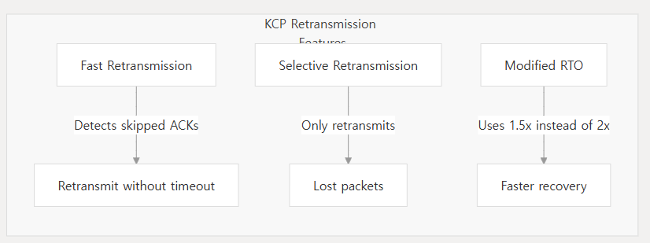

DeepWiki로 만든 것을 번역하였다.    
- https://deepwiki.com/jacking75/kcp/1-kcp-protocol-overview  
  
======================================

# KCP 프로토콜 개요

## 목적 및 범위
이 문서는 전통적인 TCP와 비교하여 지연 시간을 크게 줄이면서 신뢰성을 유지하도록 설계된 빠르고 안정적인 ARQ 프로토콜인 KCP(KCP Control Protocol)에 대한 소개를 제공한다. KCP의 핵심 개념, 아키텍처, 주요 기능 및 기본 사용 패턴을 다룬다. 자세한 구현 지침은 빠른 시작 가이드 및 API 참조를 참조하면 된다.

## KCP란 무엇인가?
KCP는 다음을 제공하는 경량화되고 고성능 신뢰성 전송 프로토콜이다:
- TCP에 비해 **평균 지연 시간 30-40% 감소**
- 손실이 많은 네트워크 환경에서 **최대 3배 낮은 최대 지연 시간**
- TCP와 유사한 **신뢰성**이지만 더 공격적이고 구성 가능한 재전송 전략 제공
- 모든 데이터그램 프로토콜(일반적으로 UDP)에서 작동하는 **전송 계층 독립적 설계**

이 프로토콜은 TCP에 비해 약 10-20% 추가 대역폭 사용이라는 트레이드오프로 이러한 이점을 달성하여, 응답성이 대역폭 효율성보다 더 중요한 지연 시간에 민감한 응용 프로그램에 이상적이다.

많은 네트워크 프로토콜이 모든 것을 함께 번들로 제공하는 것과 달리, KCP는 단 두 개의 파일(`ikcp.h` 및 `ikcp.c`)로 구성된 순수 알고리즘 구현으로, 기존 시스템에 통합하기가 매우 쉽고 이식성이 뛰어나다.

## 프로토콜 아키텍처
  
   
KCP 프로토콜 아키텍처 다이어그램  
  
KCP는 설계에서 명확한 관심사 분리를 따른다:
- **프로토콜 코어**: `ikcpcb`(KCP Control Block) 구조는 KCP 연결의 상태를 유지한다
- **애플리케이션 인터페이스**: `ikcp_send`, `ikcp_recv`, `ikcp_update`와 같이 KCP와 상호 작용하는 함수
- **전송 추상화**: KCP는 실제 네트워크 I/O를 처리하지 않고 패킷을 보내기 위한 콜백 메커니즘을 사용한다

이 설계를 통해 KCP는 핵심 성능 이점을 유지하면서 모든 전송 계층 및 애플리케이션 프레임워크와 통합될 수 있다.
   
   
## 데이터 흐름  
   
KCP 데이터 흐름 다이어그램

KCP의 데이터 흐름은 다음 단계를 따른다:
1. 애플리케이션 데이터가 `ikcp_send`에 전달되어 전송 대기열(`snd_queue`)에 저장된다
2. `ikcp_update` 함수는 전송 대기열에서 전송 버퍼(`snd_buf`)로 데이터를 이동시키고 패킷을 생성한다
3. 이러한 패킷은 사용자가 제공한 출력 콜백을 통해 전송된다
4. 수신 측은 `ikcp_input`을 통해 패킷을 받고, 수신 버퍼(`rcv_buf`)로 처리한다
5. 재정렬 및 검증 후, 데이터는 수신 대기열(`rcv_queue`)로 이동한다
6. 애플리케이션은 `ikcp_recv`를 통해 데이터를 검색한다
  
  
## 주요 기능

### 1. 지연 시간 대 처리량에 최적화
TCP가 처리량(단위 시간당 데이터 양)을 최대화하도록 설계된 반면, KCP는 지연 시간(개별 패킷이 도착하는 시간)을 최소화하는 데 중점을 둔다. 이러한 근본적인 설계 차이는 다음과 같이 비유할 수 있다:
- **TCP**: 대량의 물을 운반하는 넓고 느리게 움직이는 운하
- **KCP**: 더 적은 양을 더 빠르게 전달하는 좁고 빠르게 움직이는 개울

이 설계 철학은 응답성이 원시 대역폭보다 더 중요한 실시간 애플리케이션에 KCP를 이상적으로 만든다.

### 2. 고급 재전송 전략  
   
KCP 재전송 전략 다이어그램  

KCP는 손실이 많은 네트워크에서 성능을 향상시키기 위한 여러 전략을 구현한다:
- **RTO 계산**: 빠른 모드에서는 패킷 손실 후 RTO가 TCP의 2배가 아닌 1.5배만 증가하여 여러 손실 후 지연을 줄인다
- **선택적 재전송**: 손실된 패킷만 재전송되며, 종종 모든 후속 데이터를 재전송하는 TCP와는 다르다
- **빠른 재전송**: KCP는 순서가 맞지 않는 ACK를 통해 패킷 건너뛰기를 감지할 때 타임아웃을 기다리지 않고 재전송을 트리거할 수 있다

### 3. ACK 최적화
KCP는 확인 응답 처리에 두 가지 주요 개선 사항을 제공한다:
- **구성 가능한 ACK 지연**: TCP의 지연된 ACK(인식된 RTT를 증가시킴)와 달리, KCP는 즉각적인 ACK 전송을 허용한다
- **결합된 UNA+ACK**: 각 패킷에는 UNA 정보(특정 시퀀스 번호까지의 모든 패킷 수신 확인)와 특정 ACK 정보가 모두 포함되어 효율성이 향상된다

### 4. 유연한 흐름 제어
KCP는 여러 흐름 제어 옵션을 제공한다:
- **표준 흐름 제어**: TCP와 유사하게 송수신 윈도우 크기, 혼잡 및 슬로우 스타트를 고려한다
- **비양보 모드**: 지연 시간이 중요한 애플리케이션의 경우 혼잡 제어 및 슬로우 스타트를 우회하고 버퍼 용량만 사용할 수 있다

이러한 유연성을 통해 개발자는 특정 사용 사례에 맞게 최적화할 수 있다.

## 구성 옵션  
   
KCP 구성 옵션 다이어그램  
  
KCP는 성능을 미세 조정하기 위한 광범위한 구성 옵션을 제공한다:

| 매개변수 | 기능 | 설명 |
|---------|------|------|
| nodelay | Nagle 알고리즘 활성화/비활성화 | 0=비활성화(기본값), 1=활성화 |
| interval | 프로토콜 업데이트 간격 | 밀리초 단위(일반적으로 10-100ms) |
| resend | 빠른 재전송 공격성 | 0=끔, 2=중복 ACK 2개 후 재전송 |
| nc | 흐름 제어 모드 | 0=정상, 1=혼잡 제어 없음 |
| sndwnd | 송신 윈도우 크기 | 패킷 단위(기본값 32) |
| rcvwnd | 수신 윈도우 크기 | 패킷 단위(기본값 32) |
| mtu | 최대 전송 단위 | 기본값 1400 바이트 |
| rx_minrto | 최소 RTO | 재전송 전 최소 타임아웃 |

두 가지 일반적인 사전 설정 구성은 다음과 같다:
- **일반 모드**: `ikcp_nodelay(kcp, 0, 40, 0, 0)` - TCP와 유사한 동작
- **빠른 모드**: `ikcp_nodelay(kcp, 1, 10, 2, 1)` - 최소 지연 시간에 최적화

## 기본 사용법
KCP를 사용하기 위한 기본 워크플로우는 다음과 같다:
1. KCP 인스턴스 생성  
    ```
    ikcpcb *kcp = ikcp_create(conv, user);
    ```  
       
2. 출력 콜백 설정  
    ```
    int udp_output(const char *buf, int len, ikcpcb *kcp, void *user) {
        // Send data via UDP or other transport
    }
    kcp->output = udp_output;
    ```

3. KCP 상태 정기적 업데이트
    ```
    ikcp_update(kcp, millisec);
    ```  

4. 수신 패킷 처리  
    ```
    ikcp_input(kcp, received_udp_packet, received_udp_size);
    ```  
    
5. 애플리케이션 데이터 송수신
    ```
    ikcp_send(kcp, data, size);  // Send data
    ikcp_recv(kcp, buffer, size);  // Receive data  
    ```
  
더 자세한 사용 예제는 빠른 시작 가이드를 참조하면 된다.
   
  
## 성능 특성
KCP는 특히 손실이 많은 네트워크 조건에서 TCP와 같은 다른 신뢰성 있는 프로토콜에 비해 상당한 지연 시간 개선을 달성한다. 독립적인 벤치마크에 따르면:
- TCP에 비해 **평균 지연 시간 30-40% 감소**
- 네트워크 혼잡 동안 **최대 지연의 최대 3배 감소**
- ENet 및 UDT와 같은 대안보다 **패킷 손실로부터 더 빠른 복구**

이러한 이점은 무선(WiFi), 모바일(3G/4G) 및 혼잡한 공용 네트워크와 같은 까다로운 네트워크 환경에서 특히 두드러진다.

트레이드오프는 TCP에 비해 대역폭 사용량이 10-20% 증가하는 것인데, 이는 응답성이 중요한 애플리케이션에서는 일반적으로 허용 가능하다.
  

## 사용 사례
KCP는 다음과 같은 경우에 특히 적합하다:
- 최소한의 입력 지연이 필요한 **실시간 멀티플레이어 게임**
- **라이브 비디오/오디오 스트리밍** 애플리케이션
- 응답성이 중요한 **대화형 원격 애플리케이션**
- 신뢰할 수 없는 네트워크에서 작동하는 **IoT 애플리케이션**
- 성능 향상이 필요한 **VPN 및 터널링 서비스**
  
이 프로토콜은 인기 있는 온라인 게임, 스트리밍 플랫폼 및 네트워킹 도구를 포함하여 수백만 명의 사용자가 있는 수많은 고프로파일 애플리케이션에 성공적으로 배포되었다.
   
특정 사용 사례에 대한 성능 튜닝에 대한 자세한 내용은 구성 가이드 및 성능 튜닝을 참조하면 된다.
  

## 요약
KCP는 신뢰성을 유지하면서 전통적인 TCP에 비해 지연 시간을 크게 줄이는 경량화되고 고성능 신뢰성 전송 프로토콜을 제공한다. 고급 재전송 전략, 최적화된 확인 응답 처리 및 유연한 흐름 제어를 구현하여 KCP는 까다로운 네트워크 조건에서 우수한 성능을 달성한다.

모듈화되고 전송에 구애받지 않는 설계로 기존 시스템에 쉽게 통합할 수 있으며, 광범위한 구성 옵션을 통해 특정 애플리케이션 요구 사항에 맞게 미세 조정할 수 있다.

구현 세부 사항에 대한 자세한 정보는 프로토콜 아키텍처를 참조하고, API 문서는 API 참조를 참조하면 된다.  
    
   
<br>  

# KCP 빠른 시작 가이드

## KCP란 무엇인가?
KCP는 경량화되고, 빠르며, 신뢰할 수 있는 ARQ 프로토콜이다. TCP보다 30-40% 낮은 지연 시간을 달성하는 대신 10-20% 더 많은 대역폭을 사용한다. 전체 구현은 단 두 개의 파일(`ikcp.h`와 `ikcp.c`)로 구성되어 있어 어떤 프로젝트에도 쉽게 통합할 수 있다.

## 기본 통합 흐름
  
 

### 1단계: KCP 객체 생성

```
// Initialize KCP object
// conv: conversation ID (must match on both endpoints)
// user: pointer for callbacks
ikcpcb *kcp = ikcp_create(conv, user);
```     
  
`conv` 매개변수는 통신하는 양쪽 엔드포인트에서 동일해야 하는 세션 식별자이다. `user` 매개변수는 콜백에 전달되어 컨텍스트를 제공하는 포인터이다.   
  
### 2단계: 출력 콜백 설정
  
```
// Define your network output function
int udp_output(const char *buf, int len, ikcpcb *kcp, void *user)
{
    // Send the packet via your transport (e.g., UDP)
    // Return 0 on success, negative on error
}

// Set the callback
kcp->output = udp_output;
```    
이 콜백은 중요하다 - KCP가 기본 전송을 통해 패킷을 보내는 방법이다. KCP는 순수하게 프로토콜 로직에 집중하고 실제 네트워크 I/O는 애플리케이션에 위임한다.  
    
### 3단계: KCP 상태 업데이트
  
```
// Call regularly with current timestamp in milliseconds
ikcp_update(kcp, current_millisec);
```    
이 함수를 주기적으로(10-100ms마다) 호출하여 재전송, 확인 응답, 윈도우 업데이트를 처리하는 KCP의 내부 상태 기계를 구동해야 한다.

### 4단계: 입력 패킷 처리
  
```
// When you receive a packet from your transport
ikcp_input(kcp, received_packet_data, received_packet_size);
```    
전송 계층에서 들어오는 모든 패킷을 이 함수를 통해 KCP에 전달한다.  

### 5단계: 데이터 송수신

데이터 보내기:
```
// Send data reliably
int result = ikcp_send(kcp, data_buffer, data_length);
```

데이터 받기:
```
// Check if data is available
int size = ikcp_peeksize(kcp);
if (size > 0) {
    // Buffer must be at least 'size' bytes
    char *buffer = malloc(size);
    // Receive data
    int received = ikcp_recv(kcp, buffer, size);
    // Process data...
    free(buffer);
}
```
  

## KCP의 데이터 흐름
이 다이어그램은 KCP 프로토콜을 통해 데이터가 어떻게 흐르는지 보여준다:  

 

## 구성 옵션

### Nodelay 모드
  
```
int ikcp_nodelay(ikcpcb *kcp, int nodelay, int interval, int resend, int nc);
```  
    
매개변수:
- `nodelay`: 노딜레이 모드 활성화(1) 또는 비활성화(0)
- `interval`: 내부 업데이트 간격(밀리초, 10-100)
- `resend`: 빠른 재전송 모드(0=비활성화, 2=빠름)
- `nc`: 혼잡 제어(0=활성화, 1=비활성화)

일반적인 프리셋:
- 표준 모드: `ikcp_nodelay(kcp, 0, 40, 0, 0);`
- 빠른 모드: `ikcp_nodelay(kcp, 1, 10, 2, 1);`
 
### 윈도우 크기
  
```
int ikcp_wndsize(ikcpcb *kcp, int sndwnd, int rcvwnd);
```    
최대 송신 및 수신 윈도우 크기 설정(기본값: 32). 더 큰 윈도우는 메모리 사용량이 증가하는 대신 처리량을 향상시킬 수 있다.

### MTU 크기
  
```
int ikcp_setmtu(ikcpcb *kcp, int mtu);
```    
최대 전송 단위 크기 설정(기본값: 1400바이트). IP 단편화를 피하기 위해 네트워크에 맞게 조정한다.
  

## 완전한 통합 예제
다음은 애플리케이션에 KCP를 통합하는 완전한 예제이다:  
```
// 1. Create KCP object
ikcpcb *kcp = ikcp_create(0x12345678, user_context);

// 2. Set output callback
kcp->output = udp_output_function;

// 3. Configure KCP (optional)
ikcp_nodelay(kcp, 1, 10, 2, 1);  // Fast mode
ikcp_wndsize(kcp, 128, 128);     // Larger window
ikcp_setmtu(kcp, 1400);          // Default MTU

// 4. Main application loop
while (running) {
    // Get current timestamp
    uint32_t current = get_current_millisec();
    
    // Process any received UDP packets
    while (udp_packet_available()) {
        char buffer[1500];
        int size = receive_udp_packet(buffer);
        ikcp_input(kcp, buffer, size);
    }
    
    // Send data if needed
    if (data_to_send_available()) {
        ikcp_send(kcp, data, data_size);
    }
    
    // Check for received data
    int peek_size;
    while ((peek_size = ikcp_peeksize(kcp)) > 0) {
        char *recv_buffer = malloc(peek_size);
        int recv_size = ikcp_recv(kcp, recv_buffer, peek_size);
        if (recv_size > 0) {
            process_received_data(recv_buffer, recv_size);
        }
        free(recv_buffer);
    }
    
    // Update KCP state
    ikcp_update(kcp, current);
    
    // Sleep for a short time
    sleep_milliseconds(10);
}

// 5. Cleanup
ikcp_release(kcp);
```  
  
  
## KCP 제어 블록의 주요 구성 요소
`ikcpcb` 구조체는 KCP의 기능을 구동하는 몇 가지 중요한 구성 요소를 포함한다:

| 구성 요소 | 설명 |
|-----------|------|
| conv | 연결을 식별하는 대화 ID |
| mtu, mss | 최대 전송 단위 및 세그먼트 크기 |
| snd_una | 가장 오래된 확인되지 않은 패킷 시퀀스 번호 |
| snd_nxt | 다음으로 보낼 패킷 시퀀스 번호 |
| rcv_nxt | 다음으로 받을 것으로 예상되는 패킷 시퀀스 번호 |
| snd_wnd, rcv_wnd | 송신 및 수신 윈도우 크기 |
| cwnd | 혼잡 윈도우 크기 |
| snd_queue, rcv_queue | 애플리케이션 데이터 큐 |
| snd_buf, rcv_buf | 전송 중인 패킷 버퍼 |
| output | 출력 콜백을 위한 함수 포인터 |
  

## 중요한 팁
- **정기적인 업데이트**: 유휴 상태에서도 구성한 간격(10-100ms)으로 `ikcp_update`를 호출한다.
- **타임스탬프 정확도**: `ikcp_update`에 정확한 밀리초 타임스탬프를 제공한다.
- **반환 값 확인**: 오류 조건을 확인하기 위해 항상 KCP 함수의 반환 값을 확인한다.
- **버퍼 관리**: KCP는 애플리케이션 버퍼를 관리하지 않는다; 적절한 할당과 해제를 보장한다.
- **ikcp_peeksize**: 수신하기 전에 다음 메시지의 크기를 결정하기 위해 이 함수를 사용한다.

더 자세한 튜닝 정보는 `구성 가이드`를 참조한다.
  

## 다음 단계
더 자세한 정보는 다음을 참조한다:
- KCP의 내부 메커니즘에 대한 자세한 내용은 `프로토콜 아키텍처`
- 모든 함수에 대한 포괄적인 문서는 `API 참조`
- KCP가 네트워크 혼잡을 관리하는 방법에 대한 통찰력은 `흐름 제어 및 혼잡 제어`


<br>  
  
# 프로토콜 아키텍처

## 소개
KCP는 UDP와 같은 신뢰할 수 없는 데이터그램 기반 프로토콜 위에서 작동하도록 설계된 경량화되고 신뢰할 수 있는 전송 프로토콜이다. TCP가 처리량을 최적화하는 것과 달리, KCP는 빠른 재전송, 선택적 승인, 구성 가능한 혼잡 제어와 같은 혁신적인 메커니즘을 통해 30-40% 낮은 평균 지연 시간을 달성하면서 신뢰성을 유지하는 데 우선순위를 둔다.

이 프로토콜은 외부 종속성 없이 단 두 개의 파일(ikcp.h 및 ikcp.c)로 구현되어 있어 기존 네트워크 스택에 쉽게 통합할 수 있다.

## 프로토콜 계층화
KCP는 응용 프로그램과 기본 신뢰할 수 없는 전송 프로토콜(일반적으로 UDP) 사이의 중간 계층으로 작동한다. 전통적인 소켓 API와 달리 KCP는 실제 네트워크 I/O 작업을 직접 처리하지 않고 패킷을 보내기 위한 콜백에 의존하며 외부 타이밍 메커니즘이 필요하다.

 
  

## 핵심 구성 요소
KCP 아키텍처는 신뢰할 수 있는 데이터 전송을 제공하기 위해 함께 작동하는 여러 핵심 구성 요소로 구성된다:

 
  
주요 구성 요소는 다음과 같다:  
- **KCP 제어 블록(`ikcpcb`)**: 연결 상태를 보유하는 중앙 데이터 구조
- **송신 큐(`snd_queue`)**: 전송 전 송신 데이터 저장
- **수신 큐(`rcv_queue`)**: 응용 프로그램이 소비할 준비가 된 정렬된 데이터 저장
- **송신 버퍼(`snd_buf`)**: 승인될 때까지 전송된 세그먼트 보유
- **수신 버퍼(`rcv_buf`)**: 순서가 맞지 않는 세그먼트를 임시로 저장
  

## 패킷 구조
KCP는 24바이트 헤더와 선택적 데이터 페이로드로 구성된 모든 메시지에 대해 단일 통합 패킷 형식을 사용한다:
  
   
  
### 헤더 필드

| 필드 | 크기 | 설명 |
|------|------|------|
| conv | 4 바이트 | 대화 ID - 연결을 식별 |
| cmd | 1 바이트 | 명령 유형 (PUSH=81, ACK=82, WASK=83, WINS=84) |
| frg | 1 바이트 | 조각 개수 (0 = 마지막 조각) |
| wnd | 2 바이트 | 광고된 수신 윈도우 크기 |
| ts | 4 바이트 | 타임스탬프 - RTT 계산에 사용 |
| sn | 4 바이트 | 이 패킷의 시퀀스 번호 |
| una | 4 바이트 | 첫 번째 미확인 시퀀스 번호 |
| len | 4 바이트 | 데이터 페이로드의 길이 |

KCP 헤더는 항상 24바이트(`IKCP_OVERHEAD`)이며, 전체 패킷 크기는 구성된 MTU(기본값 1400바이트)로 제한된다.
  

## 프로토콜을 통한 데이터 흐름
KCP의 데이터 흐름은 데이터를 보내고, 승인하고, 받는 사이클이다:
  
    


### 송신 경로
1. 응용 프로그램이 전송할 데이터와 함께 `ikcp_send()`를 호출한다
2. 필요한 경우 데이터가 조각화되어 `snd_queue`에 추가된다
3. `ikcp_update()` 동안 `snd_queue`에서 세그먼트가 `snd_buf`로 이동한다
4. `ikcp_flush()`가 이러한 세그먼트를 형식화하고 출력 콜백을 호출한다
5. 전송 계층이 패킷을 전달한다

### 수신 경로
1. 전송 계층이 패킷을 수신하고 `ikcp_input()`에 전달한다
2. KCP가 패킷을 처리하여 ACK 및 데이터 세그먼트를 처리한다
3. 데이터 세그먼트는 `rcv_buf`에 배치된다
4. 순서가 맞는 세그먼트는 `rcv_queue`로 이동한다
5. 응용 프로그램이 데이터를 검색하기 위해 `ikcp_recv()`를 호출한다
  

## 상태 기계 및 작동
KCP의 작동은 프로토콜 타이밍을 유지하기 위해 정기적으로(일반적으로 10-100ms마다) 호출해야 하는 `ikcp_update()` 함수에 의해 구동된다. 이 함수는 상태 기계를 구동하고 필요한 패킷 전송 및 재전송을 트리거한다.
  
   
   

주요 작동 단계는 다음과 같다:

1. **생성**: 응용 프로그램이 `ikcp_create()`로 KCP 인스턴스를 생성한다
2. **초기화**: 응용 프로그램이 `ikcp_setoutput()`으로 출력 콜백을 설정한다
3. **주기적 업데이트**: 응용 프로그램이 현재 시간으로 `ikcp_update()`를 정기적으로 호출한다
4. **송신 프로세스**: 응용 프로그램이 전송할 데이터를 큐에 넣기 위해 `ikcp_send()`를 호출한다
5. **수신 프로세스**: 네트워크에서 데이터가 도착하면 응용 프로그램이 `ikcp_input()`을 호출한다
6. **데이터 검색**: 응용 프로그램이 수신된 데이터를 검색하기 위해 `ikcp_recv()`를 호출한다
7. **종료**: 응용 프로그램이 리소스를 정리하기 위해 `ikcp_release()`를 호출한다
  

## 핵심 메커니즘
KCP는 지연 시간을 최소화하면서 신뢰성을 제공할 수 있는 몇 가지 중요한 메커니즘을 구현한다:

### 1. ARQ (Automatic Repeat reQuest)
KCP는 선택적 승인 ARQ 시스템을 구현한다:
- 각 전송된 세그먼트에는 고유한 시퀀스 번호가 있다
- 수신자는 전용 ACK 패킷을 통해 세그먼트를 확인한다
- 미확인 세그먼트는 타임아웃 후 또는 빠른 재전송 트리거에 의해 재전송된다
- TCP와 달리 KCP는 손실 후 모든 세그먼트가 아닌 손실된 세그먼트만 재전송한다
  

### 2. 빠른 재전송
패킷이 손실될 가능성이 있을 때 KCP는 빠르게 재전송할 수 있다:
  
   

송신자가 특정 시퀀스 번호를 건너뛰는 여러 ACK를 수신하면 타임아웃을 기다리지 않고 누락된 패킷을 빠르게 식별하고 재전송할 수 있다.  
  

### 3. 흐름 제어 및 혼잡 제어
KCP는 윈도우 기반 흐름 및 혼잡 제어 시스템을 구현한다:

**흐름 제어**: 송신자가 수신자를 압도하지 않도록 보장한다
- 수신자는 윈도우 크기(`rcv_wnd`)를 광고한다
- 송신자는 이 윈도우를 존중하고 수신자가 처리할 수 있는 것보다 더 많이 보내지 않는다

**혼잡 제어**: 네트워크 혼잡을 방지한다
- 느린 시작 및 혼잡 회피가 있는 TCP와 유사한 체계 사용
- 네트워크 조건에 따라 조정할 수 있는 혼잡 윈도우(`cwnd`)를 유지한다
- 지연 시간에 민감한 응용 프로그램의 경우 `nocwnd` 매개변수로 선택적으로 비활성화할 수 있다
  

### 4. RTO (Retransmission Timeout) 관리
KCP는 측정된 RTT를 기반으로 RTO를 동적으로 조정한다:
- 평활화된 RTT(`rx_srtt`) 및 RTT 변동(`rx_rttval`)을 유지한다
- TCP와 유사한 공식을 사용하지만 구성 가능한 매개변수로 RTO를 계산한다
- 표준 모드에서 최소 RTO는 100ms이다
- nodelay 모드에서 최소 RTO는 30ms로 감소한다
- 다양한 네트워크 시나리오에 맞게 수동으로 구성할 수 있다
  

## 구성 옵션
KCP는 다양한 시나리오에 대한 성능을 최적화하기 위한 몇 가지 구성 옵션을 제공한다:

### 1. nodelay 매개변수
  
```
int ikcp_nodelay(ikcpcb *kcp, int nodelay, int interval, int resend, int nc)
```  
    
| 매개변수 | 설명 |
|----------|------|
| nodelay | 0=비활성화(기본값), 1=nodelay 모드 활성화 |
| interval | 밀리초 단위의 업데이트 간격(10-100ms) |
| resend | 빠른 재전송 트리거 임계값(0=끔, 2=권장) |
| nc | 혼잡 제어 없음(0=정상, 1=혼잡 제어 비활성화) |
  

### 2. 프리셋 모드
KCP는 여러 가지 프리셋 작동 모드를 제공한다:

| 모드 | 구성 | 특성 |
|------|------|------|
| 기본 | nodelay(0, 40, 0, 0) | TCP와 유사한 동작 |
| 일반 | nodelay(0, 30, 2, 1) | 개선된 지연 시간 |
| 빠름 | nodelay(1, 20, 2, 1) | 가장 낮은 지연 시간, 더 많은 대역폭 사용 |
  

### 3. 윈도우 크기
  
```
int ikcp_wndsize(ikcpcb *kcp, int sndwnd, int rcvwnd)
```    
최대 송신 및 수신 윈도우 크기를 설정한다(기본값 32 패킷).
  

## 응용 프로그램과의 통합
KCP는 전송에 구애받지 않도록 설계되었으며 응용 프로그램의 네트워크 I/O 시스템과의 통합이 필요하다:
  
   
  
일반적인 통합 단계는 다음과 같다:

1. `ikcp_create()`로 KCP 인스턴스 생성
2. `ikcp_setoutput()`으로 출력 콜백 설정
3. `ikcp_update()`를 정기적으로 호출하기 위한 타이머 설정
4. 응용 프로그램이 데이터를 보내고 싶을 때 `ikcp_send()` 호출
5. UDP 패킷이 수신되면 `ikcp_input()` 호출
6. 수신된 데이터를 검색하기 위해 주기적으로 `ikcp_recv()` 호출
7. 완료되면 리소스를 해제하기 위해 `ikcp_release()` 호출

KCP는 패킷 전송을 직접 처리하지 않는다 - 응용 프로그램은 출력 콜백을 기반으로 실제 네트워크 I/O 작업을 구현해야 한다.

## 결론
KCP의 아키텍처는 지연 시간을 최소화하면서 신뢰할 수 없는 전송을 통한 신뢰성을 제공한다. 신중한 흐름 제어, 빠른 재전송 및 구성 가능한 작동 모드를 통해 KCP는 많은 대화형 응용 프로그램에서 TCP보다 더 나은 성능을 달성한다.

프로토콜의 경량 구현(단 두 개의 소스 파일)은 여전히 강력한 전송 기능을 제공하면서 프로젝트에 쉽게 통합할 수 있다.

특정 API 세부 정보 및 사용 예제는 `API 참조`를 참조하라.  
  
  
<br>  
  
# 패킷 구조

## 개요
KCP는 데이터 전송 및 제어 메시지를 포함한 모든 유형의 메시지에 대해 통합된 패킷 형식을 사용한다. 코드에서는 "세그먼트"라고도 불리는 단일 패킷 구조를 사용한다. 모든 패킷 유형은 동일한 헤더 형식을 공유하며, 데이터 패킷의 경우 선택적 데이터 페이로드가 있다.  
   
  

## 헤더 구조
KCP 패킷 헤더는 24바이트 길이로, 프로토콜의 신뢰성, 순서 지정 및 흐름 제어 메커니즘을 제어하는 여러 필드를 포함한다.

헤더의 각 필드는 프로토콜에서 특정 목적을 가진다:

| 필드 | 크기 | 설명 |
|------|------|------|
| conv | 4 바이트 | 대화 ID - 연결을 식별 |
| cmd | 1 바이트 | 명령 유형 - 패킷 목적을 나타냄 |
| frg | 1 바이트 | 조각 - 메시지에 남은 조각 수 |
| wnd | 2 바이트 | 윈도우 크기 - 사용 가능한 수신 윈도우를 알림 |
| ts | 4 바이트 | 타임스탬프 - RTT 계산에 사용 |
| sn | 4 바이트 | 일련 번호 - 패킷의 고유 식별자 |
| una | 4 바이트 | 미확인 - 가장 초기의 미확인 패킷 |
| len | 4 바이트 | 길이 - 데이터 페이로드의 크기 |

## 메모리 레이아웃
KCP 패킷의 정확한 바이트 레이아웃은 다음과 같다:  
   
  

## 필드 상세 정보

### Conversation(대화) ID (conv)
Conversation ID는 KCP 연결을 고유하게 식별하는 32비트 정수이다. 동일한 연결의 모든 패킷은 동일한 Conversation ID를 공유한다. 이 필드는 단일 UDP 소켓을 통해 여러 연결을 다중화할 수 있게 한다.

실제로 대화 ID는 종종 양쪽 엔드포인트의 식별자를 포함하는 구조를 가진다:
- 상위 16비트: 호출자의 인덱스
- 하위 16비트: 수신자의 인덱스

### Commnad(명령) (cmd)

명령 필드는 패킷의 유형을 지정한다. KCP는 네 가지 명령 유형을 정의한다:

| 명령 | 값 | 설명 |
|------|------|------|
| IKCP_CMD_PUSH | 81 | 데이터 패킷 |
| IKCP_CMD_ACK | 82 | 확인 응답 |
| IKCP_CMD_WASK | 83 | 윈도우 프로브 (피어의 윈도우 크기 요청) |
| IKCP_CMD_WINS | 84 | 윈도우 크기 알림 |
  

### Fragment(조각) (frg)
조각 필드는 다중 패킷 메시지에서 얼마나 많은 조각이 더 따르는지 나타낸다. 단일 패킷 메시지나 다중 패킷 메시지의 마지막 조각의 경우 이 값은 0이다.

- 조각화되지 않은 메시지의 경우: frg = 0
- N개의 조각으로 나눠진 메시지의 경우:
  - 첫 번째 조각: frg = N-1
  - 두 번째 조각: frg = N-2
  - ...
  - 마지막 조각: frg = 0

이를 통해 수신자는 조각화된 메시지를 올바르게 재조립할 수 있다.
  

### 윈도우 크기 (wnd)
윈도우 크기 필드는 수신자의 버퍼에 남아 있는 공간을 알려주며, 수신자의 버퍼가 가득 차기 전에 발신자가 전송할 수 있는 패킷 수를 나타낸다.
  

### 타임스탬프 (ts)
타임스탬프 필드는 왕복 시간(RTT) 계산에 사용된다. 수신자가 패킷을 확인할 때 원래 타임스탬프를 다시 보내어 발신자가 RTT를 계산할 수 있게 한다.
  

### 일련 번호 (sn)
일련 번호는 시퀀스에서 각 패킷을 고유하게 식별한다. 패킷 손실을 감지하고, 재전송을 처리하며, 순서대로 전달을 보장하는 데 사용된다.
  

### 미확인 (una)
미확인 필드는 아직 확인되지 않은 가장 초기의 시퀀스 번호를 포함한다. 이는 수신자가 발신자가 아직 추적 중인 패킷을 이해하는 데 도움이 된다.
  

### 길이 (len)
길이 필드는 데이터 페이로드의 크기를 바이트 단위로 나타낸다. 페이로드가 없는 제어 패킷의 경우 이 값은 0이다.
  

## 패킷 유형 및 기능
  
    

### PUSH 패킷
PUSH 패킷(cmd = 81)은 발신자에서 수신자로 실제 데이터를 전달한다. 이들은 다음을 포함한다:
- 모든 필드가 있는 전체 헤더
- 데이터 페이로드(len 필드로 지정됨)

수신자는 ACK 패킷을 보내 PUSH 패킷을 확인한다.

### ACK 패킷
ACK 패킷(cmd = 82)은 PUSH 패킷의 수신을 확인한다. 이들은 다음을 포함한다:
- 전체 헤더(데이터 필드는 확인된 패킷과 관련됨)
- 데이터 페이로드 없음(len = 0)

ACK 패킷의 sn 필드는 확인된 PUSH 패킷의 시퀀스 번호를 포함한다.

### 윈도우 프로브 패킷 (WASK)
WASK 패킷(cmd = 83)은 발신자의 윈도우가 가득 차고 수신자에게 더 많은 공간이 있는지 알아야 할 때 보내진다. 이들은 다음을 포함한다:
- 전체 헤더
- 데이터 페이로드 없음(len = 0)

### 윈도우 업데이트 패킷 (WINS)
WINS 패킷(cmd = 84)은 수신자의 현재 윈도우 크기에 대해 발신자에게 알린다. 이들은 다음을 포함한다:
- 전체 헤더(wnd 필드 업데이트됨)
- 데이터 페이로드 없음(len = 0)
  

## 인코딩 및 디코딩
KCP 패킷은 바이트 단위로 인코딩 및 디코딩된다. 프로토콜은 다른 시스템 간의 호환성을 보장하기 위해 엔디안 문제를 처리한다.

### 인코딩 프로세스
인코딩 프로세스는 각 필드를 바이트 시퀀스로 변환하고 출력 버퍼에 추가한다:
1. conversation(대화) ID 인코딩(4 바이트)
2. 명령 인코딩(1 바이트)
3. 조각 수 인코딩(1 바이트)
4. 윈도우 크기 인코딩(2 바이트)
5. 타임스탬프 인코딩(4 바이트)
6. 일련 번호 인코딩(4 바이트)
7. 미확인 인코딩(4 바이트)
8. 길이 인코딩(4 바이트)
9. 데이터 추가(있는 경우)
  
### 디코딩 프로세스
디코딩 프로세스는 바이트 시퀀스에서 각 필드를 추출한다:
1. conversation ID 디코딩(4 바이트)
2. 명령 디코딩(1 바이트)
3. 조각 수 디코딩(1 바이트)
4. 윈도우 크기 디코딩(2 바이트)
5. 타임스탬프 디코딩(4 바이트)
6. 일련 번호 디코딩(4 바이트)
7. 미확인 디코딩(4 바이트)
8. 길이 디코딩(4 바이트)
9. 데이터 처리(있는 경우)
  

## 코드에서의 처리
KCP 구현에서 패킷 처리와 가장 관련된 함수는 다음과 같다:
- `ikcp_encode_seg`: 세그먼트를 바이트로 인코딩
- `ikcp_input`: 들어오는 패킷 처리
- `ikcp_parse_data`: 수신된 데이터 패킷 처리
- `ikcp_flush`: 대기 중인 패킷 전송
  
 
  

## 결론
KCP 패킷 구조는 UDP와 같은 신뢰할 수 없는 전송 프로토콜을 통해 신뢰할 수 있고, 순서가 지정되며, 흐름이 제어되는 통신을 지원하도록 설계되었다. 통합된 패킷 형식은 프로토콜이 효과적으로 기능하는 데 필요한 모든 정보를 제공하면서 구현을 단순화한다.  


<br>  

# 흐름 제어 및 혼잡 제어
이 페이지는 KCP가 흐름 제어 및 혼잡 제어 메커니즘을 처리하여 TCP와 같은 전통적인 프로토콜보다 낮은 지연 시간을 달성하면서 신뢰할 수 있는 데이터 전송을 유지하는 방법을 설명한다. 이러한 시스템은 네트워크 혼잡을 방지하고 다양한 네트워크 조건에서 최적의 성능을 보장하는 데 중요하다.

패킷 구조 및 프로토콜 세부 정보에 대한 정보는 [패킷 구조]를 참조한다.

## 흐름 제어 및 혼잡 제어 개요
흐름 제어와 혼잡 제어는 신뢰할 수 있는 전송 프로토콜에서 다르지만 상호 보완적인 목적을 제공한다:

**흐름 제어**: 수신자의 용량에 기반하여 전송 중인 데이터의 양을 제한함으로써 수신자가 과부하되는 것을 방지한다.

**혼잡 제어**: 네트워크 조건에 따라 전송 속도를 조정하여 네트워크가 과부하되는 것을 방지한다.

KCP는 지연 시간을 줄이면서 신뢰성을 유지하는 목표를 달성하는 데 도움이 되는 몇 가지 고유한 최적화를 통해 두 메커니즘을 모두 구현한다.
  
   
  

## KCP의 흐름 제어
KCP는 TCP와 유사한 슬라이딩 윈도우 메커니즘을 사용하지만, 지연 시간 감소를 위한 몇 가지 최적화가 있다.

### 윈도우 관리
KCP는 세 가지 주요 윈도우 매개변수를 유지한다:

**송신 윈도우**(snd_wnd): 송신자가 전송할 수 있는 패킷 수를 제한한다.

**수신 윈도우**(rcv_wnd): 수신자가 수락할 수 있는 패킷 수를 제한한다.

**원격 윈도우**(rmt_wnd): 수신자가 공지한 윈도우 크기이다.

유효 윈도우 크기는 이들 값의 최소값으로 계산된다.

   
 

### 윈도우 프로빙
원격 윈도우 크기가 0일 때, KCP는 윈도우 프로빙 상태로 전환한다:
- 지수 백오프가 있는 프로브 타이머를 설정한다.
- 윈도우 프로브 명령(IKCP_CMD_WASK)을 보낸다.
- 윈도우 크기 업데이트(IKCP_CMD_WINS)를 기다린다.

이 메커니즘은 임시 수신 버퍼 가득 참 상태 이후에 전송이 재개될 수 있도록 보장한다.

 

### 흐름 제어 구성
송신 및 수신 윈도우 크기를 설정하여 KCP의 흐름 제어를 구성할 수 있다:  
```
int ikcp_wndsize(ikcpcb *kcp, int sndwnd, int rcvwnd);
```  
  
KCP의 기본 윈도우 크기는 다음과 같다:
- 기본 송신 윈도우: 32 패킷
- 기본 수신 윈도우: 128 패킷(최대 조각 크기 이상이어야 함)

  
## KCP의 혼잡 제어
KCP의 혼잡 제어는 TCP 접근 방식을 기반으로 하지만 지연 시간에 민감한 애플리케이션을 위해 수정하거나 비활성화하는 옵션을 포함한다.

### 표준 혼잡 제어
표준 모드에서 작동할 때, KCP는 TCP와 유사한 혼잡 제어를 구현한다:

**슬로우 스타트**: 슬로우 스타트 임계값에 도달할 때까지 혼잡 윈도우를 지수적으로 증가시킨다.

**혼잡 회피**: 임계값 이후 혼잡 윈도우를 선형적으로 증가시킨다.

**빠른 복구**: 패킷 손실 감지 시 윈도우를 줄인다.
  
   
  
### 빠른 재전송
KCP의 빠른 재전송 메커니즘은 TCP보다 더 적극적이다:

- 패킷이 "건너뛰어진"(순서에 맞지 않게 확인됨) 횟수를 추적한다.
- 건너뛰기 횟수가 구성된 임계값에 도달하면(기본값: 0, 비활성화):
  - RTO를 기다리지 않고 즉시 패킷을 재전송한다.
  - 혼잡 제어 매개변수를 업데이트한다.

이는 패킷 손실 후 복구 시간을 크게 줄인다.
  
   


### 후퇴하지 않는 혼잡 제어
KCP의 고유한 기능 중 하나는 `nc` 매개변수를 사용하여 전통적인 혼잡 제어를 비활성화하는 기능이다:

- `nc = 0`(기본값): 표준 TCP와 유사한 혼잡 제어를 사용한다.
- `nc = 1`: 혼잡 제어를 비활성화한다.
  - 흐름 제어(snd_wnd, rcv_wnd)만 전송을 제한한다.
  - 패킷 손실 시 백오프하지 않는다.
  - 공정성을 낮은 지연 시간으로 교환한다.

이 모드는 제어된 환경에서 지연 시간에 민감한 애플리케이션에 적합하다.
  
     
  
  
## RTO 계산 및 백오프 전략
KCP의 RTO(재전송 타임아웃) 계산은 TCP와 유사하지만 구성 옵션을 제공한다:

### RTO 계산

KCP는 평활화된 RTT와 RTT 변동 공식을 사용한다:  
```
SRTT = (7 * SRTT + RTT) / 8
RTTVAR = (3 * RTTVAR + |RTT - SRTT|) / 4
RTO = SRTT + max(interval, 4 * RTTVAR)
```  
  
RTO는 `rx_minrto`와 `IKCP_RTO_MAX`(60000ms) 사이로 제한된다.

  
### RTO 백오프 전략
TCP와의 한 가지 주요 차이점은 재전송 시 RTO가 증가하는 방식이다:
- **TCP**: 재전송 시 RTO를 두 배로 늘린다(RTO *= 2)
- **일반 모드의 KCP**: RTO = max(RTO, rx_rto) - 더 점진적인 증가
- **nodelay 모드의 KCP**: RTO += RTO/2 - 더욱 보수적임

이러한 덜 적극적인 백오프 전략은 KCP가 일시적인 네트워크 문제에서 더 빠르게 복구하는 데 도움이 된다.
  
     

  
## 구성 옵션
KCP는 흐름 및 혼잡 제어를 미세하게 조정하기 위한 유연한 구성 인터페이스를 제공한다:

### Nodelay 구성
`ikcp_nodelay` 함수는 KCP의 전송 동작을 구성하는 주요 방법이다:  
```
int ikcp_nodelay(ikcpcb *kcp, int nodelay, int interval, int resend, int nc);
```  
  
- nodelay: nodelay 모드 활성화(1) 또는 비활성화(0)
- interval: 밀리초 단위의 업데이트 간격(플러시 빈도에 영향)
- resend: 빠른 재전송 임계값(0은 빠른 재전송 비활성화)
- nc: 일반 혼잡 제어(0) 또는 혼잡 제어 없음(1)
  

### 프리셋 모드
KCP는 세 가지 프리셋 구성을 제공한다:

| 모드 | 구성 | 설명 |
|------|------|------|
| 기본 | nodelay(0, 40, 0, 0) | 신뢰성 우선의 TCP와 유사한 동작 |
| 일반 | nodelay(0, 30, 2, 1) | 개선된 지연 시간을 가진 균형 모드 |
| 빠름 | nodelay(1, 20, 2, 1) | 가장 낮은 지연 시간 모드, 더 많은 대역폭을 사용할 수 있음 |

  
### 윈도우 크기 구성
윈도우 크기는 애플리케이션 요구 사항에 맞게 구성할 수 있다:  
```
int ikcp_wndsize(ikcpcb *kcp, int sndwnd, int rcvwnd);
```  
  
더 큰 윈도우는 처리량을 향상시키지만 더 많은 메모리를 소비한다. 수신 윈도우는 최대 조각 크기 이상이어야 한다.
  
  
## 구현 세부 사항

### 데이터 구조
KCP는 흐름 및 혼잡 제어를 위해 여러 주요 구조와 필드를 사용한다.  
  
     
  
  
### 주요 알고리즘

#### 윈도우 업데이트 및 처리
- 수신자는 각 패킷에서 윈도우 크기를 공지한다.
- 원격 윈도우가 0일 때 윈도우 프로빙이 사용된다.
- 데이터 전송은 모든 윈도우 제약 조건의 최소값을 준수한다.
  
  
#### 혼잡 윈도우 업데이트
새로운 확인응답이 수신될 때 혼잡 윈도우가 업데이트된다.

   
  
#### 빠른 재전송 처리
동일한 패킷에 대해 반복된 ACK가 수신될 때(새로운 패킷을 "순서에 맞지 않게" 만듦):
- 확인된 모든 패킷에 대해 `fastack` 카운터가 증가한다.
- 이 카운터가 임계값을 초과하면 패킷이 재전송된다.
- 혼잡 제어 매개변수가 업데이트된다.
  
  
## 성능 고려 사항

### 대역폭 대 지연 시간 트레이드오프
KCP의 흐름 및 혼잡 제어 접근 방식에는 트레이드오프가 관련되어 있다:
- **기본 모드**는 대역폭 효율성이 더 높지만 지연 시간이 더 높다.
- **빠른 모드**는 지연 시간이 낮지만 더 많은 대역폭을 사용한다.
- 혼잡 제어 비활성화(nc=1)는 가장 낮은 지연 시간을 제공하지만 다른 네트워크 사용자에게 불공정할 수 있다.

사용 사례에 따른 최적 구성은 [구성 가이드]를 참조한다.
  
  
### 네트워크 조건
다른 네트워크 조건에는 다른 구성이 필요할 수 있다:
- 패킷 손실이 적은 안정적인 네트워크는 더 적극적인 설정을 사용할 수 있다.
- 높은 패킷 손실 네트워크는 빠른 재전송 설정의 이점을 얻는다.
- 매우 높은 지연 시간 네트워크는 더 큰 윈도우가 필요할 수 있다.
  

## 요약
KCP의 흐름 제어 및 혼잡 제어 메커니즘은 다양한 애플리케이션 요구 사항에 맞게 조정할 수 있는 유연한 프레임워크를 제공한다:
- **윈도우 기반 흐름 제어**는 수신자가 과부하되는 것을 방지한다.
- **구성 가능한 혼잡 제어**는 지연 시간 또는 공정성의 우선순위를 지정할 수 있다.
- **빠른 재전송**은 패킷 손실 후 복구 시간을 줄인다.
- **덜 적극적인 RTO 백오프**는 패킷 손실 중에 처리량을 유지하는 데 도움이 된다.

이러한 메커니즘은 KCP의 다른 최적화와 결합하여 TCP에 비해 지연 시간을 줄이면서 신뢰성을 유지하는 목표를 달성할 수 있게 한다.
  
  
<br>  
  
https://deepwiki.com/jacking75/kcp/3-api-reference  


<br>  

  


<br>  


<br>            