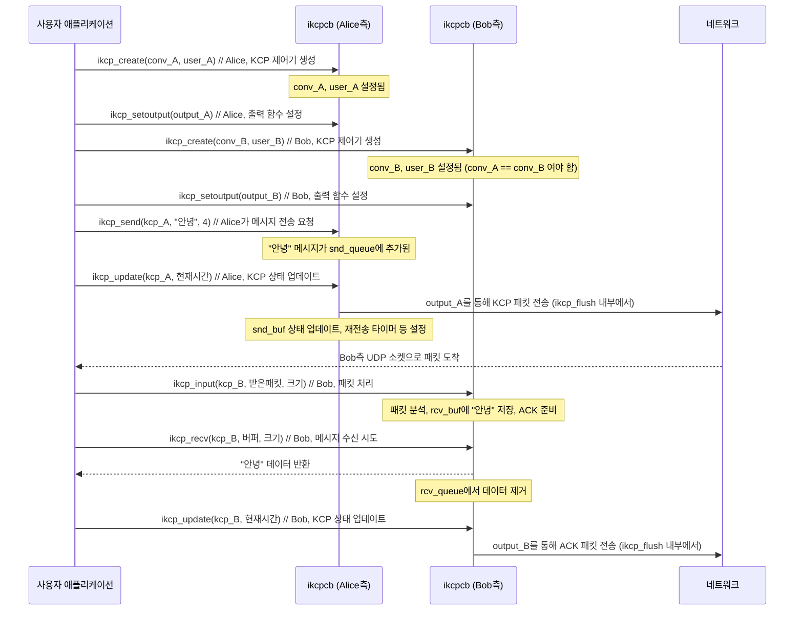

# Chapter 2: KCP 연결 제어기 (ikcpcb)


이전 [제1장: KCP 핵심 동작 엔진 (주요 API 및 업데이트 루프)](01_kcp_핵심_동작_엔진__주요_api_및_업데이트_루프__.md)에서는 KCP 통신의 기본적인 API 함수들과 업데이트 루프에 대해 알아보았습니다. `ikcp_send`로 데이터를 보내고, `ikcp_recv`로 데이터를 받고, `ikcp_input`으로 수신된 패킷을 처리하며, `ikcp_update`를 주기적으로 호출하여 KCP 엔진을 계속 가동시키는 과정을 배웠습니다. 이 모든 함수의 첫 번째 인자로 `ikcpcb *kcp`라는 포인터가 사용되는 것을 보셨을 겁니다. 이번 장에서는 바로 이 `ikcpcb` 구조체, 즉 'KCP 연결 제어기'에 대해 자세히 알아보겠습니다.

여러분은 친구와 메시지를 주고받는 상황을 상상해 보세요. KCP는 이 메시지 교환을 안정적이고 빠르게 처리해 주는 우체부와 같습니다. 그런데 만약 여러분이 동시에 여러 친구와 메시지를 주고받는다면, 각 친구와의 대화 내용을 따로따로 기억하고 관리해야겠죠? `ikcpcb`는 바로 이 '각 친구와의 개별 대화 상태'를 저장하고 관리하는 역할을 합니다.

## KCP 연결 제어기(ikcpcb)란 무엇일까요?

`ikcpcb` (I KCP Control Block의 약자)는 KCP 통신의 **모든 상태와 설정을 담고 있는 핵심 구조체**입니다. 각 KCP 연결마다 하나씩 생성되며, 해당 연결에 대한 모든 정보를 마치 개인 비서처럼 꼼꼼하게 관리합니다.

비유하자면, `ikcpcb`는 두 사람 간의 복잡한 대화를 원활하게 중재하고 모든 대화 내용을 기억하는 숙련된 **'대화 관리자'** 와 같습니다. 이 관리자는 다음과 같은 중요한 정보들을 책임집니다:

*   **누구와의 대화인가?** (연결 식별자: `conv`)
*   **어떤 메시지를 보냈고, 어떤 메시지를 받았는가?** (송수신 큐 및 버퍼)
*   **메시지를 한 번에 얼마나 많이 주고받을 수 있는가?** (윈도우 크기: `snd_wnd`, `rcv_wnd`)
*   **메시지가 제때 도착하지 않으면 언제 다시 보내야 하는가?** (재전송 타이머 관련 정보: `rx_rto`)
*   **메시지를 실제로 어떻게 외부로 전달할 것인가?** (출력 콜백 함수: `output`)

이 '대화 관리자' 덕분에 데이터가 순서대로, 빠짐없이, 그리고 효율적으로 전달될 수 있습니다. 만약 여러 개의 KCP 연결을 동시에 사용해야 한다면 (예: 서버가 여러 클라이언트와 통신), 각 연결마다 별도의 `ikcpcb` 인스턴스를 만들어서 관리하게 됩니다.

## `ikcpcb` 생성하고 해제하기

KCP 연결을 시작하려면 먼저 이 '대화 관리자'를 만들어야 합니다.

### 1. `ikcpcb` 생성: `ikcp_create()`

`ikcp_create` 함수를 사용하여 새로운 KCP 연결 제어기 인스턴스를 생성합니다.

```c
// ikcp.h
ikcpcb* ikcp_create(IUINT32 conv, void *user);
```

*   `conv`: **연결 식별자(Conversation ID)** 입니다. 통신하는 양쪽 끝에서 이 ID가 동일해야 서로의 패킷을 인식할 수 있습니다. 마치 두 사람이 서로를 알아보는 비밀 코드와 같습니다.
*   `user`: 사용자 정의 데이터를 가리키는 포인터입니다. 이 포인터는 나중에 KCP가 데이터를 외부로 보낼 때 사용하는 콜백 함수(output)에 그대로 전달됩니다. 이를 통해 콜백 함수 내에서 특정 KCP 연결에 대한 추가 정보에 접근할 수 있습니다. 예를 들어, 각 연결마다 다른 소켓 정보를 저장하는 데 사용할 수 있습니다.

**예시:**

```c
// 연결 ID를 12345로 설정하고, 사용자 데이터는 NULL로 설정하여 KCP 제어기 생성
IUINT32 connection_id = 12345;
void *my_user_data = NULL; // 필요하다면 여기에 특정 연결 정보를 담은 구조체 포인터를 전달할 수 있습니다.
ikcpcb *kcp_controller = ikcp_create(connection_id, my_user_data);

if (kcp_controller == NULL) {
    // 생성 실패 처리
    printf("KCP 제어기 생성에 실패했습니다.\n");
} else {
    // 성공! kcp_controller를 사용하여 통신 준비
    printf("KCP 제어기 (conv=%u)가 성공적으로 생성되었습니다.\n", kcp_controller->conv);
}
```
위 코드는 `12345`라는 고유 ID를 가진 KCP 연결을 위한 '대화 관리자'를 만듭니다. 이제 `kcp_controller` 변수는 이 관리자를 가리키게 되며, 앞으로 이 연결과 관련된 모든 KCP 함수 호출에 사용됩니다.

### 2. `ikcpcb` 해제: `ikcp_release()`

KCP 연결 사용이 끝나면, 생성했던 `ikcpcb` 인스턴스를 반드시 해제하여 관련된 메모리 자원을 반환해야 합니다.

```c
// ikcp.h
void ikcp_release(ikcpcb *kcp);
```

*   `kcp`: 해제할 `ikcpcb` 객체의 포인터입니다.

**예시:**

```c
// 이전에 생성한 kcp_controller 해제
if (kcp_controller != NULL) {
    ikcp_release(kcp_controller);
    kcp_controller = NULL; // 안전하게 포인터를 NULL로 설정
    printf("KCP 제어기를 해제했습니다.\n");
}
```
`ikcp_release` 함수는 `ikcpcb`가 사용하던 내부 버퍼, 큐에 남아있는 데이터 조각 등을 모두 정리하고 할당된 메모리를 풀어줍니다.

## `ikcpcb` 구조체의 주요 멤버 살펴보기

`ikcpcb` 구조체 안에는 KCP 통신을 제어하기 위한 수많은 정보가 들어있습니다. 모든 멤버를 다 알 필요는 없지만, 몇 가지 핵심적인 멤버들을 이해하면 KCP 동작 방식을 파악하는 데 큰 도움이 됩니다. 마치 자동차의 계기판을 보는 것과 같습니다. 모든 부품의 작동 원리를 알 필요는 없지만, 속도계, 연료계 등 주요 정보는 알아야 운전을 할 수 있겠죠?

다음은 `ikcpcb`의 주요 멤버들입니다 (실제 구조체에는 더 많은 멤버가 있습니다):

*   `IUINT32 conv`: 위에서 설명한 **연결 식별자**입니다.
*   `void *user`: `ikcp_create` 시 전달된 **사용자 정의 데이터 포인터**입니다.
*   `IUINT32 mtu`: **최대 전송 단위 (Maximum Transmission Unit)**. KCP가 한 번에 하위 프로토콜(예: UDP)로 보낼 수 있는 최대 패킷 크기입니다. 기본값은 1400 바이트입니다.
*   `IUINT32 mss`: **최대 세그먼트 크기 (Maximum Segment Size)**. KCP 헤더 크기(`IKCP_OVERHEAD`, 기본 24바이트)를 제외하고, 하나의 KCP 패킷에 담을 수 있는 순수 데이터의 최대 크기입니다. 즉, `mss = mtu - IKCP_OVERHEAD` 입니다.
*   `IUINT32 snd_wnd`: **송신 윈도우 크기**. 상대방의 확인(ACK)을 받지 않고도 한 번에 보낼 수 있는 데이터 패킷의 최대 개수입니다. 기본값은 32개입니다. ([제5장: KCP 데이터 흐름 조절 장치 (윈도우 관리)](05_kcp_데이터_흐름_조절_장치__윈도우_관리__.md)에서 자세히 다룹니다.)
*   `IUINT32 rcv_wnd`: **수신 윈도우 크기**. 수신 버퍼에 저장할 수 있는 데이터 패킷의 최대 개수입니다. 기본값은 128개입니다.
*   `IUINT32 snd_nxt`: 다음에 전송할 **데이터 패킷의 시퀀스 번호(Sequence Number, SN)** 입니다.
*   `IUINT32 rcv_nxt`: 다음에 수신할 것으로 기대되는 **데이터 패킷의 시퀀스 번호**입니다.
*   `int (*output)(const char *buf, int len, struct IKCPCB *kcp, void *user)`: **출력 콜백 함수 포인터**입니다. KCP가 실제로 데이터를 네트워크로 내보내야 할 때 이 함수를 호출합니다. 사용자는 이 함수를 직접 구현하여 UDP 소켓의 `sendto` 함수 등을 호출하도록 만들어야 합니다.
*   `struct IQUEUEHEAD snd_queue`: **송신 큐**. `ikcp_send`로 전달된 사용자 데이터가 아직 처리되지 않고 대기하는 곳입니다. 여기에 있는 데이터는 [KCP 데이터 조각 (IKCPSEG)](03_kcp_데이터_조각__ikcpseg__.md)으로 포장되어 `snd_buf`로 옮겨집니다.
*   `struct IQUEUEHEAD rcv_queue`: **수신 큐**. KCP가 수신하고 순서대로 정렬한 데이터 중, `ikcp_recv`를 통해 애플리케이션이 아직 가져가지 않은 데이터가 대기하는 곳입니다.
*   `struct IQUEUEHEAD snd_buf`: **송신 버퍼**. 전송되었거나 전송될 예정인 [KCP 데이터 조각 (IKCPSEG)](03_kcp_데이터_조각__ikcpseg__.md)들이 저장되는 곳입니다. ACK를 기다리거나 재전송될 수 있습니다.
*   `struct IQUEUEHEAD rcv_buf`: **수신 버퍼**. 수신된 [KCP 데이터 조각 (IKCPSEG)](03_kcp_데이터_조각__ikcpseg__.md)들이 임시로 저장되는 곳입니다. 순서가 맞지 않게 도착한 조각들은 여기서 정렬됩니다.

이러한 멤버들은 KCP 통신 과정에서 계속 업데이트되며, 연결의 현재 상태를 정확하게 반영합니다.

## `ikcpcb`와 출력 콜백 함수: KCP가 말하는 법 배우기

KCP 자체는 실제로 네트워크 패킷을 보내는 방법을 모릅니다. KCP는 "이 데이터를 보내야 해!"라고 결정할 뿐, '어떻게' 보낼지는 사용자가 알려줘야 합니다. 이것이 바로 `output` 콜백 함수의 역할입니다.

`ikcpcb` 객체를 생성한 후, `ikcp_setoutput` 함수를 사용하여 이 출력 콜백 함수를 KCP에게 알려줘야 합니다.

```c
// ikcp.h
void ikcp_setoutput(ikcpcb *kcp, int (*output)(const char *buf, int len,
	ikcpcb *kcp, void *user));
```

이 함수는 `kcp->output` 멤버에 여러분이 만든 함수를 등록합니다.

**예시: 간단한 UDP 출력 콜백 함수 설정**

먼저, UDP 소켓을 통해 데이터를 전송하는 함수를 만듭니다. (실제 UDP 소켓 생성 및 주소 설정 코드는 생략합니다.)

```c
// 이 함수는 KCP가 데이터를 보내야 할 때 호출됩니다.
// 실제로는 이 안에서 UDP 소켓의 sendto() 등을 사용합니다.
int my_udp_output(const char *buf, int len, ikcpcb *kcp, void *user_data) {
    // user_data를 사용하여 특정 연결의 소켓 정보 등을 가져올 수 있습니다.
    // 예: MyConnectionInfo *conn_info = (MyConnectionInfo*)user_data;
    //     sendto(conn_info->socket_fd, buf, len, 0, ...);
    printf("KCP (conv=%u)가 %d 바이트 데이터 전송 요청: [", kcp->conv, len);
    for (int i = 0; i < len && i < 20; ++i) { // 처음 20바이트만 간단히 출력
        printf("%02X ", (unsigned char)buf[i]);
    }
    if (len > 20) printf("...");
    printf("]\n");

    // 실제로 데이터를 전송했다고 가정하고, 전송된 바이트 수를 반환 (또는 오류 시 음수)
    return len; 
}

// ... kcp_controller 생성 후 ...
if (kcp_controller != NULL) {
    ikcp_setoutput(kcp_controller, my_udp_output);
    printf("KCP (conv=%u)에 대한 출력 콜백 함수가 설정되었습니다.\n", kcp_controller->conv);
}
```

이제 KCP가 `ikcp_update` (내부적으로 `ikcp_flush` 호출)를 통해 데이터를 보내야 할 시점이 되면, `kcp_controller->output` 즉, `my_udp_output` 함수가 호출됩니다. KCP는 `buf`와 `len`을 통해 전송할 KCP 패킷 데이터와 그 크기를 전달하고, `kcp` 포인터와 `user_data`도 함께 전달해 줍니다.

`ikcpcb`는 이렇게 사용자가 제공한 `output` 함수를 통해 비로소 외부 세계(네트워크)와 소통할 수 있게 됩니다.

## `ikcpcb`의 역할: 이전 장의 API들과의 관계

[제1장: KCP 핵심 동작 엔진 (주요 API 및 업데이트 루프)](01_kcp_핵심_동작_엔진__주요_api_및_업데이트_루프__.md)에서 배운 `ikcp_send`, `ikcp_recv`, `ikcp_input`, `ikcp_update` 함수들은 모두 첫 번째 인자로 `ikcpcb *kcp`를 받습니다. 이는 KCP에게 "지금 이 작업은 **어떤** '대화 관리자' (즉, 어떤 KCP 연결)에 대해 수행해야 하는지" 알려주는 것입니다.

*   `ikcp_send(kcp_A, ...)`: `kcp_A`라는 대화 관리자에게 "이 메시지를 상대방에게 보내줘"라고 요청합니다. `kcp_A`는 이 메시지를 자신의 `snd_queue`에 넣습니다.
*   `ikcp_input(kcp_B, ...)`: `kcp_B`라는 대화 관리자에게 "네트워크에서 이런 패킷을 받았어"라고 알려줍니다. `kcp_B`는 이 패킷을 분석하여 자신의 상태(예: `rcv_buf`, `rmt_wnd` 등)를 업데이트합니다.
*   `ikcp_update(kcp_A, ...)`: `kcp_A` 관리자에게 "지금 상태를 점검하고 필요한 일을 처리해 줘"라고 지시합니다. `kcp_A`는 재전송 타이머를 확인하고, `snd_queue`의 데이터를 `snd_buf`로 옮기며, `kcp_A->output`을 통해 실제 패킷을 보낼 준비를 합니다.
*   `ikcp_recv(kcp_B, ...)`: `kcp_B` 관리자에게 "상대방이 보낸 메시지 중에 내가 받을 수 있는 게 있니?"라고 묻습니다. `kcp_B`는 자신의 `rcv_queue`에서 데이터를 꺼내 전달합니다.

다음은 `ikcpcb`가 중심이 되어 KCP 통신이 이루어지는 과정을 간단한 다이어그램으로 나타낸 것입니다.


이처럼 `ikcpcb`는 각 KCP 연결의 상태를 독립적으로 관리하며, 모든 KCP 연산의 중심에 있습니다.

## `ikcpcb` 내부 들여다보기: `ikcp_create` 함수

`ikcp_create` 함수가 호출되면 `ikcpcb` 구조체 내의 수많은 필드들이 초기값으로 설정됩니다. `ikcp.c` 파일에 있는 `ikcp_create` 함수의 일부를 살펴보면 이 과정을 엿볼 수 있습니다.

```c
// ikcp.c (간략화된 버전)
ikcpcb* ikcp_create(IUINT32 conv, void *user)
{
    // 1. KCP 제어 블록(ikcpcb)을 위한 메모리 할당
    ikcpcb *kcp = (ikcpcb*)ikcp_malloc(sizeof(struct IKCPCB));
    if (kcp == NULL) return NULL; // 메모리 할당 실패 시 NULL 반환

    // 2. 전달받은 conv와 user 값 설정
    kcp->conv = conv; // 연결 식별자
    kcp->user = user; // 사용자 정의 데이터 포인터

    // 3. 주요 시퀀스 번호 및 상태 변수 초기화
    kcp->snd_una = 0;    // 아직 확인응답(ACK) 받지 않은 가장 오래된 데이터의 시퀀스 번호
    kcp->snd_nxt = 0;    // 다음에 보낼 데이터의 시퀀스 번호
    kcp->rcv_nxt = 0;    // 다음에 받을 것으로 기대하는 데이터의 시퀀스 번호

    // 4. 윈도우 크기 기본값 설정
    kcp->snd_wnd = IKCP_WND_SND; // 기본 송신 윈도우 크기 (32)
    kcp->rcv_wnd = IKCP_WND_RCV; // 기본 수신 윈도우 크기 (128)
    kcp->rmt_wnd = IKCP_WND_RCV; // 상대방 수신 윈도우 크기 초기 추정치

    // 5. MTU 및 MSS 기본값 설정
    kcp->mtu = IKCP_MTU_DEF;     // 기본 MTU (1400 바이트)
    kcp->mss = kcp->mtu - IKCP_OVERHEAD; // MSS 계산 (1400 - 24 = 1376 바이트)

    // 6. 송신/수신 큐 및 버퍼 초기화 (내부적으로 사용되는 연결 리스트)
    iqueue_init(&kcp->snd_queue); // 사용자가 보낸 데이터가 임시 저장되는 큐
    iqueue_init(&kcp->rcv_queue); // 수신 완료되어 사용자가 가져갈 수 있는 데이터 큐
    iqueue_init(&kcp->snd_buf);   // 전송 중이거나 재전송 대기 중인 데이터 버퍼
    iqueue_init(&kcp->rcv_buf);   // 수신되었으나 아직 순서가 맞지 않거나 처리 중인 데이터 버퍼
    
    kcp->nrcv_buf = 0; // 수신 버퍼 내 세그먼트 개수
    kcp->nsnd_buf = 0; // 송신 버퍼 내 세그먼트 개수
    kcp->nrcv_que = 0; // 수신 큐 내 세그먼트 개수
    kcp->nsnd_que = 0; // 송신 큐 내 세그먼트 개수

    // 7. 재전송 타이머 관련 변수 초기화
    kcp->rx_rto = IKCP_RTO_DEF;    // 기본 재전송 타임아웃 (200ms)
    kcp->rx_minrto = IKCP_RTO_MIN; // 최소 재전송 타임아웃 (100ms)

    // 8. 기타 중요한 설정들
    kcp->interval = IKCP_INTERVAL; // ikcp_update 내부에서 ikcp_flush를 호출하는 주기 (100ms)
    kcp->ts_flush = IKCP_INTERVAL; // 다음 ikcp_flush 호출 시간 초기화
    kcp->updated = 0;            // ikcp_update가 아직 호출되지 않았음을 표시
    kcp->output = NULL;          // 출력 콜백 함수는 ikcp_setoutput으로 설정해야 함
    kcp->writelog = NULL;        // 로그 콜백 함수 (기본값 NULL)

    // ... 그 외에도 혼잡 제어, 빠른 재전송 등과 관련된 많은 필드들이 초기화됩니다 ...

    return kcp; // 초기화된 KCP 제어기 반환
}
```
이처럼 `ikcp_create` 함수는 KCP 연결이 정상적으로 동작하는 데 필요한 모든 기본 설정을 담당합니다. 여기서 설정된 값들은 KCP의 동작 방식과 성능에 영향을 미치며, 일부 값들은 `ikcp_nodelay`, `ikcp_wndsize`, `ikcp_setmtu` 등의 함수를 통해 사용자가 직접 변경할 수 있습니다.

## 여러 개의 대화 관리하기

만약 여러분의 프로그램이 여러 상대방과 동시에 KCP 통신을 해야 한다면 (예: 채팅 서버가 여러 명의 사용자와 대화하는 경우), 각 상대방과의 연결마다 별도의 `ikcpcb` 인스턴스를 생성하고 관리해야 합니다.

각 `ikcpcb`는 고유한 `conv` 값을 가져야 하며, 자신만의 송수신 큐, 윈도우 상태, 재전송 타이머 등을 독립적으로 유지합니다. 이렇게 함으로써 여러 연결 간의 상태가 서로 섞이지 않고 안전하게 관리될 수 있습니다.

## 결론

이번 장에서는 KCP 통신의 심장과도 같은 `ikcpcb` 구조체에 대해 알아보았습니다. `ikcpcb`는 각 KCP 연결의 모든 상태 정보와 설정을 담고 있는 '대화 관리자'로서, KCP가 안정적이고 효율적으로 데이터를 주고받을 수 있도록 하는 핵심 요소입니다.

*   `ikcp_create` 함수로 각 연결마다 `ikcpcb` 인스턴스를 생성합니다.
*   `ikcpcb`는 연결 식별자(`conv`), 윈도우 크기, MTU, 송수신 큐, 출력 콜백 함수 등 중요한 정보를 저장합니다.
*   `ikcp_setoutput`을 통해 KCP가 데이터를 하위 계층으로 전달할 방법을 알려줘야 합니다.
*   모든 KCP API 함수는 `ikcpcb*`를 첫 번째 인자로 받아 특정 연결에 대해 동작합니다.
*   연결 사용이 끝나면 `ikcp_release`로 `ikcpcb`를 해제해야 합니다.

이 '대화 관리자'(`ikcpcb`)가 관리하는 데이터는 실제로 어떤 형태로 존재할까요? 바로 다음 장인 [제3장: KCP 데이터 조각 (IKCPSEG)](03_kcp_데이터_조각__ikcpseg__.md)에서 KCP가 데이터를 주고받는 기본 단위인 '데이터 조각'에 대해 자세히 살펴보겠습니다. 이 데이터 조각들이 `ikcpcb`의 여러 큐와 버퍼 사이를 어떻게 이동하는지 이해하게 될 것입니다.

---

Generated by [AI Codebase Knowledge Builder](https://github.com/The-Pocket/Tutorial-Codebase-Knowledge)