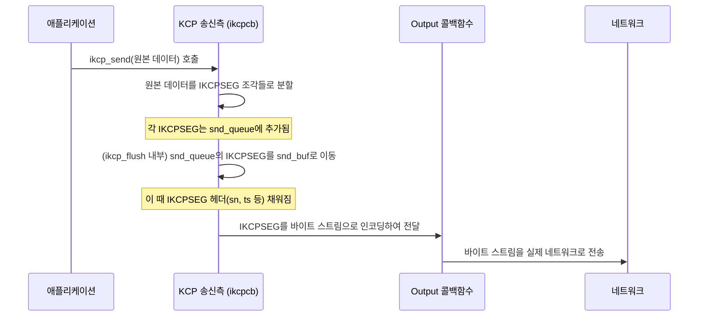
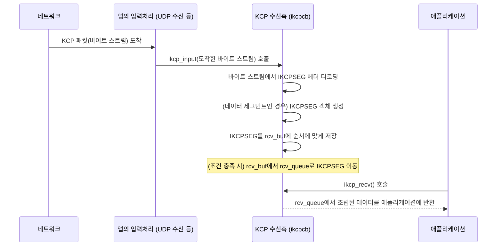

# Chapter 3: KCP 데이터 조각 (IKCPSEG)


이전 [제2장: KCP 연결 제어기 (ikcpcb)](02_kcp_연결_제어기__ikcpcb__.md)에서는 각 KCP 연결의 상태를 관리하는 '대화 관리자' `ikcpcb`에 대해 배웠습니다. `ikcpcb` 내부에는 데이터를 보내고 받기 위한 여러 큐(queue)와 버퍼(buffer)가 있다고 언급했는데, 이 큐와 버퍼에 실제로 저장되는 데이터의 기본 형태가 바로 이번 장에서 다룰 'KCP 데이터 조각(IKCPSEG)'입니다.

만약 여러분이 아주 긴 편지를 친구에게 보내고 싶다고 상상해 보세요. 한 장의 거대한 종이에 모든 내용을 적어 보내는 대신, 편지를 여러 장의 종이로 나누어 각 장마다 봉투에 넣어 보낼 것입니다. 그리고 각 봉투에는 이것이 누구의 편지인지, 몇 번째 장인지, 언제 보냈는지 등을 적어두겠죠? KCP도 애플리케이션이 보내려는 데이터를 바로 이런 방식으로 처리합니다. 여기서 각 '봉투에 담긴 편지 한 장'이 바로 KCP 데이터 조각, 즉 `IKCPSEG`에 해당합니다.

## KCP 데이터 조각(IKCPSEG)이란 무엇일까요?

`IKCPSEG`는 KCP 프로토콜이 데이터를 주고받는 **가장 기본적인 단위**입니다. 애플리케이션이 전송하려는 큰 데이터 덩어리는 이 `IKCPSEG`라는 더 작은 조각(세그먼트)으로 나뉘어 네트워크를 통해 전송됩니다. 마치 택배 상자 안에 여러 개의 작은 물품들이 포장되어 있는 것과 같습니다.

각 `IKCPSEG`에는 실제 전송하려는 사용자 데이터뿐만 아니라, 데이터를 올바르고 효율적으로 전달하는 데 필요한 중요한 **제어 정보**들이 함께 포함됩니다. 이 제어 정보 덕분에 KCP는 다음과 같은 일들을 할 수 있습니다:

*   데이터가 올바른 순서로 도착했는지 확인하고 재조립합니다.
*   데이터가 중간에 사라졌는지 감지하고 필요하면 다시 보냅니다 ([제4장: KCP 신뢰성 보장 장치 (ACK 및 재전송)](04_kcp_신뢰성_보장_장치__ack_및_재전송__.md)에서 자세히 다룹니다).
*   네트워크 상태에 따라 데이터 전송량을 조절합니다 ([제5장: KCP 데이터 흐름 조절 장치 (윈도우 관리)](05_kcp_데이터_흐름_조절_장치__윈도우_관리__.md)에서 자세히 다룹니다).

## `IKCPSEG` 구조 살펴보기: 봉투에는 무엇이 적혀 있을까요?

`IKCPSEG` 구조체는 `ikcp.h` 파일에 정의되어 있으며, KCP 통신에 필요한 모든 정보를 담고 있습니다. 주요 필드들을 살펴보겠습니다.

```c
// ikcp.h
struct IKCPSEG
{
	struct IQUEUEHEAD node; // 큐에서 세그먼트를 관리하기 위한 내부용 연결 고리
	IUINT32 conv;      // 연결 식별자: 이 세그먼트가 어떤 대화(연결)에 속하는지 나타냅니다.
	IUINT32 cmd;       // 명령어: 이 세그먼트의 목적을 나타냅니다 (데이터, ACK 등).
	IUINT32 frg;       // 조각 번호: 데이터가 여러 조각으로 나뉘었을 때, 몇 번째 조각인지 나타냅니다. (0이면 마지막 조각 또는 조각 아님)
	IUINT32 wnd;       // 송신자의 남은 수신 윈도우 크기: "나는 이만큼 더 받을 수 있어"라고 상대방에게 알려줍니다.
	IUINT32 ts;        // 타임스탬프: 세그먼트 전송 시간 또는 ACK 대상 세그먼트의 시간 등 시간 정보를 담습니다.
	IUINT32 sn;        // 순서 번호: 데이터 세그먼트의 고유한 일련번호입니다. 이를 통해 수신측에서 순서를 맞춥니다.
	IUINT32 una;       // 미확인 순서 번호: "나는 이 번호까지의 데이터는 확실히 받았어!"라고 상대방에게 알려주는 번호입니다.
	IUINT32 len;       // 실제 데이터의 길이: `data` 필드에 저장된 사용자 데이터의 실제 크기입니다.
	IUINT32 resendts;  // 재전송 타임스탬프 (KCP 내부용)
	IUINT32 rto;       // 재전송 타임아웃 값 (KCP 내부용)
	IUINT32 fastack;   // 빠른 재전송 카운터 (KCP 내부용)
	IUINT32 xmit;      // 전송 횟수 (KCP 내부용)
	char data[1];   // 실제 애플리케이션 데이터가 저장되는 공간입니다. 길이는 `len` 필드에 의해 결정됩니다.
};
```

위 구조체에서 몇 가지 중요한 필드를 좀 더 자세히 살펴보겠습니다:

*   **`conv` (연결 식별자):** [제2장: KCP 연결 제어기 (ikcpcb)](02_kcp_연결_제어기__ikcpcb__.md)에서 `ikcp_create` 함수로 `ikcpcb`를 만들 때 지정한 그 `conv` 값입니다. 이 값이 같아야 서로 통신하는 양단이 같은 연결임을 알 수 있습니다.
*   **`cmd` (명령어):** 세그먼트의 종류를 나타냅니다. 주요 명령어는 다음과 같습니다.
    *   `IKCP_CMD_PUSH` (81): 실제 사용자 데이터를 담고 있는 세그먼트입니다. "이 데이터를 받아줘!"
    *   `IKCP_CMD_ACK` (82): 상대방으로부터 받은 데이터에 대한 확인 응답 세그먼트입니다. "네가 보낸 데이터 잘 받았어!"
    *   `IKCP_CMD_WASK` (83): 상대방의 수신 윈도우 크기를 묻는 세그먼트입니다. "너 얼마나 더 받을 수 있니?"
    *   `IKCP_CMD_WINS` (84): 자신의 수신 윈도우 크기를 알리는 세그먼트입니다. "나는 이만큼 더 받을 수 있어."
*   **`sn` (순서 번호):** `IKCP_CMD_PUSH` (데이터) 세그먼트에만 사용되며, 각 데이터 조각의 고유한 번호입니다. 수신 측은 이 `sn`을 보고 데이터 조각들을 원래 순서대로 재조립합니다.
*   **`frg` (조각 번호):** `ikcp_send`로 보낸 데이터가 너무 커서 하나의 `IKCPSEG`에 다 담을 수 없을 때 (즉, `kcp->mss`보다 클 때) 여러 조각으로 나뉘는데, 이때 각 조각의 역순 번호입니다. 예를 들어 데이터가 3조각으로 나뉘면 첫 번째 조각은 `frg=2`, 두 번째는 `frg=1`, 마지막 조각은 `frg=0`이 됩니다. 조각나지 않은 데이터는 `frg=0`입니다.
*   **`una` (미확인 순서 번호):** "Unacknowledged"의 약자로, 송신자가 수신자로부터 아직 확인 응답(ACK)을 받지 못한 데이터 세그먼트 중 가장 작은 `sn`보다 하나 작은 값, 혹은 수신자가 다음으로 받기를 기대하는 `sn`을 의미합니다. 즉, "나는 `una` 이전의 모든 데이터는 잘 받았으니, 다음에는 `una` 번호의 데이터를 보내줘"라는 의미를 전달합니다.
*   **`len` (데이터 길이)와 `data` (실제 데이터):** `len`은 `data` 필드에 저장된 실제 사용자 데이터의 바이트 크기를 나타냅니다. `data[1]`로 선언되어 있지만, 실제로는 `ikcp_segment_new` 함수가 `IKCPSEG` 구조체 크기 + `len` 만큼의 메모리를 할당하여 `data` 필드 뒤에 실제 데이터가 위치하게 됩니다.

## `IKCPSEG`는 어떻게 만들어지고 처리될까요?

`IKCPSEG`는 KCP 내부에서 생성되고 관리됩니다. 사용자가 직접 `IKCPSEG` 구조체를 만들거나 조작할 일은 거의 없습니다. 대신 KCP API 함수들을 사용하면 KCP가 알아서 이 `IKCPSEG`들을 처리합니다.

### 1. 데이터 전송 요청 시 (`ikcp_send`)

애플리케이션이 [제1장: KCP 핵심 동작 엔진 (주요 API 및 업데이트 루프)](01_kcp_핵심_동작_엔진__주요_api_및_업데이트_루프__.md)에서 배운 `ikcp_send(kcp, buffer, length)` 함수를 호출하여 데이터를 보내려고 할 때 KCP 내부에서는 다음과 같은 일이 일어납니다:

*   만약 `length`가 `kcp->mss` (최대 세그먼트 크기, `mtu` - `IKCP_OVERHEAD`)보다 크면, KCP는 데이터를 여러 개의 `IKCPSEG`에 나눠 담을 수 있도록 분할합니다.
*   각 데이터 조각에 대해 KCP는 `ikcp_segment_new()` 함수 (내부 함수)를 호출하여 `IKCPSEG` 객체를 위한 메모리를 할당합니다.
*   새로 만들어진 `IKCPSEG`의 `data` 필드에 실제 데이터 조각을 복사하고, `len` 필드에 데이터 길이를 설정합니다.
*   분할된 경우 `frg` 필드에 조각 번호를 설정합니다.
*   이 `IKCPSEG`들은 일단 [KCP 연결 제어기 (ikcpcb)](02_kcp_연결_제어기__ikcpcb__.md)의 `snd_queue` (송신 큐)에 추가됩니다. 아직 실제 전송은 되지 않은 상태입니다.

```c
// ikcp.c의 ikcp_send 함수 일부 (개념 설명용)
// 사용자가 ikcp_send(kcp, "안녕하세요, KCP!", 18)을 호출했다고 가정
// kcp->mss가 10이라고 가정하면, 데이터는 두 조각으로 나뉨

// 첫 번째 조각 처리 (예시)
IKCPSEG *seg1 = ikcp_segment_new(kcp, 10); // 10바이트 데이터용 세그먼트 생성
// seg1->data에 "안녕하세요, K" 복사
seg1->len = 10;
seg1->frg = 1; // 두 조각 중 첫 번째 (역순)
// iqueue_add_tail(&seg1->node, &kcp->snd_queue); // snd_queue에 추가

// 두 번째 조각 처리 (예시)
IKCPSEG *seg2 = ikcp_segment_new(kcp, 8); // 8바이트 데이터용 세그먼트 생성
// seg2->data에 "CP!" 복사
seg2->len = 8;
seg2->frg = 0; // 마지막 조각
// iqueue_add_tail(&seg2->node, &kcp->snd_queue); // snd_queue에 추가
```
위 코드는 실제 KCP 코드와는 차이가 있지만, `ikcp_send`가 데이터를 조각내어 `IKCPSEG`를 만들고 큐에 넣는 과정을 개념적으로 보여줍니다.

### 2. 실제 데이터 전송 시 (`ikcp_flush`)

주기적으로 호출되는 `ikcp_update` 함수는 내부적으로 `ikcp_flush` 함수를 호출합니다. `ikcp_flush`는 `snd_queue`에 대기 중인 `IKCPSEG`들을 실제 네트워크로 내보내는 역할을 합니다.

*   `snd_queue`에 있는 `IKCPSEG`들이 `snd_buf` (송신 버퍼)로 옮겨집니다.
*   이때, `IKCPSEG`의 주요 헤더 필드들 (`conv`, `cmd`, `wnd`, `ts`, `sn`, `una` 등)이 현재 KCP 상태에 맞게 채워집니다. 예를 들어, `sn`은 `kcp->snd_nxt` 값으로 설정되고 `kcp->snd_nxt`는 1 증가합니다.
*   `ikcp_encode_seg()` 함수 (내부 함수)가 `IKCPSEG` 구조체 정보를 실제 전송될 바이트 스트림 형태로 변환(인코딩)합니다. 이 과정에서 `conv`, `cmd`, `frg`, `wnd`, `ts`, `sn`, `una`, `len` 정보가 정해진 순서와 크기로 바이트 배열에 기록됩니다.
*   이 바이트 스트림은 `kcp->output` 콜백 함수를 통해 하위 프로토콜(예: UDP)로 전달되어 네트워크로 전송됩니다.

### 3. 데이터 수신 시 (`ikcp_input`)

네트워크로부터 데이터(바이트 스트림)가 도착하면, 애플리케이션은 이 데이터를 `ikcp_input(kcp, data, size)` 함수에 전달해야 합니다.

*   `ikcp_input` 함수는 수신된 바이트 스트림의 앞부분부터 KCP 헤더 정보를 디코딩합니다 (`ikcp_decode32u`, `ikcp_decode8u` 등의 내부 함수 사용). `conv`, `cmd`, `frg`, `wnd`, `ts`, `sn`, `una`, `len` 등의 필드 값을 읽어냅니다.
*   만약 `cmd`가 `IKCP_CMD_PUSH` (데이터 세그먼트)라면:
    *   `ikcp_segment_new()`로 새로운 `IKCPSEG`를 만듭니다.
    *   디코딩된 헤더 정보와 데이터 부분을 이 `IKCPSEG`에 채워 넣습니다.
    *   `ikcp_parse_data()` 함수 (내부 함수)를 통해 이 `IKCPSEG`를 `kcp->rcv_buf` (수신 버퍼)에 `sn` 순서에 맞게 삽입합니다. 순서가 뒤섞여 도착한 세그먼트들은 여기서 제자리를 찾아갑니다.
    *   `rcv_buf`에서 `kcp->rcv_nxt` (다음에 받아야 할 순서 번호)부터 연속적인 `IKCPSEG`들이 발견되면, 이들은 `kcp->rcv_queue` (수신 큐)로 옮겨져 애플리케이션이 `ikcp_recv`로 가져갈 수 있도록 준비됩니다.
*   만약 `cmd`가 `IKCP_CMD_ACK` (확인 응답 세그먼트)라면:
    *   `ikcp_parse_ack()` 함수 (내부 함수)가 이 ACK 정보를 처리합니다. 해당 `sn`을 가진 세그먼트가 `kcp->snd_buf`에 있다면, 그 세그먼트는 성공적으로 전달된 것으로 간주하고 `snd_buf`에서 제거될 수 있습니다. 이는 [제4장: KCP 신뢰성 보장 장치 (ACK 및 재전송)](04_kcp_신뢰성_보장_장치__ack_및_재전송__.md)에서 더 자세히 다룹니다.

### 4. 애플리케이션이 데이터 가져갈 때 (`ikcp_recv`)

애플리케이션이 `ikcp_recv(kcp, buffer, len)`를 호출하면, KCP는 `rcv_queue`에 있는, 완전히 조립되고 순서가 맞는 데이터(하나 이상의 `IKCPSEG`로 구성될 수 있음)를 `buffer`에 복사하여 반환합니다.

## `IKCPSEG`의 여정 요약 (편지 배송 과정)

`IKCPSEG`가 KCP 시스템 내에서 어떻게 이동하는지 간단한 그림으로 표현해 보겠습니다.

**데이터 보내기 (편지 부치기):**



**데이터 받기 (편지 받기):**



이처럼 `IKCPSEG`는 KCP 통신의 모든 단계에서 핵심적인 역할을 수행합니다. 애플리케이션 데이터는 `IKCPSEG` 형태로 포장되어 KCP 내부의 여러 큐와 버퍼를 거쳐 상대방에게 전달되고, 다시 원래 데이터로 조립됩니다.

## 결론

이번 장에서는 KCP가 데이터를 주고받는 기본 단위인 `IKCPSEG`에 대해 알아보았습니다. `IKCPSEG`는 단순한 데이터 조각이 아니라, KCP의 안정적이고 효율적인 통신을 가능하게 하는 다양한 제어 정보(순서 번호 `sn`, 명령어 `cmd`, 타임스탬프 `ts` 등)를 담고 있는 중요한 구조체입니다.

*   큰 데이터는 여러 개의 `IKCPSEG`로 분할되어 전송됩니다.
*   각 `IKCPSEG`는 헤더 정보를 통해 자신을 식별하고 통신을 제어합니다.
*   `IKCPSEG`는 `ikcpcb`의 `snd_queue`, `snd_buf`, `rcv_buf`, `rcv_queue` 등의 내부 큐와 버퍼를 통해 처리됩니다.
*   사용자는 KCP API를 통해 간접적으로 `IKCPSEG`를 사용하며, KCP가 내부적으로 이들의 생성, 인코딩, 디코딩, 관리를 담당합니다.

이러한 `IKCPSEG`의 존재 덕분에 KCP는 패킷 손실이나 순서 뒤바뀜과 같은 네트워크 문제에 효과적으로 대응할 수 있습니다. 다음 장인 [제4장: KCP 신뢰성 보장 장치 (ACK 및 재전송)](04_kcp_신뢰성_보장_장치__ack_및_재전송__.md)에서는 이 `IKCPSEG`들을 이용하여 KCP가 어떻게 데이터 전송의 신뢰성을 보장하는지, 특히 확인 응답(ACK)과 재전송 메커니즘에 대해 자세히 살펴보겠습니다.

---

Generated by [AI Codebase Knowledge Builder](https://github.com/The-Pocket/Tutorial-Codebase-Knowledge)