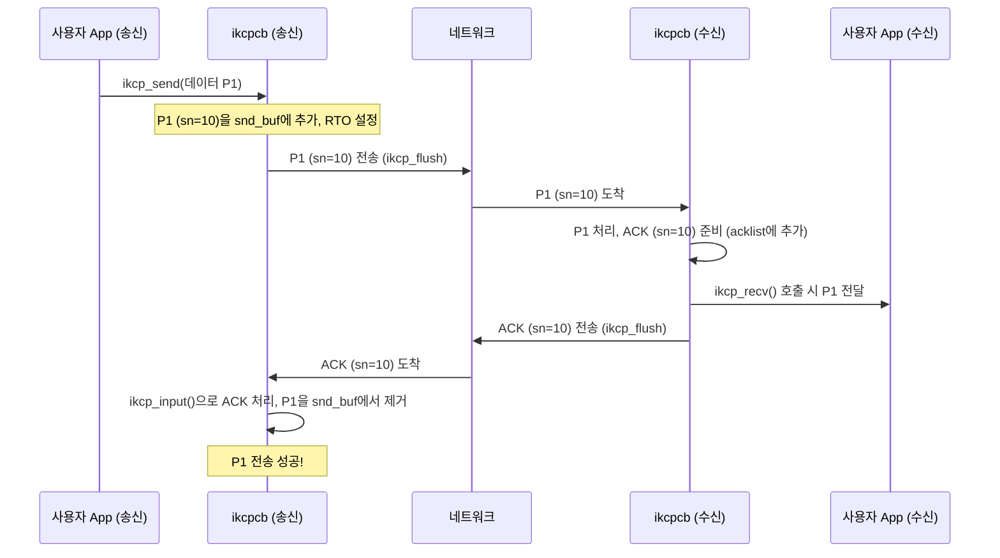
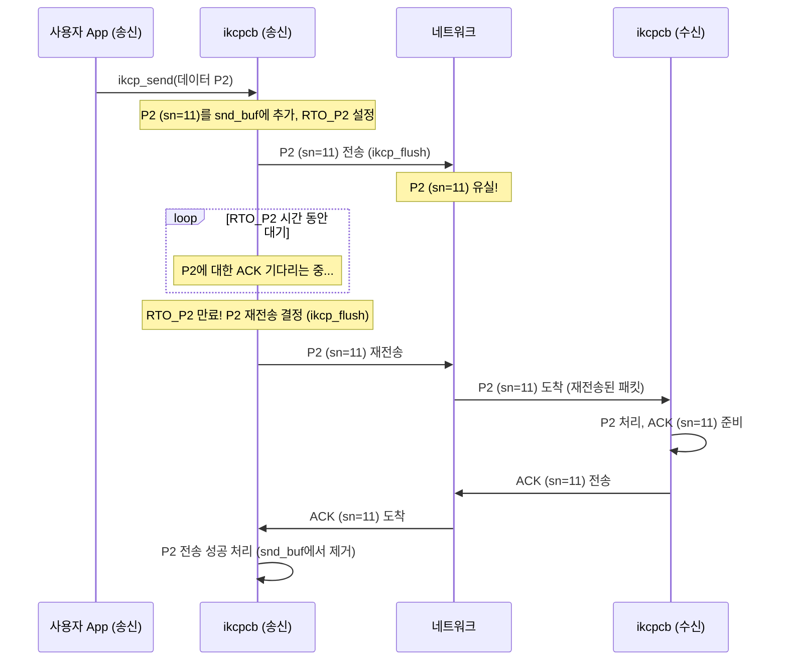
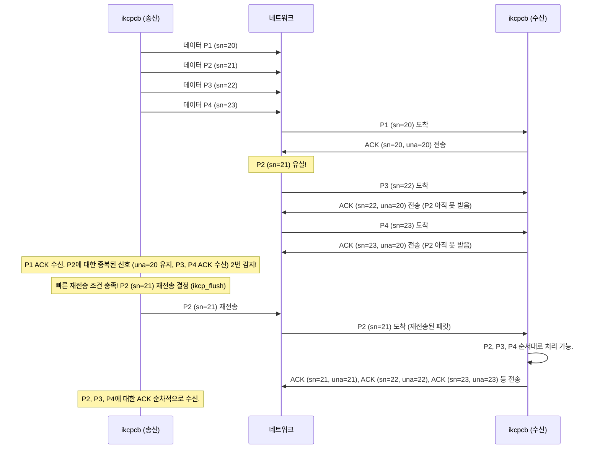

# Chapter 4: KCP 신뢰성 보장 장치 (ACK 및 재전송)


이전 [제3장: KCP 데이터 조각 (IKCPSEG)](03_kcp_데이터_조각__ikcpseg__.md)에서는 KCP가 데이터를 주고받는 기본 단위인 `IKCPSEG`에 대해 배웠습니다. 이 데이터 조각들이 어떻게 네트워크를 통해 안전하게 목적지까지 전달될 수 있을까요? 인터넷은 때때로 편지가 중간에 사라지거나 순서가 뒤바뀌어 도착하는 우편 시스템과 비슷할 수 있습니다. 특히 KCP가 주로 사용하는 UDP 프로토콜은 편지를 보내기는 하지만, 잘 도착했는지, 순서대로 도착했는지 전혀 신경 쓰지 않는 '일반 우편'과 같습니다.

만약 우리가 매우 중요한 계약서를 보낸다고 생각해 보세요. 일반 우편으로 보내면 불안하겠죠? 중간에 분실될 수도 있고, 상대방이 받았는지 확인할 방법도 없습니다. KCP는 이러한 문제를 해결하기 위해 마치 '등기 우편'과 같은 특별한 장치를 사용합니다. 이번 장에서는 KCP가 데이터를 안정적으로, 즉 '신뢰성 있게' 전달할 수 있도록 하는 핵심 메커니즘인 **ACK(수신 확인 응답) 및 재전송** 기능에 대해 알아보겠습니다.

## 왜 신뢰성 보장이 필요할까요?

KCP는 UDP 위에서 동작하는데, UDP는 "일단 보내고 보자!" 스타일이라 패킷이 중간에 유실되거나, 순서가 뒤바뀌거나, 심지어 중복되어 도착해도 전혀 책임지지 않습니다. 게임 캐릭터의 움직임 정보나 중요한 채팅 메시지가 중간에 사라진다면 큰 문제가 되겠죠?

KCP는 이러한 UDP의 단점을 보완하여, 마치 TCP처럼 데이터가 정확하고 빠짐없이 전달되도록 보장하는 역할을 합니다. 이 신뢰성을 확보하는 핵심 기술이 바로 **ACK(Acknowledgment, 수신 확인 응답)** 와 **재전송(Retransmission)** 입니다.

## KCP의 등기 우편 시스템: ACK와 재전송

KCP의 신뢰성 보장 장치는 마치 중요한 소포를 보내는 등기 우편 시스템과 매우 유사합니다.

1.  **데이터 발송 (소포 보내기):** 송신 측(데이터를 보내는 쪽)은 [KCP 데이터 조각 (IKCPSEG)](03_kcp_데이터_조각__ikcpseg__.md)들을 목적지로 보냅니다.
2.  **수신 확인 (수취 확인 사인 받기):** 수신 측(데이터를 받는 쪽)은 데이터를 받을 때마다 "나 이 데이터 잘 받았어!"라는 의미로 **ACK**라는 특별한 메시지를 송신 측에 다시 보냅니다.
3.  **ACK 대기 및 확인 (사인 기다리기):** 송신 측은 자신이 보낸 데이터에 대한 ACK가 도착하기를 기다립니다.
4.  **문제 발생 시 재처리 (분실 시 다시 보내기):**
    *   만약 일정 시간(이를 **RTO, Retransmission Timeout** 이라 합니다) 내에 ACK가 도착하지 않으면, 송신 측은 '아, 내가 보낸 데이터가 중간에 사라졌나 보다!'라고 판단하고 해당 데이터를 **재전송**합니다.
    *   또는 특정 조건(예: 특정 데이터 이후의 데이터들에 대한 ACK는 계속 오는데, 정작 그 특정 데이터에 대한 ACK만 안 오는 경우)이 만족되면, 타임아웃을 기다리지 않고 좀 더 빠르게 재전송하기도 합니다. 이를 **빠른 재전송(Fast Retransmit)** 이라고 합니다.

이 과정을 통해 KCP는 데이터가 중간에 유실되더라도 결국 목적지까지 안전하게 전달될 수 있도록 보장합니다.

### 1. 수신 확인 응답 (ACK - Acknowledgment)

ACK는 "Acknowledged", 즉 "확인했다"는 뜻입니다. 수신자가 특정 데이터를 성공적으로 받았음을 송신자에게 알려주는 짧은 메시지입니다.

*   **송신자가 데이터를 보낼 때:** 각 [KCP 데이터 조각 (IKCPSEG)](03_kcp_데이터_조각__ikcpseg__.md)에는 고유한 순서 번호(`sn`)가 부여됩니다.
*   **수신자가 데이터를 받을 때:** 수신자는 받은 데이터의 `sn`을 포함하는 ACK 패킷을 생성하여 송신자에게 보냅니다. (예: "나 `sn=5` 데이터 받았어!")
*   **송신자가 ACK를 받을 때:** 송신자는 이 ACK를 보고 '아, `sn=5` 데이터는 안전하게 도착했구나!'라고 안심하고, 더 이상 이 데이터에 대해 걱정하지 않아도 됩니다.

KCP에서 ACK는 `IKCP_CMD_ACK`라는 명령 코드를 가진 [KCP 데이터 조각 (IKCPSEG)](03_kcp_데이터_조각__ikcpseg__.md) 형태로 전송됩니다. 이 ACK 세그먼트에는 확인된 데이터의 `sn`과 함께 해당 데이터가 처음 전송되었을 때의 타임스탬프(`ts`)가 포함될 수 있어, 송신자가 왕복 시간(RTT)을 계산하는 데 도움을 줍니다.

### 2. 재전송 타임아웃 (RTO - Retransmission Timeout)

송신자가 데이터를 보낸 후, 해당 데이터에 대한 ACK를 무한정 기다릴 수는 없습니다. RTO는 "이 시간 안에 ACK가 안 오면, 문제가 생긴 걸로 간주하고 데이터를 다시 보내야겠다!"라고 정해둔 제한 시간입니다.

KCP는 네트워크 상태에 따라 이 RTO 값을 동적으로 조절합니다.
*   네트워크가 빠르고 안정적이어서 ACK가 빨리 도착하면 RTO 값을 줄입니다.
*   네트워크가 느리거나 패킷 손실이 잦아서 ACK가 늦게 오거나 안 오면 RTO 값을 늘립니다.

이 RTO 계산은 송신자가 데이터 패킷을 보낸 시간과 해당 패킷에 대한 ACK를 수신한 시간을 바탕으로 평균 왕복 시간(SRTT, Smoothed Round-Trip Time)과 그 변동(RTTVar, RTT Variation)을 측정하여 이루어집니다.

`ikcpcb` 구조체 내의 `rx_rto`, `rx_srtt`, `rx_rttval` 등의 멤버가 이와 관련된 값을 저장합니다. `ikcp_update_ack` 함수에서 주로 RTT 관련 값들이 갱신되고, 이를 바탕으로 `rx_rto`가 조절됩니다.

```c
// ikcp.c (ikcp_update_ack 함수 일부)
// RTT (왕복 시간)을 기반으로 rx_srtt (평균 RTT)와 rx_rttval (RTT 변동폭)을 갱신하고,
// 이를 바탕으로 rx_rto (재전송 타임아웃)을 계산합니다.
static void ikcp_update_ack(ikcpcb *kcp, IINT32 rtt)
{
	IINT32 rto = 0;
	if (kcp->rx_srtt == 0) { // 처음 RTT 샘플인 경우
		kcp->rx_srtt = rtt;
		kcp->rx_rttval = rtt / 2;
	}	else { // 이후 RTT 샘플
		long delta = rtt - kcp->rx_srtt;
		if (delta < 0) delta = -delta;
		kcp->rx_rttval = (3 * kcp->rx_rttval + delta) / 4; // RTT 변동성 업데이트 (지수 가중 이동 평균)
		kcp->rx_srtt = (7 * kcp->rx_srtt + rtt) / 8;     // 평균 RTT 업데이트 (지수 가중 이동 평균)
		if (kcp->rx_srtt < 1) kcp->rx_srtt = 1;
	}
	// RTO 계산: 평균 RTT + (안정성을 위한 여유 마진, RTT 변동폭의 4배 또는 KCP 인터벌 중 큰 값)
	rto = kcp->rx_srtt + _imax_(kcp->interval, 4 * kcp->rx_rttval);
	kcp->rx_rto = _ibound_(kcp->rx_minrto, rto, IKCP_RTO_MAX); // 최소/최대 RTO 범위 내로 제한
}
```
위 코드는 RTT 측정값을 이용하여 RTO를 동적으로 조절하는 KCP의 핵심 로직을 보여줍니다. `_imax_`는 둘 중 큰 값을, `_ibound_`는 값이 특정 범위 내에 있도록 하는 헬퍼 함수입니다.

### 3. 데이터 재전송 (Data Retransmission)

송신 측의 [KCP 연결 제어기 (ikcpcb)](02_kcp_연결_제어기__ikcpcb__.md) 내부에는 `snd_buf` (송신 버퍼)가 있어서, 보낸 데이터들 중 아직 ACK를 받지 못한 데이터 조각들을 보관합니다. 주기적으로 호출되는 `ikcp_flush` 함수 (실제로는 `ikcp_update` 함수 내부에서 호출됨)는 이 `snd_buf`를 확인하여 다음 두 가지 경우에 재전송을 수행합니다.

#### 가. 타임아웃 기반 재전송

각 데이터 조각(`IKCPSEG`)에는 `resendts` (재전송 타임스탬프)라는 멤버가 있어서, 이 데이터 조각이 언제 재전송되어야 하는지 시간이 기록됩니다. 이 시간은 처음 전송될 때 `현재 시간 + RTO`로 설정됩니다.

`ikcp_flush`는 `snd_buf`의 각 데이터 조각에 대해 현재 시간이 `resendts`를 지났는지 확인합니다.
```c
// ikcp.c (ikcp_flush 함수 내 재전송 결정 부분 일부)
// segment는 snd_buf에 있는, ACK를 기다리는 데이터 조각입니다.
// current는 현재 시간입니다.
if (_itimediff(current, segment->resendts) >= 0) { // 현재 시간이 재전송 예정 시간을 지났다면
    needsend = 1; // 재전송 필요!
    segment->xmit++; // 전송 횟수 증가
    // ... RTO 값 증가 (Nodelay 모드 여부에 따라 다르게) ...
    segment->resendts = current + segment->rto; // 다음 재전송 시간 설정
    lost = 1; // 패킷 손실 발생으로 간주
}
```
만약 현재 시간이 `resendts`를 지났다면, KCP는 해당 데이터 조각이 유실된 것으로 판단하고 다시 전송합니다. 이때, 재전송 횟수(`xmit`)가 증가하고, 다음 재전송을 위한 RTO 값도 네트워크 상황을 고려하여 약간 더 길게 설정될 수 있습니다 (지수적 백오프와 유사하지만 KCP는 좀 더 공격적임).

#### 나. 빠른 재전송 (Fast Retransmit)

네트워크에서 패킷이 하나만 유실되고 그 뒤의 패킷들은 잘 도착하는 경우가 있습니다. 예를 들어, 송신자가 1, 2, 3, 4, 5번 패킷을 보냈는데, 2번만 유실되고 1, 3, 4, 5번은 수신자에게 잘 도착했다고 가정해 봅시다.

수신자는 1번을 받고 "ACK 1"을 보냅니다. 2번은 못 받았으니 ACK를 못 보냅니다. 3번을 받으면, 아직 2번을 못 받았으므로 "내가 마지막으로 순서대로 받은 건 1번이야"라는 의미로 다시 "ACK 1" (더 정확히는 `una` 값을 통해 전달)을 보낼 수 있습니다. 4번을 받아도 "ACK 1", 5번을 받아도 "ACK 1"을 보낼 수 있습니다. (실제 KCP의 ACK는 받은 개별 `sn`에 대한 ACK와 `una`를 함께 보내므로, 3, 4, 5번을 받았다는 정보도 전달됩니다.)

송신자 입장에서 보면, 1번에 대한 ACK는 받았는데, 그 이후로 계속해서 "아직 2번 못 받았어!"라는 신호(예: 중복된 `una` 값 또는 특정 `sn` 이후의 `sn`들에 대한 ACK가 계속 도착하는 상황)를 여러 번 (KCP에서는 `fastresend` 옵션으로 이 횟수 설정, 기본값 0은 비활성화, 보통 2나 3으로 설정) 받게 되면, "아, 2번 패킷이 유실되었을 가능성이 매우 높구나! 굳이 RTO까지 기다릴 필요 없이 빨리 다시 보내주자!"라고 판단하여 2번 패킷을 즉시 재전송합니다. 이것이 빠른 재전송입니다.

`IKCPSEG` 구조체에는 `fastack` (fast acknowledgment count)라는 멤버가 있습니다. 이 값은 특정 세그먼트(`sn`)보다 더 높은 `sn`을 가진 세그먼트들에 대한 ACK가 수신될 때마다 증가합니다.
`ikcp_flush` 함수에서 이 `fastack` 값이 설정된 `kcp->fastresend` (빠른 재전송을 발동시키는 중복 ACK 임계값) 이상이 되면 재전송을 수행합니다.

```c
// ikcp.c (ikcp_flush 함수 내 빠른 재전송 결정 부분 일부)
// resent는 kcp->fastresend 값 (빠른 재전송 임계값)
else if (segment->fastack >= resent) { // 이 segment보다 뒤쪽 데이터에 대한 ACK가 충분히 많이 왔다면
    if ((int)segment->xmit <= kcp->fastlimit || kcp->fastlimit <= 0) { // 너무 많이 재전송하지 않도록 제한
        needsend = 1; // 재전송 필요!
        segment->xmit++;
        segment->fastack = 0; // fastack 카운터 리셋
        segment->resendts = current + segment->rto; // 다음 재전송 시간 설정
        change++; // 혼잡 제어 상태 변경 표시
    }
}
```
빠른 재전송은 불필요한 대기 시간을 줄여주므로, 특히 약간의 패킷 손실이 있는 네트워크에서 전송 효율을 크게 높일 수 있습니다. `ikcp_nodelay` 함수를 통해 `fastresend` 값을 설정하여 이 기능을 활성화/조정할 수 있습니다.

## 신뢰성 보장 메커니즘 동작 시나리오

KCP의 ACK 및 재전송 메커니즘이 어떻게 동작하는지 몇 가지 시나리오를 통해 살펴보겠습니다.

**시나리오 1: 순조로운 데이터 전송 및 ACK 수신**

가장 이상적인 경우입니다.


이 시나리오에서는 데이터가 성공적으로 전달되고, 수신자는 ACK를 보내며, 송신자는 이 ACK를 받고 해당 데이터 전송이 완료되었음을 인지합니다.

**시나리오 2: 데이터 유실 및 타임아웃 재전송**

데이터 패킷이 중간에 사라진 경우입니다.


송신자는 P2를 보냈지만 ACK를 받지 못했습니다. 설정된 RTO 시간이 지나자 KCP는 P2가 유실되었다고 판단하고 P2를 다시 보냅니다. 재전송된 P2가 수신자에게 도착하면, 수신자는 ACK를 보내고 통신이 정상적으로 이어집니다.

**시나리오 3: 데이터 유실 및 빠른 재전송**

중간의 데이터 하나만 유실되고, 그 뒤의 데이터는 정상적으로 도착하는 경우입니다. (빠른 재전송 기능이 활성화되었다고 가정, 예: `fastresend=2`)


P2가 유실되었지만 P3, P4가 도착하자 수신자는 P3, P4에 대한 ACK를 보내면서 "아직 20번까지밖에 순서대로 못 받았다"는 정보(`una=20`)를 함께 보냅니다. 송신자는 P2 이후의 패킷(P3, P4)에 대한 ACK가 도착하는 것을 보고 P2가 유실되었음을 빠르게 감지하여 RTO를 기다리지 않고 P2를 재전송합니다.

## KCP 내부 코드 살펴보기: 신뢰성은 어떻게 구현되나?

KCP의 신뢰성 메커니즘은 주로 `ikcp_input` 함수 (데이터 및 ACK 수신 처리)와 `ikcp_flush` 함수 (ACK 전송 및 데이터 재전송 처리) 내에서 이루어집니다.

### 1. 데이터 수신 및 ACK 생성 (`ikcp_input`)

수신 측에서 `ikcp_input` 함수가 호출되어 데이터 패킷(`IKCP_CMD_PUSH`)을 받으면, 해당 데이터의 `sn` (순서 번호)과 `ts` (타임스탬프)를 사용하여 ACK를 생성할 준비를 합니다.

```c
// ikcp.c (ikcp_input 함수 일부)
// ... 헤더 디코딩 후 cmd, sn, ts 등의 값을 얻음 ...
if (cmd == IKCP_CMD_PUSH) { // 데이터 패킷을 받았다면
    // ... (수신 윈도우 내에 있고, 아직 받지 않은 sn인지 등 검사) ...
    if (_itimediff(sn, kcp->rcv_nxt + kcp->rcv_wnd) < 0) { // 수신 윈도우 범위 안의 패킷인가?
        ikcp_ack_push(kcp, sn, ts); // 이 sn과 ts에 대한 ACK를 acklist에 추가 (나중에 ikcp_flush가 보냄)
        if (_itimediff(sn, kcp->rcv_nxt) >= 0) { // 기대하고 있거나 그 이후의 패킷인가?
            // ... (IKCPSEG 객체 생성 및 데이터 복사) ...
            // ikcp_parse_data(kcp, seg); // 수신 버퍼(rcv_buf)에 순서대로 정렬하여 삽입
        }
    }
}
```
`ikcp_ack_push(kcp, sn, ts)` 함수는 전달받은 `sn`과 `ts`를 `kcp->acklist`라는 배열에 저장합니다. `acklist`는 나중에 `ikcp_flush` 함수가 ACK 패킷을 만들어 보낼 때 사용됩니다.

`ikcp_ack_push` 함수의 구현은 다음과 같습니다:
```c
// ikcp.c
static void ikcp_ack_push(ikcpcb *kcp, IUINT32 sn, IUINT32 ts)
{
	IUINT32 newsize = kcp->ackcount + 1; // 필요한 ACK 슬롯 개수
	IUINT32 *ptr;

	if (newsize > kcp->ackblock) { // 현재 할당된 acklist 공간이 부족하면
		// ... (acklist 메모리 재할당 로직) ...
        // kcp->acklist와 kcp->ackblock 업데이트
	}

	ptr = &kcp->acklist[kcp->ackcount * 2]; // acklist의 다음 빈 공간 포인터
	ptr[0] = sn; // 순서 번호 저장
	ptr[1] = ts; // 타임스탬프 저장
	kcp->ackcount++; // acklist에 저장된 ACK 개수 증가
}
```
이렇게 `acklist`에 쌓인 ACK 정보들은 `ikcp_flush`가 주기적으로 실제 ACK 패킷으로 만들어 전송합니다.

### 2. ACK 수신 및 처리 (`ikcp_input`)

송신 측에서 `ikcp_input` 함수가 호출되어 ACK 패킷(`IKCP_CMD_ACK`)을 받으면, 해당 ACK가 어떤 데이터(`sn`)에 대한 것인지 확인하고 처리합니다.

```c
// ikcp.c (ikcp_input 함수 일부)
// ... 헤더 디코딩 후 cmd, sn, ts 등의 값을 얻음 ...
else if (cmd == IKCP_CMD_ACK) { // ACK 패킷을 받았다면
    if (_itimediff(kcp->current, ts) >= 0) { // 유효한 ACK 시간이라면 (너무 과거의 ACK가 아니라면)
        ikcp_update_ack(kcp, _itimediff(kcp->current, ts)); // RTT (왕복 시간) 업데이트 -> RTO 재계산에 사용
    }
    ikcp_parse_ack(kcp, sn); // sn에 해당하는 패킷이 ACK되었음을 처리 (snd_buf에서 제거 시도)
    ikcp_shrink_buf(kcp); // snd_buf 정리 (snd_una 업데이트)
    // ... (빠른 재전송 관련 처리: ikcp_parse_fastack) ...
}
```
`ikcp_update_ack` 함수는 위에서 설명했듯이 RTT와 RTO를 갱신하는 데 사용됩니다.
`ikcp_parse_ack(kcp, sn)` 함수는 `sn` 번호를 가진 데이터 조각이 `kcp->snd_buf` (송신 버퍼)에 있다면, 해당 조각을 "성공적으로 전달됨"으로 간주하고 `snd_buf`에서 제거합니다.

```c
// ikcp.c
static void ikcp_parse_ack(ikcpcb *kcp, IUINT32 sn)
{
	struct IQUEUEHEAD *p, *next;

    // 유효한 sn 범위인지 확인 (이미 ACK 받았거나 아직 보내지도 않은 sn은 무시)
	if (_itimediff(sn, kcp->snd_una) < 0 || _itimediff(sn, kcp->snd_nxt) >= 0)
		return;

	for (p = kcp->snd_buf.next; p != &kcp->snd_buf; p = next) { // snd_buf 순회
		IKCPSEG *seg = iqueue_entry(p, IKCPSEG, node);
		next = p->next;
		if (sn == seg->sn) { // ACK 받은 sn과 일치하는 세그먼트 발견!
			iqueue_del(p); // snd_buf에서 제거
			ikcp_segment_delete(kcp, seg); // 세그먼트 메모리 해제
			kcp->nsnd_buf--; // snd_buf 개수 감소
			break;
		}
		if (_itimediff(sn, seg->sn) < 0) { // snd_buf는 sn 순으로 정렬되어 있으므로, 더 볼 필요 없음
			break;
		}
	}
}
```
또한, ACK 패킷에는 `una` (Unacknowledged) 정보도 포함되어 있어서, "나는 `una` 이전의 모든 데이터를 확실히 받았다"는 것을 알려줍니다. `ikcp_parse_una` 함수는 이 정보를 바탕으로 `snd_buf`에서 `una` 이전의 모든 데이터 조각들을 한 번에 제거하기도 합니다.

### 3. 재전송 결정 및 실행 (`ikcp_flush`)

`ikcp_flush` 함수는 KCP의 핵심 출력 로직을 담당하며, 여기서 ACK 전송 및 데이터 재전송이 이루어집니다.

**ACK 전송:**
`ikcp_flush`는 먼저 `kcp->acklist`에 쌓여 있는 ACK 정보들을 실제 ACK 패킷으로 만들어 `kcp->output` 콜백 함수를 통해 전송합니다.
```c
// ikcp.c (ikcp_flush 함수 일부 - ACK 전송 부분)
	seg.cmd = IKCP_CMD_ACK; // ACK 명령어 설정
	seg.wnd = ikcp_wnd_unused(kcp); // 나의 현재 수신 가능 윈도우 크기 알림
	seg.una = kcp->rcv_nxt; // 내가 다음으로 기대하는 데이터의 sn 알림

	count = kcp->ackcount; // 보낼 ACK 개수
	for (i = 0; i < count; i++) {
		// ... (버퍼 공간 확인 및 필요시 output 호출) ...
		ikcp_ack_get(kcp, i, &seg.sn, &seg.ts); // acklist에서 sn, ts 정보 가져오기
		ptr = ikcp_encode_seg(ptr, &seg); // ACK 세그먼트를 버퍼에 인코딩
	}
	kcp->ackcount = 0; // acklist 비우기
```

**데이터 전송/재전송:**
그다음, `ikcp_flush`는 `kcp->snd_buf`를 순회하며 각 데이터 조각의 상태를 확인하고, 필요한 경우 재전송합니다.
위에서 설명한 **타임아웃 기반 재전송** 조건 (`_itimediff(current, segment->resendts) >= 0`)과 **빠른 재전송** 조건 (`segment->fastack >= resent`)이 여기서 검사됩니다.
```c
// ikcp.c (ikcp_flush 함수 일부 - 데이터 전송/재전송 부분)
	// ... (변수 초기화 및 윈도우 크기 계산) ...

	// snd_queue에 있는 새 데이터를 snd_buf로 옮기고 sn, ts 등 초기 정보 설정
	// ... (이 부분은 새 데이터 전송 로직) ...

	// snd_buf에 있는 데이터 패킷들을 순회하며 전송 또는 재전송 결정
	for (p = kcp->snd_buf.next; p != &kcp->snd_buf; p = p->next) {
		IKCPSEG *segment = iqueue_entry(p, IKCPSEG, node);
		int needsend = 0; // 이 세그먼트를 보내야 하는가?
		if (segment->xmit == 0) { // 처음 보내는 패킷인가?
			needsend = 1;
			// ... (rto, resendts 초기 설정) ...
		}
		else if (_itimediff(current, segment->resendts) >= 0) { // 타임아웃 되었는가?
			needsend = 1;
			// ... (xmit 증가, rto 증가, resendts 갱신) ...
		}
		else if (segment->fastack >= resent) { // 빠른 재전송 조건 만족하는가?
            if (/* 너무 많이 재전송하지 않도록 제한 */) {
			    needsend = 1;
			    // ... (xmit 증가, fastack 리셋, resendts 갱신) ...
            }
		}

		if (needsend) { // 전송/재전송이 필요하다면
			segment->ts = current; // 현재 시간으로 타임스탬프 업데이트
			segment->wnd = /* 현재 나의 수신 윈도우 */;
			segment->una = kcp->rcv_nxt; // 현재 나의 una 값

			// ... (MTU에 맞게 버퍼에 세그먼트 인코딩) ...
            // ptr = ikcp_encode_seg(ptr, segment);
            // memcpy(ptr, segment->data, segment->len); ptr += segment->len;
			// ... (필요시 ikcp_output으로 실제 전송) ...
		}
	}
	// ... (버퍼에 남아있는 모든 패킷 최종 전송) ...
```
`needsend` 플래그가 1로 설정된 세그먼트들은 현재 KCP 상태(`wnd`, `una` 등)를 반영하여 헤더가 업데이트된 후, `ikcp_encode_seg`를 통해 바이트 스트림으로 변환되고 `kcp->output`을 통해 네트워크로 전송됩니다.

이처럼 KCP는 `ikcp_input`과 `ikcp_flush` 함수 내의 정교한 로직을 통해 ACK를 주고받고, 손실된 데이터를 적절한 시점에 재전송함으로써 데이터 전달의 신뢰성을 확보합니다.

## 결론

이번 장에서는 KCP가 어떻게 UDP의 불안정함을 극복하고 신뢰성 있는 데이터 전송을 구현하는지 알아보았습니다. 핵심은 마치 등기 우편처럼 동작하는 **ACK(수신 확인 응답)** 와 **재전송** 메커니즘입니다.

*   수신자는 데이터를 받으면 **ACK**를 보내고, 송신자는 이를 통해 데이터가 잘 도착했는지 확인합니다.
*   송신자는 일정 시간(**RTO**) 동안 ACK가 오지 않으면 데이터를 **재전송**합니다.
*   또한, 특정 조건에서는 RTO를 기다리지 않고 **빠른 재전송**을 수행하여 효율을 높입니다.
*   이러한 과정은 `ikcpcb`의 `snd_buf`, `acklist` 등의 내부 상태와 `ikcp_input`, `ikcp_flush` 함수 내의 로직을 통해 정교하게 관리됩니다.

KCP의 신뢰성 보장 장치 덕분에 우리는 UDP를 사용하면서도 데이터가 유실될 걱정을 크게 덜 수 있습니다. 하지만 무작정 데이터를 많이 보내면 네트워크가 감당하지 못할 수도 있겠죠? 다음 [제5장: KCP 데이터 흐름 조절 장치 (윈도우 관리)](05_kcp_데이터_흐름_조절_장치__윈도우_관리__.md)에서는 KCP가 네트워크 상황에 맞게 데이터 전송량을 조절하는 '윈도우 관리' 기능에 대해 자세히 살펴보겠습니다. 이는 마치 도로 상황에 맞춰 자동차 속도를 조절하는 것과 같습니다.

---

Generated by [AI Codebase Knowledge Builder](https://github.com/The-Pocket/Tutorial-Codebase-Knowledge)