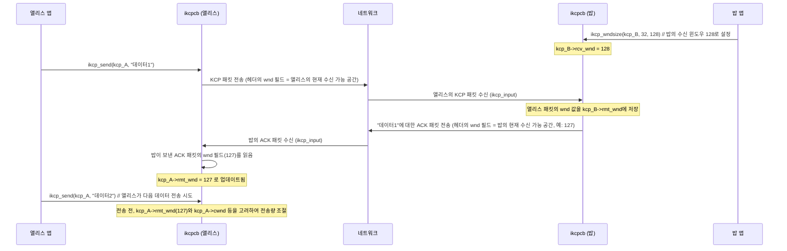

# Chapter 5: KCP 데이터 흐름 조절 장치 (윈도우 관리)


이전 [제4장: KCP 신뢰성 보장 장치 (ACK 및 재전송)](04_kcp_신뢰성_보장_장치__ack_및_재전송__.md)에서는 KCP가 어떻게 데이터의 유실을 감지하고 재전송하여 목적지까지 안전하게 전달하는지에 대해 배웠습니다. 데이터가 '확실히' 도착하는 것도 중요하지만, 만약 보내는 쪽에서 너무 많은 데이터를 한꺼번에 보내면 어떻게 될까요? 받는 쪽이 미처 처리하지 못하거나 네트워크 자체가 혼잡해져서 오히려 더 많은 데이터 유실이 발생할 수 있습니다.

이번 장에서는 KCP가 이러한 상황을 방지하기 위해 사용하는 "데이터 흐름 조절 장치", 즉 **윈도우 관리** 기능에 대해 알아보겠습니다. 이는 마치 고속도로의 교통량을 조절하는 신호등이나 차선 제어 시스템처럼, 데이터가 막힘없이 원활하게 흐르도록 돕고 전체 네트워크의 효율성을 유지하는 중요한 기능입니다.

## 왜 데이터 흐름 조절이 필요할까요?

앨리스가 밥에게 아주 큰 동영상 파일을 보낸다고 상상해 보세요. 앨리스가 가진 초고속 인터넷을 이용해 동영상 전체를 한 번에 밥에게 쏘아 보낸다면 어떻게 될까요? 만약 밥의 인터넷 속도가 앨리스보다 훨씬 느리거나, 밥의 컴퓨터가 동영상 데이터를 실시간으로 처리하기에 벅차다면, 밥은 앨리스가 보낸 데이터의 상당 부분을 놓치게 될 것입니다. 결국, [제4장: KCP 신뢰성 보장 장치 (ACK 및 재전송)](04_kcp_신뢰성_보장_장치__ack_및_재전송__.md)에서 배운 재전송이 빈번하게 발생하여 전체 전송 시간은 오히려 더 오래 걸릴 수 있습니다.

이런 문제를 해결하기 위해 KCP는 "윈도우(Window)"라는 개념을 사용하여 한 번에 주고받을 수 있는 데이터의 양을 현명하게 조절합니다.

## KCP의 창문들: 다양한 윈도우 개념 이해하기

KCP에서 "윈도우"는 송신자와 수신자, 그리고 네트워크 상태를 고려하여 현재 전송 중이거나 전송 가능한 데이터의 양을 나타내는 일종의 "허용치" 또는 "버퍼 크기"라고 생각할 수 있습니다. KCP는 여러 종류의 윈도우를 사용하여 데이터 흐름을 정교하게 제어합니다.

### 1. 송신 윈도우 (Send Window, `snd_wnd`)

*   **의미:** 송신자가 **상대방의 확인(ACK)을 아직 받지 않은 상태에서 최대로 보낼 수 있는 데이터 패킷의 개수**입니다. 즉, "내가 한 번에 최대로 보낼 수 있는 편지(데이터 패킷)의 개수"와 같습니다.
*   **비유:** 우편 배달부의 가방 크기라고 생각해 보세요. 배달부는 가방이 꽉 차면 더 이상 새 편지를 넣고 배달을 시작할 수 없습니다. `snd_wnd`는 바로 이 가방의 크기를 나타냅니다.
*   **제어:** 이 값은 `ikcpcb` 구조체의 `snd_wnd` 멤버에 저장되며, 사용자는 `ikcp_wndsize()` 함수를 통해 설정할 수 있습니다. 기본값은 32개 패킷입니다.

### 2. 수신 윈도우 (Receive Window, `rcv_wnd`)

*   **의미:** 수신자가 **한 번에 최대로 수신하여 자신의 버퍼에 저장할 수 있는 데이터 패킷의 개수**입니다. 즉, "내가 한 번에 최대로 받을 수 있는 편지를 보관할 수 있는 우편함의 크기"입니다.
*   **비유:** 여러분 집의 우편함 크기와 같습니다. 우편함이 가득 차면 배달부는 더 이상 새 편지를 넣을 수 없겠죠? 수신자는 이 `rcv_wnd` 크기를 송신자에게 알려주어 송신자가 너무 많은 데이터를 보내지 않도록 합니다.
*   **제어:** `ikcpcb` 구조체의 `rcv_wnd` 멤버에 저장되며, 사용자는 `ikcp_wndsize()` 함수를 통해 설정합니다. 기본값은 128개 패킷입니다. 이 값은 KCP 패킷 헤더의 `wnd` 필드를 통해 상대방에게 전달됩니다.

### 3. 원격지 수신 윈도우 (Remote Receive Window, `rmt_wnd`)

*   **의미:** 송신자가 알고 있는 **상대방(원격지)의 현재 수신 가능한 윈도우 크기**입니다. 즉, "상대방이 나에게 '나는 이만큼 더 받을 수 있어'라고 알려준 값"입니다.
*   **비유:** 앨리스가 밥에게 편지를 보낼 때, 밥이 "내 우편함은 지금 10개 정도 비어있어"라고 앨리스에게 알려준 정보와 같습니다. 앨리스는 이 정보를 바탕으로 밥에게 보낼 편지의 양을 조절합니다.
*   **제어:** 송신 측 `ikcpcb` 구조체의 `rmt_wnd` 멤버에 저장됩니다. 이 값은 상대방으로부터 수신한 KCP 패킷 헤더의 `wnd` 필드 값을 통해 주기적으로 업데이트됩니다 (`ikcp_input` 함수 내에서 처리).

### 4. 혼잡 윈도우 (Congestion Window, `cwnd`)

*   **의미:** 현재 **네트워크의 혼잡 상태를 고려하여 송신자가 '안전하게' 보낼 수 있다고 판단하는 데이터의 양**입니다. ACK가 잘 도착하면 크기가 커지고, 패킷 손실이 감지되면 크기가 작아지는 등 동적으로 변합니다.
*   **비유:** 고속도로의 교통 상황판과 같습니다. 도로가 뻥 뚫려있을 때는 많은 차들이 빠르게 달릴 수 있지만(큰 `cwnd`), 사고가 나거나 정체가 시작되면(패킷 손실 감지) "진입 차량 수 제한" 또는 "속도 제한" 신호가 켜지듯(`cwnd` 감소), 한 번에 보낼 수 있는 데이터 양을 줄여 네트워크 혼잡을 악화시키지 않도록 합니다.
*   **제어:** 송신 측 `ikcpcb` 구조체의 `cwnd` 멤버에 저장됩니다. KCP 내부의 혼잡 제어 알고리즘에 의해 자동으로 관리됩니다. 사용자가 `ikcp_nodelay` 함수에서 `nc` 파라미터를 1로 설정하면 이 혼잡 제어 기능을 끌 수 있으며, 이때는 `cwnd`가 흐름 제어에 영향을 주지 않습니다.

**결국, 송신자가 실제로 한 번에 보낼 수 있는 데이터의 양은 이 윈도우들 중 가장 작은 값으로 제한됩니다:**

`실제 전송 가능량 (패킷 수) = min(snd_wnd, rmt_wnd, cwnd (혼잡제어 사용 시))`

## 윈도우 관리, 어떻게 동작할까요? (앨리스와 밥의 예)

앨리스가 밥에게 동영상 파일을 전송하는 상황을 통해 윈도우 관리가 어떻게 이루어지는지 살펴봅시다.

1.  **초기 설정:**
    *   앨리스(송신자)의 KCP 객체 `kcp_A`:
        *   `kcp_A->snd_wnd` (앨리스의 송신 윈도우, 예: 64)
        *   `kcp_A->rcv_wnd` (앨리스의 수신 윈도우, 예: 128. 이 값은 밥에게 전달됨)
        *   `kcp_A->rmt_wnd` (밥의 수신 윈도우, 초기에는 기본값 또는 이전 통신 값)
        *   `kcp_A->cwnd` (혼잡 윈도우, 초기값은 작게 시작, 예: 2)
    *   밥(수신자)의 KCP 객체 `kcp_B`:
        *   `kcp_B->snd_wnd` (밥의 송신 윈도우. 밥이 앨리스에게 ACK 외 데이터를 보낼 때 사용)
        *   `kcp_B->rcv_wnd` (밥의 수신 윈도우, 예: 128. 이 값은 앨리스에게 전달됨)

2.  **데이터 전송 시작 및 윈도우 정보 교환:**
    *   앨리스가 `ikcp_send()`로 데이터를 보내면, `ikcp_flush()` (또는 `ikcp_update()` 내부에서)가 실제 패킷을 만듭니다. 이때 만들어지는 KCP 패킷 헤더의 `wnd` 필드에는 **앨리스 자신의 현재 수신 가능한 윈도우 크기** (`kcp_A`의 `rcv_wnd`에서 현재 `rcv_queue`에 있는 패킷 수를 뺀 값, 즉 `ikcp_wnd_unused(kcp_A)`)가 기록됩니다.
    *   밥이 이 패킷을 `ikcp_input()`으로 받으면, 앨리스가 알려준 `wnd` 값을 밥의 `kcp_B->rmt_wnd`에 저장합니다. (물론 지금은 앨리스가 송신, 밥이 수신이므로 밥이 앨리스의 `rmt_wnd`를 업데이트할 일은 적습니다. 반대의 경우 중요합니다.)
    *   밥은 받은 데이터에 대한 ACK 패킷을 앨리스에게 보냅니다. 이 ACK 패킷 헤더의 `wnd` 필드에는 **밥 자신의 현재 수신 가능한 윈도우 크기** (`ikcp_wnd_unused(kcp_B)`)가 기록됩니다.
    *   앨리스가 이 ACK 패킷을 `ikcp_input()`으로 받으면, 밥이 알려준 `wnd` 값을 `kcp_A->rmt_wnd`에 업데이트합니다. 이제 앨리스는 밥이 현재 얼마나 더 받을 수 있는지 알게 됩니다.

3.  **송신량 조절:**
    *   앨리스는 데이터를 보낼 때, 자신이 보냈지만 아직 ACK를 받지 않은 데이터의 양(`kcp_A->snd_nxt - kcp_A->snd_una`)이 `min(kcp_A->snd_wnd, kcp_A->rmt_wnd, kcp_A->cwnd)` 보다 작을 때만 새로운 데이터를 보냅니다.
    *   ACK가 꾸준히 잘 도착하면 앨리스의 `kcp_A->cwnd`는 점차 증가하여 더 많은 데이터를 보낼 수 있게 됩니다 (네트워크 상황이 좋다고 판단).
    *   만약 패킷 유실이 발생하여 재전송이 일어나면, `kcp_A->cwnd`는 감소하여 데이터 전송량을 줄입니다 (네트워크 혼잡 가능성).

4.  **수신자 처리 지연 및 윈도우 프로빙 (Window Probing):**
    *   만약 밥의 애플리케이션이 `ikcp_recv()`를 느리게 호출하여 `kcp_B`의 `rcv_queue` (수신된 데이터가 애플리케이션으로 전달되기 전 대기하는 큐)가 가득 차면, 밥이 앨리스에게 알리는 `wnd` 값 (즉, `ikcp_wnd_unused(kcp_B)`)은 0에 가까워집니다.
    *   앨리스는 `kcp_A->rmt_wnd`가 0이 되는 것을 보고 새로운 데이터 전송을 중단합니다. (밥이 더 이상 받을 공간이 없다고 했으니까요!)
    *   하지만 이 상태가 계속되면 통신이 멈추겠죠? 그래서 KCP는 `kcp_A->rmt_wnd`가 0일 때 주기적으로 **윈도우 프로브(Window Probe)** 패킷(`IKCP_CMD_WASK` - Window Ask, "창문 열렸니?"라고 묻는 신호)을 밥에게 보냅니다.
    *   밥의 애플리케이션이 `rcv_queue`의 데이터를 일부 처리하여 공간이 생기면, 밥은 `IKCP_CMD_WINS` (Window Announce, "창문 이만큼 열렸어!"라고 알리는 신호) 패킷을 통해 자신의 새로운 `rcv_wnd` (정확히는 `ikcp_wnd_unused(kcp_B)`)를 앨리스에게 알립니다.
    *   앨리스는 이 `WINS` 패킷을 받고 `kcp_A->rmt_wnd`를 갱신한 후 데이터 전송을 재개할 수 있습니다.

## KCP 윈도우 설정 및 사용 예시

KCP에서 송신 윈도우와 수신 윈도우의 크기는 `ikcp_wndsize()` 함수를 통해 설정할 수 있습니다.

```c
// KCP 객체 kcp_A (송신자)와 kcp_B (수신자)가 이미 생성되었다고 가정
// ikcpcb *kcp_A, *kcp_B;

// 앨리스(송신자)의 송신 윈도우 크기를 64로, 앨리스의 수신 윈도우 크기를 128로 설정
// 밥(수신자)의 송신 윈도우 크기를 32로, 밥의 수신 윈도우 크기를 256으로 설정
int alice_send_window = 64;
int alice_recv_window = 128;
int bob_send_window = 32;   // 밥도 앨리스에게 데이터를 보낼 수 있으므로 설정
int bob_recv_window = 256;

// kcp_A 설정: sndwnd는 64, rcvwnd는 128
ikcp_wndsize(kcp_A, alice_send_window, alice_recv_window);
// kcp_B 설정: sndwnd는 32, rcvwnd는 256
ikcp_wndsize(kcp_B, bob_send_window, bob_recv_window);

printf("앨리스: 송신 윈도우=%u, 수신 윈도우=%u\n", kcp_A->snd_wnd, kcp_A->rcv_wnd);
printf("밥: 송신 윈도우=%u, 수신 윈도우=%u\n", kcp_B->snd_wnd, kcp_B->rcv_wnd);
```
위 코드를 실행하면 `kcp_A->snd_wnd`는 64, `kcp_A->rcv_wnd`는 128로 설정됩니다. 마찬가지로 `kcp_B`의 값들도 설정됩니다. `rcvwnd` 값은 KCP 패킷의 `wnd` 필드를 통해 상대방에게 전달되어 상대방의 `rmt_wnd`를 업데이트하는 데 사용됩니다.

KCP가 내부적으로 전송량을 제한하는 로직은 `ikcp_flush()` 함수에 있습니다. 다음은 개념적인 코드입니다.

```c
// ikcp.c의 ikcp_flush 함수 내부의 개념적 로직
// (사용자가 직접 이 부분을 호출하거나 수정하지 않습니다)

// 1. 실제 전송에 사용할 유효 윈도우 크기 계산 (이름은 cwnd로 되어있지만, 여러 윈도우를 고려한 결과임)
IUINT32 effective_wnd = kcp->snd_wnd; // 나의 송신 윈도우로 시작
effective_wnd = _imin_(effective_wnd, kcp->rmt_wnd); // 상대방의 수신 윈도우와 비교하여 더 작은 값 선택
if (kcp->nocwnd == 0) { // 혼잡 제어 사용 시 (기본값)
    effective_wnd = _imin_(effective_wnd, kcp->cwnd); // 혼잡 윈도우와도 비교하여 더 작은 값 선택
}

// 2. 전송할 데이터 결정: 보내지 않은 데이터 중, effective_wnd 개수만큼만 전송 시도
// (kcp->snd_nxt - kcp->snd_una)는 현재 ACK를 기다리는 "미확인 전송 패킷" 수
// 이 수가 effective_wnd보다 작아야 새 패킷을 보낼 수 있음
while (_itimediff(kcp->snd_nxt, kcp->snd_una + effective_wnd) < 0) {
    // kcp->snd_queue (보내기 대기열)에서 IKCPSEG를 가져와
    // kcp->snd_buf (송신 버퍼)로 옮기고, 시퀀스 번호(sn) 등을 할당하며 전송 준비
    // ... (IKCPSEG를 snd_buf로 이동하는 로직) ...
    if (iqueue_is_empty(&kcp->snd_queue)) break; // 더 이상 보낼 데이터가 없으면 중단
    kcp->snd_nxt++; // 다음에 보낼 시퀀스 번호 증가
}
// 이후 snd_buf에 있는 준비된 패킷들을 실제로 네트워크로 전송
```
위 코드에서 `_imin_`은 두 값 중 작은 값을 반환하는 매크로입니다. `kcp->snd_nxt`는 다음에 전송할 패킷의 순서 번호이고, `kcp->snd_una`는 아직 ACK를 받지 못한 가장 오래된 패킷의 순서 번호입니다. 이 차이가 현재 "미확인 상태로 공중에 떠 있는" 패킷의 수를 의미합니다. KCP는 이 수가 계산된 `effective_wnd`를 넘지 않도록 조절하여 데이터를 전송합니다.

## KCP 내부 들여다보기: 윈도우 정보는 어떻게 교환되고 사용될까요?

### `rmt_wnd` 업데이트 및 사용 흐름

상대방의 수신 윈도우 크기(`rmt_wnd`)가 어떻게 업데이트되고 사용되는지 간단한 시나리오로 살펴봅시다.



### 코드 레벨에서의 동작

**1. `rmt_wnd` 업데이트 (`ikcp_input` 함수)**

상대방으로부터 KCP 패킷을 수신했을 때, `ikcp_input` 함수는 패킷 헤더를 디코딩하여 `wnd` 값을 추출하고, 이를 자신의 `kcp->rmt_wnd` 멤버에 저장합니다.

```c
// ikcp.c의 ikcp_input 함수 일부
// ... (앞부분 생략) ...
while (1) {
    IUINT32 ts, sn, len, una, conv;
    IUINT16 wnd_from_peer; // 상대방이 보낸 윈도우 크기 값을 담을 변수
    IUINT8 cmd, frg;

    if (size < (int)IKCP_OVERHEAD) break; // 남은 데이터가 헤더보다 작으면 종료

    data = ikcp_decode32u(data, &conv); // 연결 ID 디코딩
    if (conv != kcp->conv) return -1;   // 다른 연결의 패킷이면 무시

    data = ikcp_decode8u(data, &cmd);   // 명령어 디코딩
    data = ikcp_decode8u(data, &frg);   // 조각 번호 디코딩
    data = ikcp_decode16u(data, &wnd_from_peer); // **핵심: 상대방의 수신 윈도우 값 디코딩**
    data = ikcp_decode32u(data, &ts);   // 타임스탬프 디코딩
    data = ikcp_decode32u(data, &sn);   // 순서 번호 디코딩
    data = ikcp_decode32u(data, &una);  // 미확인 순서 번호 디코딩
    data = ikcp_decode32u(data, &len);  // 데이터 길이 디코딩

    size -= IKCP_OVERHEAD;
    if ((long)size < (long)len || (int)len < 0) return -2; // 데이터 길이 오류 검사

    // ... (cmd 유효성 검사 등) ...

    kcp->rmt_wnd = wnd_from_peer; // **나의 rmt_wnd를 상대방이 알려준 값으로 업데이트**
    ikcp_parse_una(kcp, una);     // 상대방이 una까지 받았음을 처리 (내 snd_buf 정리)
    ikcp_shrink_buf(kcp);         // snd_buf에서 ACK된 세그먼트 제거 후 snd_una 업데이트

    // ... (cmd 종류에 따른 나머지 처리: 데이터 저장, ACK 처리 등) ...

    data += len; // 다음 세그먼트 시작 위치로 포인터 이동
    size -= len; // 남은 데이터 크기 감소
}
// ... (뒷부분 생략) ...
```
위 코드에서 `ikcp_decode16u(data, &wnd_from_peer)` 부분이 상대방 패킷 헤더에서 16비트 윈도우 크기 값을 읽어오는 부분이며, 바로 다음에 `kcp->rmt_wnd = wnd_from_peer;`를 통해 송신 측의 `rmt_wnd`가 갱신됩니다.

**2. 유효 윈도우 계산 및 사용 (`ikcp_flush` 함수)**

`ikcp_flush` 함수는 실제로 데이터를 보내기 전에 현재 유효한 윈도우 크기를 계산하고, 이 크기를 넘지 않도록 보낼 데이터의 양을 조절합니다.

```c
// ikcp.c의 ikcp_flush 함수 일부
void ikcp_flush(ikcpcb *kcp)
{
    // ... (변수 초기화 및 ACK 패킷 전송 로직 등) ...

    IUINT32 effective_wnd_val; // 실제 사용될 유효 윈도우 크기

    // calculate window size (실제로는 cwnd라는 변수명으로 계산되지만, 혼동을 피하기 위해 effective_wnd_val로 설명)
    effective_wnd_val = _imin_(kcp->snd_wnd, kcp->rmt_wnd); // 나의 송신 윈도우와 상대방 수신 윈도우 중 작은 값
    if (kcp->nocwnd == 0) { // 혼잡 제어 사용 시 (kcp->nocwnd가 0이면 사용, 기본값)
        effective_wnd_val = _imin_(kcp->cwnd, effective_wnd_val); // 위 결과와 혼잡 윈도우(kcp->cwnd) 중 더 작은 값
    }

    // snd_queue (보내기 대기열)에서 snd_buf (송신 버퍼)로 데이터 이동
    // 조건: 아직 ACK 안 받은 패킷 수 (snd_nxt - snd_una) < effective_wnd_val
    while (_itimediff(kcp->snd_nxt, kcp->snd_una + effective_wnd_val) < 0) {
        IKCPSEG *newseg;
        if (iqueue_is_empty(&kcp->snd_queue)) break; // 보낼 데이터가 없으면 중단

        newseg = iqueue_entry(kcp->snd_queue.next, IKCPSEG, node);
        // ... (newseg를 snd_buf로 옮기고, KCP 헤더 정보(sn, ts 등) 설정) ...
        kcp->snd_nxt++; // 다음에 보낼 시퀀스 번호 증가
    }

    // ... (이후 snd_buf에 있는 패킷들을 재전송 조건 등 확인 후 실제 전송) ...
}
```
여기서 `effective_wnd_val`이 실제 전송 가능한 패킷 수를 결정합니다. 이 값을 초과하여 "미확인 전송 패킷"이 쌓이지 않도록 `while` 루프가 제어합니다.

**3. 윈도우 프로빙 (`ikcp_flush` 함수)**

만약 상대방의 수신 윈도우(`kcp->rmt_wnd`)가 0이 되면, 송신자는 더 이상 데이터를 보낼 수 없습니다. 이때 `ikcp_flush` 함수 내에서 윈도우 프로빙 로직이 동작합니다.

```c
// ikcp.c의 ikcp_flush 함수 일부 - 윈도우 프로빙 로직
    // ... (ACK 및 다른 제어 패킷 전송 후) ...

    // 원격지 수신 윈도우(rmt_wnd)가 0인 경우 (상대방이 데이터를 못 받는 상황)
    if (kcp->rmt_wnd == 0) {
        if (kcp->probe_wait == 0) { // 처음 프로브 대기 시간 설정
            kcp->probe_wait = IKCP_PROBE_INIT; // 초기 프로브 대기 시간 (기본 7000ms)
            kcp->ts_probe = kcp->current + kcp->probe_wait; // 다음 프로브 시간 기록
        } else {
            if (_itimediff(kcp->current, kcp->ts_probe) >= 0) { // 프로브할 시간이 되었다면
                if (kcp->probe_wait < IKCP_PROBE_INIT) kcp->probe_wait = IKCP_PROBE_INIT;
                kcp->probe_wait += kcp->probe_wait / 2; // 프로브 대기 시간을 점진적으로 늘림
                if (kcp->probe_wait > IKCP_PROBE_LIMIT) kcp->probe_wait = IKCP_PROBE_LIMIT; // 최대 대기 시간 제한
                kcp->ts_probe = kcp->current + kcp->probe_wait;
                kcp->probe |= IKCP_ASK_SEND; // WASK (윈도우 요청) 패킷을 보내도록 플래그 설정
            }
        }
    } else { // rmt_wnd가 0이 아니면 프로브 관련 변수 초기화
        kcp->ts_probe = 0;
        kcp->probe_wait = 0;
    }

    // WASK 패킷 전송 (kcp->probe에 IKCP_ASK_SEND 플래그가 설정된 경우)
    if (kcp->probe & IKCP_ASK_SEND) {
        seg.cmd = IKCP_CMD_WASK; // 명령어 WASK로 설정
        // ... (WASK 패킷을 버퍼에 인코딩하고, 공간이 되면 output 콜백으로 전송) ...
    }

    // WINS 패킷 전송 (kcp->probe에 IKCP_ASK_TELL 플래그가 설정된 경우)
    // (수신 측에서 WASK를 받거나, 자신의 수신 윈도우가 회복되어 이를 알려야 할 때 설정됨)
    if (kcp->probe & IKCP_ASK_TELL) {
        seg.cmd = IKCP_CMD_WINS; // 명령어 WINS로 설정
        // ... (WINS 패킷을 버퍼에 인코딩하고, 공간이 되면 output 콜백으로 전송) ...
    }
    kcp->probe = 0; // 사용된 프로브 플래그 초기화
```
이처럼 `rmt_wnd`가 0이 되면 `IKCP_ASK_SEND` 플래그가 설정되어 `IKCP_CMD_WASK` 패킷이 주기적으로 전송됩니다. 수신 측은 이 `WASK`를 받으면 자신의 현재 윈도우 상태를 `IKCP_CMD_WINS` 패킷으로 응답하게 되고, 송신 측은 이 `WINS`를 통해 `rmt_wnd`를 갱신하여 다시 통신을 이어갈 수 있게 됩니다.

**4. 혼잡 제어 (`cwnd`와 `ssthresh`)**

KCP는 TCP와 유사한 혼잡 제어 메커니즘을 사용하여 네트워크 상황에 따라 `cwnd` (혼잡 윈도우)와 `ssthresh` (느린 시작 임계값)를 조절합니다.

*   **ACK 성공적 수신 시 (`ikcp_input`):** `cwnd`가 증가합니다.
    *   `kcp->cwnd < kcp->ssthresh` (느린 시작 단계): `cwnd`가 비교적 빠르게 증가합니다 (KCP에서는 ACK당 1 MSS씩 증가).
    *   `kcp->cwnd >= kcp->ssthresh` (혼잡 회피 단계): `cwnd`가 더 완만하게 증가합니다 (RTT당 약 1 MSS씩 증가).
    ```c
    // ikcp.c의 ikcp_input 함수 일부 - 혼잡 윈도우 증가 로직
    // prev_una는 이전에 ACK된 가장 오래된 시퀀스 번호
    if (_itimediff(kcp->snd_una, prev_una) > 0) { // 새로운 데이터가 성공적으로 ACK 되었다면
        if (kcp->cwnd < kcp->rmt_wnd) { // cwnd가 상대방 수신 윈도우보다 작을 때만 증가 시도
            IUINT32 mss = kcp->mss;
            if (kcp->cwnd < kcp->ssthresh) { // 느린 시작 (Slow Start)
                kcp->cwnd++; // cwnd 1 증가 (1 MSS 만큼)
                kcp->incr += mss;
            } else { // 혼잡 회피 (Congestion Avoidance)
                if (kcp->incr < mss) kcp->incr = mss;
                // AIMD (Additive Increase, Multiplicative Decrease)의 Additive Increase 부분
                // 매 RTT마다 cwnd가 약 1 MSS씩 증가하도록 incr 값을 조절
                kcp->incr += (mss * mss) / kcp->incr + (mss / 16); 
                if ((kcp->cwnd + 1) * mss <= kcp->incr) {
                    kcp->cwnd++;
                }
            }
            if (kcp->cwnd > kcp->rmt_wnd) { // cwnd가 rmt_wnd를 넘지 않도록 제한
                kcp->cwnd = kcp->rmt_wnd;
                kcp->incr = kcp->rmt_wnd * mss;
            }
        }
    }
    ```

*   **패킷 손실 감지 시 (`ikcp_flush`):** `ssthresh`는 현재 `cwnd`의 절반 정도로 설정되고, `cwnd`는 크게 감소합니다.
    *   타임아웃 발생 시: `cwnd`는 1로 급격히 줄어듭니다.
    *   빠른 재전송 발생 시: `cwnd`는 새로운 `ssthresh` 값으로 줄어듭니다 (TCP Reno 방식과 유사).
    ```c
    // ikcp.c의 ikcp_flush 함수 일부 - 혼잡 발생 시 혼잡 윈도우 감소 로직
    // change: 빠른 재전송 발생 플래그, lost: 타임아웃 발생 플래그
    // cwnd_val은 이전에 계산된 유효 윈도우 크기

    if (change) { // 빠른 재전송으로 인한 손실 감지
        IUINT32 inflight = kcp->snd_nxt - kcp->snd_una; // 현재 전송 중인 데이터 양
        kcp->ssthresh = inflight / 2; // ssthresh를 inflight의 절반으로
        if (kcp->ssthresh < IKCP_THRESH_MIN) kcp->ssthresh = IKCP_THRESH_MIN; // 최소 ssthresh 보장
        kcp->cwnd = kcp->ssthresh + resent; // cwnd를 ssthresh + fastresend 임계값으로 (TCP Reno)
        kcp->incr = kcp->cwnd * kcp->mss;
    }

    if (lost) { // 타임아웃으로 인한 손실 감지
        // 이전에 계산된 유효 윈도우(effective_wnd_val)를 cwnd_val로 참조 가능
        kcp->ssthresh = cwnd_val / 2; // ssthresh를 현재 유효 윈도우의 절반으로
        if (kcp->ssthresh < IKCP_THRESH_MIN) kcp->ssthresh = IKCP_THRESH_MIN;
        kcp->cwnd = 1; // cwnd를 1로 초기화 (느린 시작 재시작)
        kcp->incr = kcp->mss;
    }
    ```

사용자는 `ikcp_nodelay(kcp, nodelay, interval, resend, nc)` 함수에서 `nc` (no congestion control) 파라미터를 1로 설정하여 이 혼잡 제어 기능을 비활성화할 수 있습니다. 이 경우 `kcp->nocwnd`가 1로 설정되어 `kcp->cwnd` 값은 유효 윈도우 계산에 사용되지 않습니다.

## 결론

이번 장에서는 KCP가 데이터 흐름을 효과적으로 조절하기 위해 사용하는 다양한 윈도우(`snd_wnd`, `rcv_wnd`, `rmt_wnd`, `cwnd`)의 개념과 동작 방식을 알아보았습니다. 이러한 윈도우 관리를 통해 KCP는 송신자가 수신자나 네트워크의 처리 능력을 초과하여 데이터를 보내는 것을 방지하고, 패킷 손실을 줄이며, 전체적인 전송 효율성과 안정성을 높입니다.

*   송신자는 자신의 **송신 윈도우(`snd_wnd`)**, 상대방이 알려준 **원격지 수신 윈도우(`rmt_wnd`)**, 그리고 네트워크 상황에 따른 **혼잡 윈도우(`cwnd`)**를 종합적으로 고려하여 전송량을 결정합니다.
*   수신자는 자신의 **수신 윈도우(`rcv_wnd`)** 크기를 상대방에게 알려주어 데이터 폭주를 막습니다.
*   상대방 수신 윈도우가 0이 되면 **윈도우 프로빙**을 통해 통신 재개 시점을 파악합니다.

KCP의 윈도우 관리는 빠른 전송 속도와 네트워크 안정성 사이의 균형을 맞추는 핵심 기술입니다.

이것으로 KCP의 핵심 기능들에 대한 여정을 마칩니다. 지금까지 [KCP 핵심 동작 엔진](01_kcp_핵심_동작_엔진__주요_api_및_업데이트_루프__.md)부터 시작하여 [연결 제어기 (ikcpcb)](02_kcp_연결_제어기__ikcpcb__.md), [데이터 조각 (IKCPSEG)](03_kcp_데이터_조각__ikcpseg__.md), [신뢰성 보장 장치 (ACK 및 재전송)](04_kcp_신뢰성_보장_장치__ack_및_재전송__.md), 그리고 이번 장의 흐름 제어까지, 여러분은 KCP를 효과적으로 이해하고 활용할 수 있는 기초를 다졌습니다. 더 자세한 설정 옵션이나 실제 적용 사례는 KCP 프로젝트의 README 문서나 관련 커뮤니티의 고급 자료들을 참고하시면 큰 도움이 될 것입니다. KCP를 통해 더욱 안정적이고 빠른 네트워크 애플리케이션을 구축하시기를 바랍니다!

---

Generated by [AI Codebase Knowledge Builder](https://github.com/The-Pocket/Tutorial-Codebase-Knowledge)