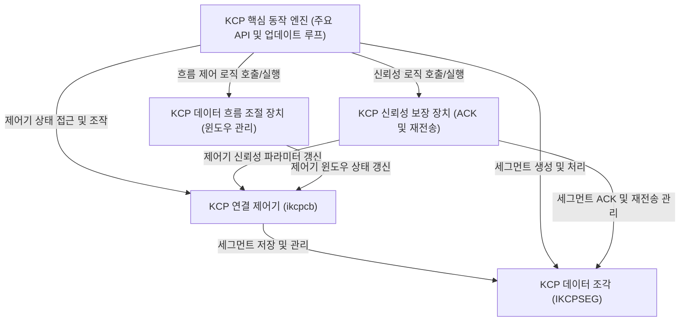

# Tutorial: kcp

`kcp` 프로젝트는 *빠르고 신뢰성 있는 ARQ (자동 반복 요청) 프로토콜*입니다. 기존 TCP 프로토콜에 비해 **지연 시간을 크게 줄이는 것**을 주된 목표로 하며, 이를 위해 독자적인 데이터 전송 확인, 재전송, 그리고 흐름 제어 방식을 사용합니다. 이 프로토콜은 **핵심 알고리즘** 형태로 제공되어, 개발자가 UDP와 같은 기존 하위 프로토콜 위에 직접 구현하여 사용할 수 있도록 설계되었습니다. KCP는 전송할 데이터를 *세그먼트(IKCPSEG)*라는 작은 단위로 나누고, 각 연결의 상태를 **연결 제어기(ikcpcb)**를 통해 관리합니다. 또한, 수신 확인 응답(ACK)과 데이터 재전송을 통해 데이터 전달의 *신뢰성을 보장*하며, 다양한 윈도우 크기 조절을 통해 네트워크 상황에 맞게 *데이터 흐름을 효과적으로 제어*합니다.

**Source Repository:** [None](None)

## Chapters

1. [KCP 핵심 동작 엔진 (주요 API 및 업데이트 루프)
](01_kcp_핵심_동작_엔진__주요_api_및_업데이트_루프__.md)
2. [KCP 연결 제어기 (ikcpcb)
](02_kcp_연결_제어기__ikcpcb__.md)
3. [KCP 데이터 조각 (IKCPSEG)
](03_kcp_데이터_조각__ikcpseg__.md)
4. [KCP 신뢰성 보장 장치 (ACK 및 재전송)
](04_kcp_신뢰성_보장_장치__ack_및_재전송__.md)
5. [KCP 데이터 흐름 조절 장치 (윈도우 관리)
](05_kcp_데이터_흐름_조절_장치__윈도우_관리__.md)

---

Generated by [AI Codebase Knowledge Builder](https://github.com/The-Pocket/Tutorial-Codebase-Knowledge)